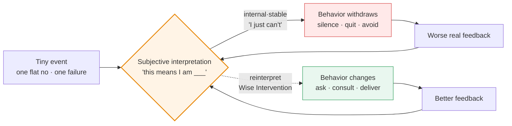

# 📘 Ordinary Magic — Core Insights & My Thinking Evolution Notes

> 📅 Last updated: 2026-09-30 · 📖 **16 themes** · 📝 ~42k Chinese characters (≈ a 42k-character notebook) · ⏱️ ~55 min · 🌐 English (Chinese version in `docs/`)
> **One-line core takeaway:** Objective facts are never what's fatal — the interpretation you put on them is. The "minimum effort" is spending your effort rewriting the interpretation, not fighting reality.
> **My thinking evolution:** From "use mechanisms to bind people into cooperation" (collective punishment, mutual review, dual sign-off, harsh penalties) toward "first eliminate the physical leverage to do harm, then use narrative to redefine everyone's identity." The hard metric: in my first 6 rounds I won on rhetoric; the next 6 on system design — and what truly woke me up were the 3 rounds I couldn't answer.

> [!NOTE]
> **What this notebook is**: A practical reader's notebook thatbreaks down Gregory M. Walton's *Ordinary Magic* into 16 high-pressure decision scenarios. Each theme splits strictly into two blocks — 📖 "Author's Core Insight" reads independently of my experience; ⚡ "My Evolution & Practice" is my own choices in the sandbox, how I got counter-killed, and the rules I kept.
> **What this notebook is NOT**: Not a book summary, not a substitute for the book. I do not have the full text; the 📖 content is the AI sparring partner's retelling of the book, **with no direct quotations from the original**, hence uniformly marked "Confidence: Medium". Bibliography is verified against the publisher's official page and Google Books' table of contents (Confidence: High).
> **Verification status**: All quotations, numbers, and chapter correspondences are in [Appendix B: Bibliography & Verification](#appendix-b).

<details><summary>📑 Table of Contents</summary>

**Start Here**
- [🚪 30-Second Orientation](#guide)
- [🧭 Learning Evolution Roadmap](#roadmap)

**Deep Dive: Essence vs. Evolution**
- [01. Downward Spiral: How One Flat No Undoes a New Hire](#d01)
- [02. Can I Do It: Downgrading "We're Doomed" to a Ticket](#d02)
- [03. Who Am I: Give Him a Noun, Then Lock His Behavior](#d03)
- [04. Do You Love Me: Why Comfort Backfires on the Wounded](#d04)
- [05. Can I Trust You: Stop Self-Defending, Show Him the Endgame](#d05)
- [06. Do I Belong: Don't Make Him Fit In, Make Him Irreplaceable](#d06)
- [07. Macro System: What a System Whispers Matters More Than Its Text](#d07)
- [08. Trial I · Crisis Leadership: When Three Correct Mechanisms Cancel](#d08)
- [09. Trial II · The Brilliant Jerk: The Genius You Punished Blackmails You](#d09)
- [10. Trial III · Whistleblower Paradox: The Side Letter Is the Knife You Handed Him](#d10)
- [11. Trial IV · Wise Feedback: You Won the Rule, Lost the Balance Sheet](#d11)
- [12. Opening Round · Narrative Reframing: The First Principle of the Book](#d12)
- [13. Dynamic Norms: Why "Everyone Wants to Grind" Is a Silent Lie](#d13)
- [14. Self-Transcendent Purpose: Why "Tech for Good" and "It's Just Money" Are Both Poison](#d14)
- [15. Institutional Metaphor: Why Tearing Down Cubicles Beats Bonuses](#d15)
- [16. Ripple Effects: Why a "Miracle" Reverts in Six Months](#d16)

**Appendices & Boundaries**
- [🧾 Appendix A: 60 Action Algorithms](#appendix-a)
- [⚠️ Methodological Boundaries & Known Blind Spots](#limits)
- [📎 Appendix B: Bibliography & Verification](#appendix-b)
- [🧩 Closing: What This Notebook Actually Changed](#closing)

</details>

---

<a id="guide"></a>
## 🚪 Start Here: 30-Second Orientation

### I. What the book is about

Three sentences:

1. People are driven not by **objective reality** but by **their interpretation of reality**.
2. A tiny negative interpretation feeds itself and snowballs (the **downward spiral**); conversely, rewriting one interpretation at a key moment makes behavior self-reinforce upward (the **upward spiral**).
3. This rewrite is called a **Wise Intervention** — usually extremely short, light, even a single sentence or gesture, yet it can bend a life's trajectory. That is the book's title: "ordinary magic."



> **How to read this**: The only box worth remembering is the middle one — **the same box is both the start of collapse and the start of turnaround**. Every technique in the book attacks this one box.

### II. How this "sandbox" works

This is not a book club; it is adversarial war-gaming. The loop runs like this:

1. **The sparring partner sets the scene** — drops you into a high-pressure situation (parachuted-in manager, founder standoff, partner breakdown, eve of IPO) with a specific role.
2. **Consecutive multiple-choice** — 2–3 four-option questions where options are second-order consequences of each other. From round 3 on, I asked the partner to **strip the hint labels** after each option (labels like "appeal to expert identity construction" spoiled the twist), so every path looked reasonable.
3. **I give the option combo + underlying logic** — usually just a few letters (`c and b`, `bcc`) plus one line of reasoning.
4. **Consequence simulation + black-swan mutation** — the partner first plays out what I got right, then throws a "situation mutation" that knocks me back: the person you stabilized turns around and accuses you of PUA.
5. **Live response → converge to first principle → four-dimension expansion** — I answer in one line; the partner hangs it back on a chapter's first principle; then pushes it to the limit across four dimensions (boundary holes / cross-domain mapping / action algorithm / era version).

> ⚠️ **Two disclaimers (must read)**
> **First**: All sandbox scenes, characters (Xiao Zhang, Old Lei, A-Jie, Old Yue, Shen Che…), dialogues, and plots in this notebook are **fictional parables constructed by the AI sparring partner** for stress-testing cognition. They **correspond to no real individual, organization, or event**. All companies, stores, funds, and exchanges mentioned are fictional.
> **Second**: The psychology concepts and cross-domain mappings the partner cites or improvises (behavioral economics, quantitative finance, evolutionary biology, blockchain, etc.) **belong to its own improvisation**; only the parts labeled "book's first principle" represent the author's stance of *Ordinary Magic* — and since I have not seen the original, their confidence is "Medium."

### III. Three background essentials (you'll be lost without them)

| # | Essential | Plain words | Cost of skipping |
| :--: | :--- | :--- | :--- |
| 1 | **Wise Intervention** | Change nothing about the objective task; only change his *interpretation* of it | You'll read the book as "a manual of rhetoric tricks" |
| 2 | **Recursive cycle of spirals** | interpretation → behavior → external feedback → reinforces the original interpretation, self-confirming round by round | You won't see why "one small thing" snowballs into collapse |
| 3 | **The five core questions** | The book reduces life's dilemmas to 5 questions: Can I succeed? / Do I belong? / Who am I? / Am I loved? / Can I trust you? | You won't see the classification logic of the 16 sandboxes |

> The five questions map to chapters: **Can I do it** = Ch4 · **Do I belong** = Ch3 · **Who am I** = Ch5 · **Am I loved** = Ch7 · **Can I trust you** = Ch8. (Confidence: High, from Google Books TOC.)

### IV. Character quick-reference

| Character | Appears in | Role | The dilemma he represents |
| :--- | :--- | :--- | :--- |
| Xiao Zhang | Theme 12 | Old hand who defensively slacks after taking the blame | "I am someone being phased out" |
| Xiao Bai | Theme 01 | New grad publicly cut off in week one | One negation snowballs into a downward spiral |
| Old Wang | Theme 01 | Senior I hoped would "lead by example" | A kindly lie punctured by reality |
| CTO / Lead Designer | Theme 02 | Core backbone after a product launch crashed | Attributing failure to "bad genes" |
| A-Jie | Theme 03 | Employee labeled "troublemaker / uncooperative" | Behavior label vs. identity label |
| Lin | Theme 04 | Partner who fought hard for half a year then lost | Threatened ego |
| Old Zhao | Theme 05 | Veteran who believes the company is purging him | Zero-trust in a performance review |
| Old Lei | Theme 05 | Co-founder in a cash-flow crisis | Suspicion in a founder standoff |
| Xiao Chen | Theme 06 | Field-tech parachuted into the "inner circle" | Belonging uncertainty |
| Elite backbone | Theme 06 | Entrenched insider | Tribal exclusion |
| Old Qin | Theme 07 | Veteran store manager who cashed out 8,000 yuan | Whose fault is systemic violation |
| Old Zhang / Xiao Xu | Theme 08 | Traditional-factory tech director / parachuted product manager | Circle rift and the dual-signoff deadlock |
| A-Meng / Xiao Liu | Theme 09 | Genius architect / extorted risk-control clerk | Blackmails after being punished |
| Old Yue | Theme 10 | Hero who overstepped and grabbed an 80M yuan order | Huge credit + huge blunder |
| Shen Che | Theme 11 | Genius chief architect, ego thin as tissue paper | Delivery of high-difficulty feedback |
| Sparring partner | All | "The contrarian sparring partner" | Tasked with slapping my face in the second half of every round |

<details><summary>🔤 One-Minute Glossary (39 plain-language terms)</summary>

| Term | Plain words |
| :--- | :--- |
| Wise Intervention | Change nothing about the task; only change how he sees it |
| Downward Spiral (Spiraling Down) | A small thing interpreted as "I can't," then worse and worse, more convinced |
| Upward Spiral (Spiraling Up) | Reverse: one small success interpreted as "I can," then better and better |
| Narrative Reframing | Give the same event a different framing; behavior changes when the framing does |
| Belonging Uncertainty | On entering a new environment, reading every awkward silence as "they don't want me" |
| Normalizing Adversity | "It's not that you're no good — everyone's first three months are like this" |
| Learned Helplessness | After enough falls, concluding nothing works, so you just stop |
| Attributional Dimension | Blaming a bad thing on "my whole self" vs. "these 3 bugs" |
| Internal·Stable attribution | Blaming yourself, and believing it's forever unfixable → most toxic |
| External·Unstable attribution | Blaming the environment, and believing it's only temporary → healthiest |
| Identity Reframing | Don't change behavior; redefine who he "is" |
| Power of Nouns | "You're careful" is an adjective; "you're a risk defender" is a noun — nouns lock behavior |
| Self-Consistency Bias | People automatically act consistent with their persona |
| Saying-is-Believing | When you persuade others, you're really convincing yourself |
| Advocate Effect | Make him teach the newbie; to teach well he first convinces himself |
| Threatened Ego | The more he fails, the more he hears comfort as mockery |
| Sympathy = condescension | You say "it's fine"; he hears "you also think I'm no good" |
| Cognitive Mirror Rebound | Flip "you look down on me" into "you're insecure about yourself" |
| Confirmation Bias | Once convinced you're out to get him, everything you do proves it |
| Malicious Compliance | He does exactly what you say, never a step more, even off a cliff |
| Overjustification Effect | Lavish praise makes him feel "you pity me" |
| Paradoxical Intention | Admit the worst outcome outright; the fear dissolves |
| Reality Testing | Don't fantasize the worst; actually ask 10 users |
| Flooding (exposure) | One maximal negative hit at once, to desensitize the fear |
| Procedural Justice | People accept being punished, but not "throat-cutting at the bottom, immunity at the top" |
| Restorative Justice | After punishing, give a clear path to re-earn trust |
| Superordinate Goals | Manufacture a common crisis that can only be solved by cooperating |
| Side Letter | A private promise that can't face the board/auditor = a time bomb |
| Dynamic Norms | Change group default not by command but by signals that "change is already happening" |
| Pluralistic Ignorance | Everyone hates the bad habit yet assumes others are fine with it, so keeps performing |
| Schelling Point | A coordination anchor assumed without discussion (late-night instant replies = loyalty) |
| Information Cascades | Seeing others sell, you sell too, ignoring fundamentals, assuming they know something |
| Dual-Motive | Transcendent purpose + self-interest, deeply meshed, not either/or |
| Scaffolding Metaphor | The system doesn't define who you should be; it's a protocol injecting resources into your uniqueness |
| Affordance | The objective support or resistance the environment gives new behavior; no crop in saline soil |
| Recursive Cycle | belief → behavior → environmental feedback → reinforces belief, a self-sustaining engine |
| Critical Juncture | The fragile moment when the old interpretive frame collapses and craves a new solution |
| Intergenerational Transmission | Pioneers bring a newbie to a minimal closed loop; the cohort rolls and spreads, not a flood |

</details>

---

<a id="roadmap"></a>
## 🧭 Learning Evolution Roadmap

> **How to read this table**: The left column is the book, the middle is me. First-time readers can **read only the middle column** — it's a conclusion usable apart from the sandbox; check the left when you want the source.

| Chapter / Theme | 🔑 Author's Core Insight | 💡 My Evolution · Transferable Conclusion | Status |
| :--- | :--- | :--- | :--- |
| Ch1-2 Spiral mechanism<br/>(Theme 01) | Tiny negative interpretations recurse and amplify | **Allow bottoming out first, strip meaning, then a threat-free micro-loop**; don't catch a falling knife mid-air | ✅ Internalized |
| Ch4 Can I do it<br/>(Theme 02) | Helplessness comes from "universal + permanent" attribution | **Downgrade existential crisis to a Jira ticket**; ban qualifiers, force quantification | ✅ Internalized |
| Ch5 Who am I<br/>(Theme 03) | Nouns define essence and reverse-constrain behavior | **Give a slightly-above-fact identity noun; he must act the persona**; new identity = behavioral shackle | ✅ Internalized |
| Ch7 Are you loved<br/>(Theme 04) | When frustrated, comfort is decoded as pity | **Block sympathy → flip identity (ask him for help) → trigger saying-is-believing**; lowering the bar is the deepest contempt | ✅ Internalized |
| Ch8 Can I trust you<br/>(Theme 05) | In suspicion, every self-defense is reversed | **Freeze self-defense → claim the worst label → fast-forward 24h past destruction → bind by structure not moral trust** | ✅ Internalized |
| Ch3 Do I belong<br/>(Theme 06) | Belonging uncertainty self-confirms | **Forbid demanding "fit in"; redefine his misfit as a scarce asset**; build belonging via shared crisis not team-building | ✅ Internalized |
| Ch6/9-11 Macro system<br/>(Theme 07, see also themes 13-16) | A system's implicit meaning outweighs its text | **Ban collective punishment, atomize responsibility, treat violations as system bug reports, give a shame-free repair path** | ✅ Internalized |
| Synthesis · Theme 08 | Intervention must mesh with power & interest scaffolds | **Pull the horizontal veto → lock a single owner → asymmetric incentive → encapsulate the defender** | 🔄 Iterating |
| Synthesis · Theme 09 | A system that blocks redemption manufactures terrorists | **Cut the ransom surface physically → carve a legal escape hatch → inject dynamic randomness → ultra-short feedback** | 🔄 Iterating |
| Synthesis · Theme 10 | Secret payoffs can't patch the hole in public procedure | **Ban side letters → three-layer cut of motive/behavior/result → self-report before whistleblow → physically fuse authority** | 🔄 Iterating |
| Synthesis · Theme 11 | A penalty's damage comes from the meta-signal it broadcasts | **Strip moral framing → dual-track narrative wrapping → build a face-saving off-ramp → institutionalize the gray zone** | 🔄 Iterating |
| Framework · Theme 12 | Behavior is driven by interpretation, not fact | **Change nothing about the objective task, only the subjective interpretation**; asking for help is the fastest defense-drop; cold treatment is the highest form of affirmation | ✅ Internalized |
| Ch6 Dynamic Norms<br/>(Theme 13) | Norms shift via signals that "change is happening" | **Measure the private belief gap → sell trajectory not absolute → sandbox exceptions → change defaults not preach** | ✅ Internalized |
| Ch9 Self-Transcendence<br/>(Theme 14) | The truth of motivation is dual-meshed | **Ban binary preaching → anchor micro-actions to macro impact → give frontline quality veto → symmetrically cash the mission** | 🔄 Iterating |
| Ch10 Institutional Metaphor<br/>(Theme 15) | A system's transmitted implicit intent outweighs text | **Strip physical-assimilation symbols → low-friction interface → asymmetric contract boundary → appropriate protest symbols as radar** | 🔄 Iterating |
| Ch11 Ripple Effects<br/>(Theme 16) | Intervention needs a recursive self-sustaining loop | **Lock critical windows → retrofit affordances → frame pioneers as probes → roll generational mentorship → micro-dashboards** | 🔄 Iterating |

<a id="d01"></a>
## 🧠 Deep Dive: Essence vs. Evolution

> **How to read this section**: Each theme splits into two blocks. The 📖 block is what the book says and reads on its own; the ⚡ block is my own sandbox. First-time readers, or those interested only in method, **the bold conclusion is enough** — skip the sandbox details.

<a id="d01"></a>
### 01. Downward Spiral: How One Flat No Undoes a New Hire

> **📌 One-liner:** What ruins a person is never the small thing, but what he translates it into — "I can't" — and then starts acting like "I can't."
> **This round maps to book Ch1 Spiraling Down / Ch2 Spiraling Up.** The bedrock of the whole book: how interpretation recurses and amplifies.

#### 📖 Author's Core Insight

- **The spiral starts absurdly small.** Not a major setback, but an unexplained sentence, an uninvited lunch, a caught-and-missed glance.
- **What's fatal is not the event but the direction of attribution.** Same failure, attributed to "internal + stable" (I'm no good, forever unfixable) triggers withdrawal; attributed to "external + unstable" (I'm just new to this industry's rules, temporarily) does not.
- **Recursion is the spiral's engine.** interpretation → behavioral withdrawal → worse real feedback → "confirms" the original interpretation → more withdrawal. Each loop tighter.
- **Language fails at the bottom.** You cannot "persuade" someone convinced he's worthless that he isn't; the only thing that breaks the spiral is **inducing a behavior inconsistent with the "worthless" identity** — behavior first, belief after.
- **Golden quote:**
  > "Objective facts are not fatal; what's fatal is your *interpretation* of objective facts."
  > — Sparring partner's retelling of Ch1-2 first principle|**Confidence: Medium** (AI retelling, original unseen)

#### ⚡ My Evolution & Practice

> **🎯 Transferable conclusion**: **Don't catch a falling knife mid-air. First let him hit bottom, then zero out all the grand meaning attached to the task, then personally drop in to complete a micro-loop he can reach by standing on tiptoe.** Because the fuel of the downward spiral is "the added meaning of the thing"; zero the meaning and the fire dies.
> <sub>The sandbox context below (newbie Xiao Bai / a data-sorting table) is skippable.</sub>

- **Cognitive blind spot (Before):** I thought truncating the spiral meant "smoothing it over with words" — adding an objective reason to that no, then a line of "you're great." I also **outsourced the most critical step to a third party** (asking veteran Old Wang to lead by example), assuming "we've all been through it" carried healing power by itself.
- **Thinking evolution (After):** The partner made Old Wang flip — "I'd have figured this table out at a glance back in my day; if you really can't, go take a class." My "kind lie" was punctured in public; Xiao Bai calmly said "I'll send my resignation to HR tomorrow." **What truly woke me: at the bottom of the downward spiral, language is pale.** I caught his resignation: "You're leaving anyway, so finish this table first — at least you'll have made something here, then we review, and I'll teach you." That downgraded "doing this table" from "job interview" to "one physicalaction before leaving" — pressure from 1000% to 0.
- **Layer 2 evolution:** This move is structurally a **free, about-to-expire deep out-of-the-money call option**: fail = loss of 0 (he's leaving anyway); succeed = unlimited gain (regained confidence and staying). In a dead end, the most effective thing is not encouragement but **constructing asymmetric payoff**.
- **Layer 3 evolution:** "Outsource to a third party" was my biggest management error here. The last link of psychological intervention **cannot be handed to someone you can't control**. Old Wang had a bad day; my whole narrative collapsed.

```text
[Anti-spiral first aid · 3-step algorithm]
1. 🛑 Allow bottoming out (Acknowledge the Bottom)
   He says "I quit" → you reply "Sure, I get it." Let the gravitational potential of emotion fully release first.
2. ✂️ Strip the stakes (Decouple the Stakes)
   Never say "this is for your future"; say "this takes 15 minutes, just get it done."
3. 🪜 Create a threat-free micro-loop (Micro-Win without Threat)
   Drop in personally, lower difficulty to what he can absolutely reach on tiptoe ("I'll teach you"). Complete one success via muscle memory.
```

<details><summary>📂 Original pitfall record: Xiao Bai's data-sorting table</summary>

**Scene**: Xiao Bai, a new grad in week one, pitched a naive idea in the weekly meeting and was cut off by my "that won't work here, just run the existing process, next item." By Friday he went silent, avoided eye contact, and a simple data sort dragged past quitting time with no proactive communication. The downward spiral had formed.

**My choice**: `1C + 2B`
- 1C — "That idea you pitched Wednesday — I thought about it; it actually fits a 2C internet company, but in our 2B traditional industry, compliance kills it. This industry runs deep; everyone needs time to adapt."
- 2B — "Feel like you're no good at anything? Perfect! We have an unwritten rule: whoever thinks they're a genius at the start is doomed. Only those who think they're dumb will push themselves to ask others. Go, ask Old Wang next to you how he screwed up his first table."

**Partner's verdict**: 1C precise; 2B is "magic" — you redefined "clumsiness" as "the team's stepping-stone."

**What got pushed back**: the black swan was Old Wang. That day Old Wang got chewed by his wife and his stocks dropped; he glanced at the table and sneered: "Who said I ever screwed up? I'd have built this model in an hour back in my day. What era is this, you can stall half a day on a few functions?" Xiao Bai completed his "calm death period" and turned in his resignation. The partner pointed out: your tactic is theoretically perfect, but you **outsourced the last link of psychological intervention to an uncontrollable third party**.

**My response**: "Xiao Bai, you're resigned anyway, so finish the data table first. At least you'll have made something here, then we review, and I'll teach you."

**Rule kept**: Deprive the cost of failure (Depriving the Cost of Failure) + action precedes belief. At the bottom, don't talk — make him act.

</details>

<a id="d02"></a>
### 02. Can I Do It: Downgrading "We're Doomed" to a Ticket

> **📌 One-liner:** When a team says "we're finished," don't rebut the conclusion — break the quantifiers: turn "finished" into "3 bugs and 1 interaction slip."
> **This round maps to book Ch4 Can I Do It.** The war on learned helplessness.

#### 📖 Author's Core Insight

- **Helplessness comes from "universal + permanent" attribution.** "We're finished" means "this will never get better, for everyone."
- **Quantification is an anti-fatalismweapon.** Forcing "how many / which specific" converts a global verdict into a local, fixable list.
- **Paradoxical intention defuses anxiety.** Directly admitting the worst outcome ("we have nothing left to lose") drains the fear's charge.
- **Golden quote:**
  > "Helplessness is not the absence of ability, but the conclusion that ability is irrelevant."
  > — Sparring partner's retelling of Ch4 first principle|**Confidence: Medium**

#### ⚡ My Evolution & Practice

> **🎯 Transferable conclusion**: **When a team says "we're finished," never argue the conclusion — disassemble the quantifiers. Ban qualitative words; force quantification.** Because "we're finished" is a feeling; "3 bugs + 1 slip" is a work order.
> <sub>Sandbox context (CTO / product launch crash) skippable.</sub>

- **Cognitive blind spot (Before):** I met despair with morale slogans ("we'll be fine"), which the other side heard as "you don't get it."
- **Thinking evolution (After):** Facing "we're finished," I stopped comforting and asked "how many, specifically?" — breaking it into "3 bugs, 1 interaction mistake." The panic collapsed from a cosmic verdict to a checklist.
- **Layer 2 evolution:** Paradoxical intention — publicly naming the worst case ("we might as well close") let the team exhale; the threat lost its mysticism.
- **Layer 3 evolution:** Qualitative words are the enemy of action. "Users think we're garbage" → "go collect 100 specific complaints." Ambiguity is where helplessness breeds.

```text
[Anti-helplessness · 3-step algorithm]
1. 🔍 Freeze the conclusion, dig the quantifiers
   "We're finished" → "which 3 specific things, with what numbers?"
2. 🧩 Slice the global verdict into local tickets
   One Jira list: bug A / bug B / slip C, each with an owner and a deadline.
3. 📉 Ban qualitative verdicts, reward micro-numbers
   Whoever says "garbage / failed / done" must attach a countable metric.
```

<details><summary>📂 Original pitfall record: the post-crash product</summary>

**Scene**: After a product launch crash, the CTO said "we're done for." The team froze.

**My choice**: Refuse comfort; ask "how many specifically"; break it into 3 bugs + 1 interaction slip; assign owners.

**Partner's verdict**: Crisp. You swapped a feeling for a work order. The trap would have been pouring morale slogans on a structural failure.

**Rule kept**: Quantification beats conviction; the global verdict is where helplessness hides.

</details>

<a id="d03"></a>
### 03. Who Am I: Give Him a Noun, Then Lock His Behavior with It

> **📌 One-liner:** To change a person's behavior, don't correct the action — redefine who he *is*. An adjective doesn't lock behavior; a noun does.
> **This round maps to book Ch5 Who Am I.** Identity reframing.

#### 📖 Author's Core Insight

- **Nouns define essence and reverse-constrain behavior.** "You're careful" is an adjective that evaporates; "you're the team's risk defender" is a noun that makes him *act* defensively.
- **Self-Consistency Bias:** people automatically behave consistent with their persona.
- **Purify the positive motive behind a negative label.** "Troublemaker" → "cares about detail"; "procrastinator" → "perfectionist who fears getting it wrong."
- **Golden quote:**
  > "Identity is the silent contract that makes behavior self-enforcing."
  > — Sparring partner's retelling of Ch5 first principle|**Confidence: Medium**

#### ⚡ My Evolution & Practice

> **🎯 Transferable conclusion**: **Don't fight theaction; mint an identity noun slightly above the fact, then give one minimal on-persona move.** Because once he wears the noun, the behavior shackles itself.
> <sub>Sandbox context (A-Jie the "troublemaker") skippable.</sub>

- **Cognitive blind spot (Before):** I corrected A-Jie's actions head-on ("stop arguing"), which he heard as "you think I'm difficult," reinforcing the label.
- **Thinking evolution (After):** I purified the motive behind "troublemaker" → "cares about detail," minted the noun "team's quality sentinel," then gave one minimal on-persona task. He began acting the sentinel.
- **Layer 2 evolution:** The noun must be *slightly above* fact — too high and it's flattery (rejected); too low and it's nothing.
- **Layer 3 evolution:** Give the minimal move *immediately* after the noun. Behavior must happen for the identity to crystallize.

```text
[Identity reframing · 3-step algorithm]
1. 🔬 Purify the positive motive behind the negative label
   "Argues" → "engaged"; "slow" → "deliberate."
2. 🏷️ Mint a noun-amulet (not an adjective)
   "You're our risk defender," not "you're careful."
3. 🪜 Hand one minimal on-persona move
   The moment he accepts the noun, give a tiny task only that persona can do.
```

<details><summary>📂 Original pitfall record: A-Jie's label</summary>

**Scene**: A-Jie was tagged "troublemaker / uncooperative." Morale sank; he leaned into the label.

**My choice**: `purify motive → mint noun "quality sentinel" → minimal move`.

**Partner's verdict**: You moved from correcting behavior (which confirmed the label) to redefining the person. The noun did the locking.

**Rule kept**: Nouns over adjectives; persona precedes behavior.

</details>

<a id="d04"></a>
### 04. Do You Love Me: Why Comfort Backfires on the Wounded

> **📌 One-liner:** To the just-crushed, "it's fine, just skip it" is not comfort — it's a verdict. The fix is block sympathy, flip identity by asking him for help, trigger saying-is-believing.
> **This round maps to book Ch7 Do You Love Me.** Threatened ego.

#### 📖 Author's Core Insight

- **Threatened ego hears comfort as condescension.** "It's okay" decodes as "even you think I'm no good."
- **Lowering the bar is the deepest contempt.** Offering an easy out signals you've written him off.
- **Saying-is-Believing / Advocate Effect:** make him explain to a junior how to face failure — he persuades himself.
- **Golden quote:**
  > "Sympathy to the wounded is not warmth; it is a mirror that reflects their incompetence back at them."
  > — Sparring partner's retelling of Ch7 first principle|**Confidence: Medium**

#### ⚡ My Evolution & Practice

> **🎯 Transferable conclusion**: **Block all sympathy (No Pity). Flip identity — find a domain unrelated to his frustration and hand him a problem only he can solve. Trigger saying-is-believing.** Because lowering the standard is the most thorough contempt.
> <sub>Sandbox context (partner Lin, half a year of hard fight then loss) skippable.</sub>

- **Cognitive blind spot (Before):** I said "it's fine, you don't have to" — she heard "you're washed up."
- **Thinking evolution (After):** I blocked sympathy, then asked her — a veteran — to mentor a newbie on resilience. Explaining it, she re-convinced herself.
- **Layer 2 evolution:** Identity flip must land on a domain *unrelated* to the wound, or it reads as mockery.
- **Layer 3 evolution:** The advocate effect is the cheapest, most durable repair — he fixes himself by teaching.

```text
[Threatened ego · 3-step algorithm]
1. 🚫 Block sympathy (No Pity)
   Never "it's fine / just skip it" — that lowers the bar and confirms incompetence.
2. 🔄 Flip identity (Role Reversal)
   Hand him a problem only he can solve, in a domain unrelated to the wound.
3. 🗣️ Trigger advocate effect
   Let him explain to a junior how to face failure — he persuades his own brain.
```

<details><summary>📂 Original pitfall record: Lin's collapse</summary>

**Scene**: Lin fought hard for half a year then lost badly; ego shattered.

**My choice**: Block sympathy → identity flip (mentor a junior) → advocate effect.

**Partner's verdict**: You avoided the pity trap that would have confirmed her "washed up" story.

**Rule kept**: Sympathy = condescension; asking for help is respect.

</details>

<a id="d05"></a>
### 05. Can I Trust You: Stop Self-Defending, Show Him the Endgame

> **📌 One-liner:** When someone is certain you're out to get him, every good deed you do is decoded as conspiracy. Don't self-exonerate — freeze the defense, claim the worst label, and fast-forward to 24 hours after his destruction.
> **This round maps to book Ch8 Can I Trust You.** The war on suspicion.

#### 📖 Author's Core Insight

- **Confirmation bias makes self-defense counterproductive.** Once he's sure you're harming him, your every explanation is proof you're hiding something.
- **Self-incrimination trap:** the more you swear innocence, the more you hand him the judge's gavel.
- **Structural transparency beats moral trust.** Bind interests by contract and objective process, not by "trust me."
- **Golden quote:**
  > "In a zero-trust standoff, the moment you open your mouth to defend yourself, you've already lost the trial."
  > — Sparring partner's retelling of Ch8 first principle|**Confidence: Medium**

#### ⚡ My Evolution & Practice

> **🎯 Transferable conclusion**: **Freeze self-defense (bite your tongue, never explain/swear/protest) → voluntarily claim the worst moral label → fast-forward to 24h after destruction ("even if you destroy me, what's your plan at 9am?") → replace emotional repair with structural binding.** Because self-defense is handing over the verdict.
> <sub>Sandbox context (veteran Old Zhao / co-founder Old Lei) skippable.</sub>

- **Cognitive blind spot (Before):** My instinct was to prove my innocence — "you misunderstand, I never meant…" which he heard as "guilty, and nervous."
- **Thinking evolution (After):** Facing Old Zhao's "the company is purging me," I stopped explaining and said "you're right, I am protecting my own ass" — defusing his moral high ground. Then fast-forwarded: "even if you gut me, who runs this at 9am tomorrow?"
- **Layer 2 evolution:** A community of shared fate  — tie his endgame to mine so destroying me destroys him too.
- **Layer 3 evolution:** Structural transparency — put the constraints in writing and process, not in vibes.

```text
[Trust rebuild · 4-step algorithm]
1. 🤐 Freeze self-defense (Freeze the Defense)
   Never explain, swear, or protest; self-defense = handing over the gavel.
2. 🏷️ Voluntarily claim the worst label
   Calmly accept the harshest verdict ("yes, I'm selfish") — strip his high ground.
3. ⏩ Fast-forward 24h past destruction
   "Even if you ruin me, what's your plan at 9am?" forces a forward frame.
4. 🔗 Bind by structure, not morality
   Use mutual-check contracts / objective process; don't rely on "trust me."
```

<details><summary>📂 Original pitfall record: Old Zhao's purge fear</summary>

**Scene**: Old Zhao, a veteran, became convinced the company was purging him after a performance review.

**My choice**: Freeze defense → claim label → fast-forward 24h → structural bind.

**Partner's verdict**: You refused the self-incrimination trap. The more you swear innocence, the more proof you supply him.

**Rule kept**: Self-defense is surrender; structure outlasts sentiment.

</details>

<a id="d06"></a>
### 06. Do I Belong: Don't Make Him Fit In, Make Him Irreplaceable

> **📌 One-liner:** "Chat more and fit in" is a toxic sentence — it implies he's currently abnormal. The fix: don't make him blend in, make his misfit a scarce asset no one else supplies.
> **This round maps to book Ch3 Do I Belong.** Belonging uncertainty.

#### 📖 Author's Core Insight

- **Belonging uncertainty self-confirms.** A newcomer reads every cold silence as "they don't want me," then withdraws, confirming it.
- **Functional complementarity:** belonging comes from supplying a function the group lacks, not from similarity.
- **Superordinate goals:** a shared crisis that only cooperation can solve builds belonging faster than any team-building.
- **Golden quote:**
  > "Belonging is not being like them; it is being needed by them for a reason they cannot replace."
  > — Sparring partner's retelling of Ch3 first principle|**Confidence: Medium**

#### ⚡ My Evolution & Practice

> **🎯 Transferable conclusion**: **Forbid demanding "fit in." Redefine his misfit as the system's scarce asset. Build belonging via shared crisis, not team-building.** Because "fit in" is a verdict of abnormality.
> <sub>Sandbox context (field-tech Xiao Chen parachuted into the inner circle) skippable.</sub>

- **Cognitive blind spot (Before):** I said "just chat more with everyone, proactively fit in" — he heard "you're not normal now."
- **Thinking evolution (After):** Xiao Chen, an outsider, was reframed as "scarce blind-spot clearing squad" / "engineering-stability moat" — his difference became the asset.
- **Layer 2 evolution:** Functional complementarity — assign him a function only he can fill.
- **Layer 3 evolution:** Superordinate goals — throw both sides into one tight, resource-poor, all-accountable crisis.

```text
[Belonging · 3-step algorithm]
1. 🚫 Forbid "fit in"
   Never say "chat more, blend in"; it labels him abnormal.
2. 🏷️ Reframe misfit as scarce asset
   "External background" → "scarce blind-spot clearer"; "rigid" → "stability moat."
3. 🔥 Shared crisis over team-building
   One high-pressure closed loop with shared accountability.
```

<details><summary>📂 Original pitfall record: Xiao Chen's alienation</summary>

**Scene**: Xiao Chen, a field-tech parachuted into the "inner circle," grew distant; insiders circled the wagons.

**My choice**: Forbid "fit in" → reframe misfit as scarce asset → shared crisis.

**Partner's verdict**: You swapped assimilation pressure for functional value. Belonging followed usefulness.

**Rule kept**: Fit-in is toxic; neededness is belonging.

</details>

<a id="d07"></a>
### 07. Macro System: What a System Whispers Matters More Than Its Text

> **📌 One-liner:** A process requiring four sign-offs to reimburse 50 yuan whispers "we assume you're all thieves." A system's *implicit meaning* outweighs its explicit text.
> **This round maps to book Ch6/9-11 macro system (Theme 07).** Institutional design.

#### 📖 Author's Core Insight

- **Implicit meaning > explicit text.** What the rule *communicates* about trust shapes behavior more than the rule itself.
- **Collective punishment manufactures silent alliances.** "One violates, all punished" produces not supervision but a conspiracy of silence.
- **Procedural justice:** people accept being punished, but not "throat-cutting at the bottom, immunity at the top."
- **Golden quote:**
  > "A system's dark whisper — 'we don't trust you' — will be answered with quiet sabotage, no matter how noble its stated aim."
  > — Sparring partner's retelling of Ch6/9-11 first principle|**Confidence: Medium**

#### ⚡ My Evolution & Practice

> **🎯 Transferable conclusion**: **Ban collective punishment, atomize responsibility (review only the independent node) → treat a violation as a system bug report (behavior blame + structure fix) → provide a shame-free repair path.** Because linkage produces silence, not oversight.
> <sub>Sandbox context (store manager Old Qin cashing out 8,000 yuan) skippable.</sub>

- **Cognitive blind spot (Before):** I reached for "collective punishment + cross-review" to force mutual supervision — it bred political blackmail.
- **Thinking evolution (After):** Old Qin's 8,000-yuan cash-out was treated not as personal evil but as a system bug — atomize the node, fix the process, give a re-earnable path.
- **Layer 2 evolution:** Responsibility atomization — one person's fault reviews only his independent node.
- **Layer 3 evolution:** Empathic discipline  — punish the behavior, protect the person's path back.

```text
[Institutional design · 4-step algorithm]
1. ✂️ Ban collective punishment, atomize responsibility
   One violation reviews only its independent node.
2. 🐛 Treat violation as system bug report
   Behavior blame (bounded cost) + structure fix (public retrospective + rulerevision).
3. 🔓 Provide shame-free repair path
   A concrete, objective action to re-earn trust; never "might as well rot."
4. ⚖️ Procedural justice over outcome
   Same rule top and bottom; no throat-cutting below, immunity above.
```

<details><summary>📂 Original pitfall record: Old Qin's 8,000 yuan</summary>

**Scene**: Veteran store manager Old Qin quietly cashed out 8,000 yuan. The system screamed "thief."

**My choice**: Atomize responsibility → bug-report framing → shame-free repair.

**Partner's verdict**: You refused collective punishment, which would have united the store against you.

**Rule kept**: Linkage breeds silence; atomization enables real oversight.

</details>

<a id="d08"></a>
### 08. Trial I · Crisis Leadership: When Three Correct Mechanisms Cancel

> **📌 One-liner:** Three perfect gears, meshed in one system, can jam each other. Fix the structure before the narrative — pull the horizontal veto, lock a single owner, asymmetric incentive, encapsulate the defender.
> **This round is synthesis: intervention must mesh with power & interest scaffolds.**

#### 📖 Author's Core Insight

- **Correct mechanisms cancel when their scaffolds conflict.** Dual-signoff + collective review + failure-bonus each work alone; together they push the firm toward dissolution.
- **Horizontal veto** (peer sign-off) is usually a disguised power deadlock.
- **Golden quote:**
  > "A wise intervention that collides with the power structure is just a more elegant way to fail."
  > — Sparring partner's retelling of synthesis first principle|**Confidence: Medium**

#### ⚡ My Evolution & Practice

> **🎯 Transferable conclusion**: **Pull the horizontal veto (downgrade peer sign-off to notify-only) → lock a single attacking owner whose fate binds to the project → build asymmetric incentive (70% to the strike team) → encapsulate the defender's specific value.** Because the order is structure first, narrative second.
> <sub>Sandbox context (traditional-factory tech director Old Zhang / parachuted PM Xiao Xu) skippable.</sub>

- **Cognitive blind spot (Before):** I loved "dual sign-off + mutual review" as elegant checks — they deadlocked into a power standoff.
- **Thinking evolution (After):** Collapsed peer vetoes to notify-only; named one owner; bound 70%excess reward to the strike team; reframed the old guard as "disaster interceptor."
- **Layer 2 evolution:** Single owner — ambiguity about "who's responsible" is the real killer.
- **Layer 3 evolution:** Asymmetric incentive — equal splitting is a commune that rewards free-riding.

```text
[Crisis leadership · 4-step algorithm]
1. 🔌 Pull the horizontal veto
   Peer approval → notify-only; verticalize the decision right.
2. 🎯 Lock a single attacking owner
   Publicly name the core; bind project success to his fate.
3. 💰 Asymmetric incentive
   70% ofexcess reward to the strike team; ban the commune.
4. 🛡️ Encapsulate the defender's value
   Reframe old guard as "disaster interceptor" — find fatal bugs, don't steer direction.
```

<details><summary>📂 Original pitfall record: Old Zhang vs. Xiao Xu</summary>

**Scene**: Traditional-factory tech director Old Zhang and parachuted PM Xiao Xu locked in a circle rift; dual sign-off stalled every decision.

**My choice**: Pull horizontal veto → single owner → asymmetric incentive → encapsulate defender.

**Partner's verdict**: You fixed the structural deadlock before narrating any unity.

**Rule kept**: Structure before narrative; equal split is a free-rider magnet.

</details>

<a id="d09"></a>
### 09. Trial II · The Brilliant Jerk: The Genius You Punished Will Blackmail You Back

> **📌 One-liner:** Drive a genius to the bottom, then hand him a key that can lock his teammates, and he'll open a black market. First cut the ransom surface physically, then carve a legal escape hatch.
> **This round is synthesis: a system that blocks redemption manufactures terrorists.**

#### 📖 Author's Core Insight

- **Ransom surface:** the leverage you leave in a resentful genius's hands is the price he'll eventually extract.
- **Architecture of hope:** a narrow, legal "escape hatch" (extraordinary delivery → extraordinary reward) defuses the blackmail without rewarding the squeeze.
- **Dynamic randomness:** rotating pairs/audits prevents micro interest-alliances.
- **Golden quote:**
  > "Punish a man to the bottom but leave him the key to his teammates, and you have funded your own extortionist."
  > — Sparring partner's retelling of synthesis first principle|**Confidence: Medium**

#### ⚡ My Evolution & Practice

> **🎯 Transferable conclusion**: **Physically cut the ransom surface (multi-node rotation / objective system judgment) → carve a legal escape hatch (public punishment + a priced narrow door) → inject dynamic randomness → ultra-short feedback (24–48h).** Because a resentful genius with a key is a future blackmailer.
> <sub>Sandbox context (genius architect A-Meng / extorted clerk Xiao Liu) skippable.</sub>

- **Cognitive blind spot (Before):** I crushed A-Meng to the bottom then, to "use his talent," handed him a unilateral veto — minting a hostage-taker.
- **Thinking evolution (After):** Cut the veto physically; opened a legal hatch (a super-delivery-for-super-reward path); rotated partnerships; compressed feedback to 48h.
- **Layer 2 evolution:** The escape hatch must be *legal and priced* — not a secret payoff.
- **Layer 3 evolution:** Ultra-short feedback replaces the victim narrative with a streak of micro-wins.

```text
[Brilliant jerk · 4-step algorithm]
1. ✂️ Cut the ransom surface physically
   Multi-node rotation / objective system judgment; remove the unilateral key.
2. 🚪 Carve a legal escape hatch
   Public punishment + a priced "extraordinary delivery → extraordinary reward" narrow door.
3. 🎲 Inject dynamic randomness
   Rotate review/pairing/assignment; prevent micro interest-alliances.
4. ⏱️ Ultra-short feedback
   Compress cycle to 24–48h; swap victim story for micro-success.
```

<details><summary>📂 Original pitfall record: A-Meng's lock</summary>

**Scene**: Genius architect A-Meng, punished, was handed a unilateral veto over deployments — then extorted the firm via Xiao Liu.

**My choice**: Cut ransom surface → legal hatch → dynamic randomness → 48h feedback.

**Partner's verdict**: You removed the key before negotiating; the blackmail had nothing to grab.

**Rule kept**: A resentful genius with a key is your future extortionist.

</details>

<a id="d10"></a>
### 10. Trial III · Whistleblower Paradox: The Side Letter Is the Knife You Handed Him

> **📌 One-liner:** Publicly shaming him while privately slipping a non-disclosable payoff is handcuffing yourself and giving him the key. Ban side letters; cut into three layers; self-report before he blows.
> **This round is synthesis: secret payoffs can't patch the hole in public procedure.**

#### 📖 Author's Core Insight

- **Side letter:** any private promise that can't face the board/auditor is atime bomb.
- **Self-reporting disclosure:** proactive disclosure + fix loop = improved risk control; external exposure = systemic fraud.
- **Procedural justice:** the         public process must withstand the light.
- **Golden quote:**
  > "The drawer agreement is the knife you forged and handed to him, hilt first."
  > — Sparring partner's retelling of synthesis first principle|**Confidence: Medium**

#### ⚡ My Evolution & Practice

> **🎯 Transferable conclusion**: **Ban side letters absolutely → cut motive / behavior / result into three layers (public praise for motive, process accountability for behavior, long-term sharing for result) → self-report before whistleblow → physically fuse authority (immutable log).** Because a secret payoff is evidence he can detonate.
> <sub>Sandbox context (hero Old Yue who grabbed an 80M order) skippable.</sub>

- **Cognitive blind spot (Before):** To "reward" Old Yue's 80M grab, I considered a private side letter — a future indictment.
- **Thinking evolution (After):** Banned side letters; split the three layers openly; pre-empted exposure by self-disclosing; moved approval authority into an immutable log.
- **Layer 2 evolution:** Three-layer cut — motive/behavior/result are judged by different frames, not one blanket verdict.
- **Layer 3 evolution:** Self-reporting converts a scandal into a control upgrade.

```text
[Whistleblower · 4-step algorithm]
1. 🚫 Ban side letters
   Anything that can't face the board/auditor/Notary — never sign.
2. 🔪 Three-layer cut (motive / behavior / result)
   Praise motive publicly; hold process accountable; share long-term result.
3. 📣 Self-report before blow
   Proactive disclosure + fix loop = control upgrade; external exposure = fraud.
4. 🔒 Physically fuse authority
   Move approval into an immutable, system-enforced log.
```

<details><summary>📂 Original pitfall record: Old Yue's 80M order</summary>

**Scene**: Old Yue overstepped and grabbed an 80M yuan order — credit and liability in one man.

**My choice**: Ban side letter → three-layer cut → self-report → immutable log.

**Partner's verdict**: You refused the private payoff that would have become his detonator.

**Rule kept**: The drawer agreement is the knife you hand him.

</details>

<a id="d11"></a>
### 11. Trial IV · Wise Feedback: You Won the Rule, Lost the Balance Sheet

> **📌 One-liner:** A penalty's damage comes not from its weight but from the meta-signal it broadcasts company-wide. Strip moral framing, wrap in a dual-track narrative, build a face-saving off-ramp.
> **This round is synthesis: a penalty's meta-signal is the real cost.**

#### 📖 Author's Core Insight

- **Meta-signal:** people react not to the penalty itself but to what it *broadcasts* ("this company thinks engineering is worthless").
- **Dual-track narrative:** externally = controlled boundary stress-test; internally = the ultimate acceptance stage for top results.
- **Face-saving off-ramp:** a higher strategic mission covering local grievances, never a public apology.
- **Golden quote:**
  > "He didn't react to the punishment; he reacted to the sentence it shouted across the company."
  > — Sparring partner's retelling of synthesis first principle|**Confidence: Medium**

#### ⚡ My Evolution & Practice

> **🎯 Transferable conclusion**: **Strip moral framing (ban moral words, lock debate to objective metrics) → wrap in dual-track narrative → build a face-saving off-ramp (higher mission, no public apology) → institutionalize the gray zone into a rule within 7 days.** Because the meta-signal is the balance-sheet cost.
> <sub>Sandbox context (genius chief architect Shen Che) skippable.</sub>

- **Cognitive blind spot (Before):** I used "special approval" to handle a gray zone ad hoc — signaling arbitrariness.
- **Thinking evolution (After):** Stripped moral words; wrapped the incident in dual-track framing; gave Shen Che a strategic off-ramp; turned the gray zone into a written innovation sandbox in 7 days.
- **Layer 2 evolution:** The meta-signal is what people remember; the fine is forgotten.
- **Layer 3 evolution:** Institutionalize gray zones fast — manager discretion is the liability.

```text
[Wise feedback · 4-step Wise Repair]
1. 🚫 Strip moral framing
   Ban "betrayal/bureaucracy/selfish"; lock debate to objective physical metrics.
2. 🎭 Dual-track narrative wrap
   External: controlled boundary stress-test; internal: ultimate acceptance stage.
3. 🪜 Face-saving off-ramp
   Cover local grievance with a higher strategic mission; never force public apology.
4. 🏛️ Institutionalize the gray zone
   Within 7 days, turn it into a written innovation sandbox, replacing manager whim.
```

<details><summary>📂 Original pitfall record: Shen Che's high-difficulty feedback</summary>

**Scene**: Genius chief architect Shen Che, ego thin as tissue, received high-difficulty feedback badly.

**My choice**: Strip moral framing → dual-track → off-ramp → 7-day sandbox.

**Partner's verdict**: You attacked the meta-signal, not just the behavior. Balance sheet preserved.

**Rule kept**: He reacted to the broadcast, not the penalty.

</details>

<a id="d12"></a>
### 12. Opening Round · Narrative Reframing: The First Principle of the Whole Book

> **📌 One-liner:** Don't change the task on his desk — change his *interpretation* of it. Diagnose the narrative virus, find the Archimedes lever, create behavioral evidence, not promises.
> **This round is the framework: behavior is driven by interpretation, not fact.**

#### 📖 Author's Core Insight

- **Narrative virus:** the tragic story he's telling himself ("I'm being phased out") is the real lock.
- **Archimedes lever:** don't rebut the story; attach a brand-new, status-raising meaning to onevague fact.
- **Overjustification & endowment:** external rewards can crowd out intrinsic motive; cold treatment is often the highest affirmation.
- **Golden quote:**
  > "The same task, reframed, becomes a different life. Never touch the task; touch the meaning."
  > — Sparring partner's retelling of framework first principle|**Confidence: Medium**

#### ⚡ My Evolution & Practice

> **🎯 Transferable conclusion**: **Diagnose the narrative virus → find the Archimedes lever (a new meaning on avague fact) → create behavioral evidence (a tiny instruction only sensible under the new narrative), not verbal promises.** Because action precedes belief.
> <sub>Sandbox context (old hand Xiao Zhang's defensive slacking) skippable.</sub>

- **Cognitive blind spot (Before):** I tried to change the *task* (new process, new KPI) — never the interpretation. Old Zhang kept slacking.
- **Thinking evolution (After):** I reframed "writing a pitfalls guide" from "busywork" to "your legacy for the next cohort" — Zhang changed without any task change.
- **Layer 2 evolution:** Endowment effect — what he "owns" he defends; give him ownership of the meaning.
- **Layer 3 evolution:** Cold treatment (no reassurance) is often respect; over-praise reads as pity.

```text
[Narrative reframing · 3-step algorithm]
1. 🔍 Diagnose the narrative virus
   What tragic story is he telling himself right now?
2. 🏛️ Find the Archimedes lever
   Don't rebut; attach a new, status-raising meaning to onevague objective fact.
3. 🧱 Create behavioral evidence
   Give one tiny instruction only sensible under the new narrative; behavior precedes belief.
```

<details><summary>📂 Original pitfall record: Xiao Zhang's slacking</summary>

**Scene**: Old hand Xiao Zhang, after taking the blame, defensively slacked — "I'm being phased out."

**My choice**: Diagnose virus → Archimedes lever → behavioral evidence.

**Partner's verdict**: You changed the meaning, not the task, and he changed.

**Rule kept**: Same task, reframed, is a different life.

</details>

<a id="d13"></a>
### 13. Dynamic Norms: Why "Everyone Wants to Grind" Is a Silent Lie

> **📌 One-liner:** The most toxic oppression in a group isn't the system — it's "everyone is performing, everyone thinks they're the only one performing." You assume others voluntarily grind; in fact ~90% privately want to stop, but no one dares stop first.
> **This round corresponds to original book Ch6 (the sandbox reframes it as "Dynamic Norms & the Hidden Tyranny of Groups").** The most hidden chapter in the book's macro-system section: norms aren't changed by decree, but by the signal that "change is already happening."

#### 📖 Author's Core Insight

- **Pluralistic Ignorance is the engine of group vice.** Everyone privately hates ineffective overtime, dares not ask, over-meets — yet each mistakenly believes "others think this is normal," so they keep performing and cement the fake consensus into a real norm.
- **Static norms die, dynamic norms live.** Saying "only a few do it now" advertises a statistical disadvantage; saying "teams adopting the new practice double every week" advertises statistical acceleration — the latter changes behavior, the former makes people give up.
- **Schelling Point is the anchor of norms.** Everyone replying instantly at midnight is essentially a pathological coordination-game Schelling point: no words needed — the lit avatar at 11pm is the default coordinate of "loyalty." Breaking the old norm isn't breaking the old point but artificially marking a clearer new Schelling point (e.g., routine emails uniformly scheduled for next morning, early ones auto-hidden).
- **Default Architecture beats ten thousand sermons.** Setting all off-hours internal messages to send next business morning works better than saying "don't grind" a hundred times — change the default, change the behavior.
- **Golden quote:**
  > "Norm interventions only solve coordination games, not zero-sum betrayal games."
  > — Sparring partner's retelling of Ch6 first principle|**Confidence: Medium** (AI retelling, original not seen)

#### ⚡ My Evolution & Practice

> **🎯 Transferable conclusion**: **Facing any group vice, first measure the "private belief gap" before acting; always advertise the rate of change, never absolute values; move inevitable exceptions into a dedicated sandbox to isolate them; replace preaching with system defaults.** Because group behavior is driven by the illusion "I thought everyone else was like this" — puncturing the illusion is a hundred times more effective than issuing orders.
> <sub>Sandbox context (organizational vice, midnight replies, performative overtime) skippable.</sub>

- **Cognitive blind spot (Before):** My instinct was top-down bans — email "please maintain work-life balance." Zero effect: nobody believed others would really stop, so the ban became new performance material.
- **Thinking evolution (After):** The partner showed me — the fatal weak point of group norms is "pluralistic ignorance." The real lever is measuring and publishing the private belief gap: launch a minimal anonymous poll, not "do you support overtime" but "do you privately wish to end ineffective communication," using an overwhelming percentage to break the "everyone wants to grind" silence spiral.
- **Layer 2 evolution:** Information Cascades explain "performative overtime" — the first person not leaving might just be watching a game; the second infers "something big tonight," and eventually the whole floor dares not turn off the lights. So demonstrating the real new behavior matters more than preaching the new slogan.
- **Layer 3 evolution:** A zero-sum survival game (bottom 10% forced out) instantly vaporizes any healthy norm — the moment one person pulls an all-nighter, others pace to avoid being last. So norm interventions have a premise: they only solve coordination games, not zero-sum betrayal games.

```text
[Dynamic norms · 4-step algorithm]
1. 📊 Measure & publish the "private belief gap" (Expose the Gap)
   Minimal anonymous poll, ask "do you privately wish to end ineffective communication," use a real overwhelming percentage to break the silence spiral.
2. 📈 Always advertise the "rate of change" (Leverage Trajectory)
   Use dynamic verbs "teams adopting the new practice double every week"; never use static statements "currently only a few do it."
3. 🛡 Strip the halo from exceptions, build an "exception emergency sandbox"
   Inevitable fire-fighting gets economic reward but blamed on "logistics scheduling flaws," moved into a dedicated emergency channel to prevent polluting the daily norm.
4. ⏱ Set a "delayed send" default architecture
   All off-hours internal messages default to next business morning; changing the default beats preaching 100 times.
```

<details><summary>📂 Original pitfall record: the pathological Schelling point of midnight replies</summary>

**Scene**: In remote and hybrid work, "everyone replies instantly at midnight" and "green avatar always lit" became the default coordinate of loyalty. The previous lead sent countless "mind your balance" emails — zero effect, because nobody believed others would really stop.

**My choice** (converged from the four-directional expansion): Instead of bans, four steps — ① anonymous poll revealed "87% privately wish to end ineffective communication"; ② set the internal messaging system default to 8:30 next morning, early routine emails auto-hidden in-system; ③ attributed one inevitable fire-fight to "logistics scheduling flaw" and moved it into a dedicated emergency channel; ④ advertised "teams switching to the new practice double every week."

**Partner's verdict**: Norm interventions only solve coordination games. Once the org enters a zero-sum survival game of "bottom 10% forced out," any dynamic norm evaporates in a second — because the moment one person grinds all night, others pace to avoid being last.

**Rule kept**: Change the default (Default Nudge) > preaching; measure the private belief gap before acting; norm interventions fail in zero-sum games, fix the game structure first.
**Source note**: Ch6's original sandbox scene and my specific options were not included in the material provided this round (only the phase-3 four-directional full-dimensional expansion), so this theme's ⚡ evolution is converged from that expansion; the user's original answers were not fabricated.

</details>

---

<a id="d14"></a>
### 14. Self-Transcendent Purpose: Why "Tech for Good" and "It's Just Money" Are Both Poison

> **📌 One-liner:** To make people endure extremely dull, painful work, more money fatigues instantly, slogans only breed cynicism; only a "self-transcendent purpose" can, at zero cost, swap "the humiliation of being exploited" for "the nobility of bearing the cost."
> **This round corresponds to original book Ch9 (the sandbox reframes it as "Self-Transcendence & Deep Purpose").** The chapter most easily misread by executives as cheap chicken-soup, yet actually the hardest-core motivational nuclear weapon.

#### 📖 Author's Core Insight

- **Fake nobility and cold cynicism are both motivational poison.** Hollow moralizing ("we are a great company") is instantly read by high-IQ elites as "moral exploitation with a pie in the sky"; pure utilitarianism ("stop pretending, we're all here for a living") once stripped of the sacred makes the employee brain launch precise cost accounting — "every hour of mine must be matched to the wage you pay."
- **Dual-Motive Architecture.** The strongest, most setback-proof human state is neither pure altruism (saint) nor pure self-interest (mercenary), but the deep meshing of "self-transcendent purpose" with "individual self-interest."
- **Correct reframing script**: Don't insult his IQ, don't sell cheap sentiment; redefine the brutal commercial reality as "heavy armor protecting sacred outcomes" — "the suffering we take is using commerce's heavy weapons to snatch a lifeline back for desperate families."
- **Golden quote:**
  > "Self-transcendent purpose is a double-edged sword of extreme sharpness. Once you borrow the sacredness of human nature, you must bear its weight with an equal sacredness; if you try to cash it out with mercenary calculation, you will surely be burned to ashes by its backlash."
  > — Sparring partner's retelling of Ch9 first principle|**Confidence: Medium** (AI retelling, original not seen)

#### ⚡ My Evolution & Practice

> **🎯 Transferable conclusion**: **Ban the binary preaching of "full mercenary" vs "pure saint"; directly anchor micro-actions to macro-impact; grant frontline the veto power to "hit the brakes for quality"; let the noble mission and real interest cash out symmetrically.** Because the truth of motivation is dual-meshing — pure sacredness reads as PUA, pure money reads as exploitation.
> <sub>Sandbox context (AI medical unicorn, 60 pathology analysts, FDA deadline) skippable.</sub>

- **Cognitive blind spot (Before):** I instinctively thought "more money (piece-rate overtime doubled)" or "pump them up (Tech for Good banner)" would solve dull high-pressure work. The predecessor tried — employees took the money for two weeks then still quit: "my eyeballs are about to burst"; the banner was cursed as "using a pie to morally hijack cheap high-educated labor."
- **Thinking evolution (After):** I chose 1B (self-transcendent writing + objective calibration set) + 3B (redefine active rest as "quality control responsible for life"), precisely activating self-transcendent purpose, encoding "dull pixel labeling" as a holy war guarding children's brains. But at Dr. Shen's extreme-fatigue black swan, I panicked and pulled out 2C (cold interest accounting: talking FDA authorship, sunk cost, adults either endure or leave).
- **Layer 2 evolution:** That 2C slash slaughtered all the sacred assets built before. What Dr. Shen heard was not rational analysis but a slap — "so saving the kids was all a lie, in the leader's eyes it's only FDA and company valuation." He then launched "extreme malicious compliance": unified 800 MRI slice labels' confidence to 99.9%, cut time 70%, turning the whole team's soul into a pipeline of "how to compliantly fake data and take the money then leave." Ten thousand times scarier than a mass resignation.
- **Layer 3 evolution:** My counter (materialist heavy punch "admit we're commercial to ship, who do you think you are being so noble?") was also wrong — it stripped their "spiritual bulletproof vest." The book's real breakthrough script is dual-motive: tear off hypocrisy, admit commerce, but position commerce as "the carrier and servant of the sacred purpose."

```text
[Dual-motive reframing · 4-step algorithm]
1. 🚫 Ban the binary preaching of "full mercenary" vs "pure saint"
   Never say "stop the sentiment, it's just for money," nor "sacrifice all personal return for the big picture."
2. 🔗 Directly anchor micro-actions to macro-impact (Direct Beneficiary Link)
   Don't preach "company valuation"; make the dull action concrete — "these 10 lines of code's anomaly catch decides whether next week's line worker gets smashed by the robotic arm."
3. 🛡 Adjudication power where professional bottom-line beats admin assessment
   Publicly grant frontline the veto to hit the brakes for quality; only when a lead tolerates short-term schedule delay for long-term meaning does the sacred take root.
4. 💰 Noble mission and real interest cash out symmetrically
   After breakthrough, the team gets not only spiritual recognition but irreversible real settlement in option pool, rank, and profit sharing.
```

<details><summary>📂 Original pitfall record: Dr. Shen's extreme malicious compliance</summary>

**Scene**: AI medical unicorn, 60 highly-paid pathology analysts doing pixel-level labeling of children's rare glioma MRI; labeling error rate jumped from 0.8% to 4.2% in two weeks, 7 core staff resigned, FDA deadline 45 days out.

**My choice**: 1B + 2C + 3B, plus a line "admit we're commercial to ship, who do you think you are being so noble?"

**Partner's verdict**: 1B, 3B were vicious; 2C was schizophrenia — you light the sacred fire on the altar then sell indulgences in the back alley. Downgrading "noble cause" to "trading personal fame and gain stepping on your own critically-ill child" made Dr. Shen's sense of meaning instantly turn into toxic self-loathing.

**What got pushed back**: Dr. Shen didn't quit; he launched "extreme malicious compliance" — raised 800 slices' confidence to 99.9%, cut time 70%, turning the team from "saving lives" into "how to compliantly fake data and take the money then leave."

**Rule kept**: Self-transcendent purpose is double-edged; it must be borne with equal sacredness; cashing out the sacred with mercenary calculation invites backlash; binary preaching (pure saint / pure mercenary) both die.

</details>

---

<a id="d15"></a>
### 15. Institutional Metaphor: Why Tearing Down Cubicles Beats Bonuses

> **📌 One-liner:** The human brain is a never-stopping "implicit-intent decoder" — whether employees trust you depends not on the pretty words in your meetings, but on micro environmental cues like the shape of the access gate, the disclaimer on the reimbursement form, and the office's spatial flow, which anchor signals unconsciously.
> **This round corresponds to original book Ch10 (the sandbox reframes it as "Institutional Metaphor & Systemic Reform").** The most hidden chapter, most easily dismissed as metaphysics by "tough-guy managers."

#### 📖 Author's Core Insight

- **The "implicit intent" a system transmits decides all of an individual's neural responses to it.** A space full of "guard-against-thieves, isolate, privilege, censor" metaphors, no matter how beautifully the slogans shout, only triggers a persistent threat alarm, mass-producing indifference, defensiveness, and covert sabotage.
- **Failed reform always pushes "Assimilative Metaphor"**: demanding marginal groups sand down their edges, trim to fit, put on a uniform — encoded by the brain as "cultural cleansing and existential threat."
- **Wise institutional design pushes "Scaffolding Metaphor"**: the institution exists not to define who you "should become," but as an objective "transmission Protocol" continuously injecting resources and protection into your uniqueness.
- **Golden quote:**
  > "When the institution cannot carry real power rebalancing, any surface-level symbolic co-optation will, in an instant, detonate a nuclear disaster of true-vs-fake rupture."
  > — Sparring partner's retelling of Ch10 first principle|**Confidence: Medium** (AI retelling, original not seen)

#### ⚡ My Evolution & Practice

> **🎯 Transferable conclusion**: **Strip "physical assimilation" symbols (remove surveillance / privilege offices / threatening wording); build low-friction one-way interfaces (appoint a single interface person to translate HQ bureaucracy); lock asymmetric contract boundaries (give up the definition right over culture, keep accountability over compliance bottom-line); appropriate resistance symbols as a system self-reflection radar.** Because the implicit intent a system sends to individuals is more fatal than its text.
> <sub>Sandbox context (multinational group acquires geek workshop, Luo Ge's resistance sculpture, CEO inspection) skippable.</sub>

- **Cognitive blind spot (Before):** I instinctively thought "give money, write clear rules, speak politely" was enough. But after the predecessor "institutionally formatted" the pioneer studio, new proposals plummeted 75% in 90 days; lead designer Luo Ge publicly sneered "this place reminds us we're monitored slaves even when we breathe."
- **Thinking evolution (After):** I chose 1B (tear down exec privilege wall, move the gate into the core server room, replace slogans with an unfinished whiteboard) + 2B (rewrite reimbursement text, delete threatening words, build a 5,000-yuan autonomous purchase green channel, reshape finance from "reviewing referee" to "reimbursement assistant"). But 3B (packaging Luo Ge's provocative sculpture as a "self-warning exhibit") committed a fatal "cognitive hegemony error" — I unilaterally wrote a reconciliation script for a hostile rebel.
- **Layer 2 evolution:** Luo Ge tore off my nameplate in front of the CEO and all directors, the sculpture base engraved with the CEO's initials and "souls dead by process." I hit a life-death 60 seconds: smash the sculpture and fire Luo Ge = studio-wide strike, hundreds of millions of acquisition down the drain; muddy compromise = fired by CEO.
- **Layer 3 evolution:** My counter (interface theory) broke the deadlock — "a bought team isn't force-fitted into an ill-fitting mold; he should be the leader; you're not freelancers, not gig workers, no need to melt into the system, but build connection with the system to get resource injection." One sentence suspended Luo Ge's "moral kidnapping" and reframed the CEO's rage into strategic majesty.

```text
[Heterodox team integration · 4-step algorithm]
1. ✂ Strip "physical assimilation" symbols (Strip Assimilative Cues)
   Sweep the space, remove non-essential hardware carrying "surveillance / rank / guard-against-thieves" coloring; replace all threatening wording in approval texts with objective procedure descriptions.
2. 🔌 Build a "low-friction one-way interface" (Build Low-Friction APIs)
   Appoint a single interface person; HQ finance / legal / admin processes are translated and wrapped by the interface person; no functional department may slam the bureaucracy manual in creators' faces.
3. ⚖ Lock "asymmetric contract boundaries" (Define Asymmetric Boundaries)
   Publicly declare giving up the definition right over their work style / personal style / internal culture; but absolutely lock external compliance bottom-line and acceptance criteria for key milestone delivery.
4. 🎨 Appropriate "resistance symbols" as system-boundary early-warning (Appropriate Symbols)
   When protest symbols appear, never violently dismantle them in shame; convert to a neutral "system self-reflection radar," publicly marking their reminder meaning.
```

<details><summary>📂 Original pitfall record: Luo Ge's revenge sculpture</summary>

**Scene**: Multinational tech-consulting group acquires pioneer studio "Geek Workshop" (50 people); predecessor pushed "institutional formatting," innovation output plummeted 75% in 90 days. Board gave a 60-day deadline, but financial-compliance / data-confidentiality red lines absolutely could not be overturned.

**My choice**: 1B + 2B + 3B (packaging Luo Ge's satirical sculpture as "Reborn from Fire: A Warning to Management").

**Partner's verdict**: 1B+2B was textbook-level behavioral-science downgrade; 3B committed "cognitive hegemony error" — you unilaterally wrote the explanation script for the enemy, naively assuming the CEO had the measure of a philosopher-king. You carried a technical time-bomb that could be defused into the spotlight of power.

**What got pushed back**: Luo Ge tore off the nameplate in front of all directors, the sculpture base engraved with the CEO's initials and "souls dead by process," sneering "this sculpture is my indictment of you institutional vampires." The CEO gave 60 seconds to explain.

**My response**: To Luo Ge "you're not freelancers, not gig workers, no need to melt into the system but build connection to get resource injection"; to the CEO "a bought team isn't force-fitted into an ill-fitting mold, he should be the leader."

**Rule kept**: Assimilative metaphor = cultural cleansing; scaffolding metaphor = transmission protocol; resistance symbols are system self-reflection radar, not enemies to destroy; interface theory beats forced assimilation.

</details>

---

<a id="d16"></a>
### 16. Ripple Effects: Why a "Miracle" Reverts in Six Months

> **📌 One-liner:** Any training, incentive, or intervention looks radiant at launch, then decays back to baseline in a month or two — unless it forms a self-sustaining recursive loop of "belief → behavior → environmental response → reinforced belief," and takes root in the key cracks of the wild environment.
> **This round corresponds to original book Ch11 (the sandbox reframes it as "Ripple Effects & Self-Sustaining Loops").** The book's true finale: when the intervention ends and the manager leaves, how this tiny magic resists the entropy of time.

#### 📖 Author's Core Insight

- **A wise intervention is only a "trigger catalyst," not a panacea.** It is injected only at "critical junctures," using a reframed interpretive frame to drive new behavior; new behavior triggers external positive feedback, which in turn cements the new belief — only by forming this recursive cycle can change resist entropy.
- **The environment is the soil of "Affordance."** If the external environment is saline-alkali land (lacking structural scaffolding), any psychological magic withers under real collision.
- **Diffusion relies on "Intergenerational Transmission," not flood irrigation.** After pioneers run the closed loop, they don't "teach" others but each adopts a newcomer in a frustration period; the queue rolls and swells (30→50→80→500), and the old norm naturally bleeds out and dies.
- **Golden quote:**
  > "Any intervention that relies on an external artificial privilege greenhouse will instantly die once the greenhouse is lost; true self-sustaining must take root directly in the key cracks of the wild environment."
  > — Sparring partner's retelling of Ch11 first principle|**Confidence: Medium** (AI retelling, original not seen)

#### ⚡ My Evolution & Practice

> **🎯 Transferable conclusion**: **Reject full-scale promotion, lock key recipient windows; physically retrofit environmental affordance (change the objective interest chain); grant the pioneer team a legitimate "mine-probe" label; implement dynamic rolling generational mentoring; set up a micro-observability dashboard for positive feedback.** Because heat and privilege both ebb; only an engine self-sustaining in the wild mud can grow long-term.
> <sub>Sandbox context (asset-management MD, 10 RM pilot "miracle," board forces 500 people, stock-bond double kill) skippable.</sub>

- **Cognitive blind spot (Before):** I instinctively thought "standardize the success manual, force-assess everyone" or "build a guru roadshow" would replicate the miracle. The board only watched KPIs, ordering 500 people in 30 days.
- **Thinking evolution (After):** I chose 1B+D (seed fission + 30-person closed special-forces privilege zone), 2C (tie back-office approval latency to RM client satisfaction, carve 5% management split into the back-office bonus pool), 3B (swap the lagging indicator "account-opening amount" for a micro-experiment sandbox of "extract 3 client panic quotes daily"). 2C, 3B were textbook; but 1B+D exposed the most fatal greed and cowardice in strategic diffusion — wanting both monastery purity and missionary expansion.
- **Layer 2 evolution:** The zone (D) turned the seed (B) into a "foreign antigen" of the org's autoimmune system — 470 regular employees concluded "those 30 perform because of privilege resources," branch GMs co-signed a protest letter, account-opening rate dropped 12% YoY, chairman issued a 24-hour ultimatum.
- **Layer 3 evolution:** My counter (probe reframing) saved the day — "these 30 aren't a privilege star team, they're the first-generation recipient testers probing the water and clearing reefs for all 500; every pioneering retrospective is them taking the bullet to test errors for the brothers behind." Then use "30→30+20→500 rolling mentoring" to retrofit the privilege island into a positive-feedback engine in the wild mud, and use "saying-is-believing" to have sliding old-timers mentor newcomers, reverse-welding their belief.

```text
[Anti-decay recursive intervention · 5-step algorithm]
1. 🛑 Reject full-scale promotion, lock "critical recipient windows" (Critical Junctures)
   Inject only when an individual hits a vulnerable moment where the old frame collapses and they desperately need a new solution — new hire / consecutive setbacks / promotion stuck point.
2. 🛡 Physically retrofit "environmental affordance" (Affordance Retrofitting)
   Before pushing the new belief, first cut and modify the objective interest and physical-resistance chain (e.g., give back-office 5% revenue share); don't try to grow crops with psychology on saline-alkali land.
3. 🏷 Grant the pioneer team a legitimate "mine-probe" label (Probe Framing)
   Publicly state the pilot team is a "work-injury test group bearing the cost of failure," not a "privilege class enjoying excess dividends," pulling out the whole org's jealousy antenna.
4. 🔄 Implement "dynamic rolling generational mentoring" (Generational Mentorship)
   Stepwise diffusion (30→30+20→500); the only acceptance criterion for a pioneer to cement belief is mentoring 1 newcomer through a minimal success loop (saying-is-believing).
5. 📊 Set up a "micro-feedback dashboard" for positive feedback (Micro-Feedback Loops)
   When the macro climate freezes, decisively downgrade the lagging delivery indicator into a micro behavioral-process causal indicator, letting the system keep secreting self-sustaining dopamine through the harsh winter.
```

<details><summary>📂 Original pitfall record: the 30-person zone's autoimmune rejection</summary>

**Scene**: Asset-management MD ran a micro breakout pilot, picked 10 bottom-tier RMs, used psychological intervention to spike cold-call conversion 400%, birthed 3 sales champions. Half a year later 4 slid back mentally; the board forced rollout to 500 in 30 days; Q4 hit a stock-bond double kill, rejection rate 98%.

**My choice**: 1B+D + 2C + 3B (B=seed fission key-window mentoring, D=30-person closed special-forces privilege zone; 2C=back-office 5% revenue share; 3B=micro-experiment sandbox).

**Partner's verdict**: 2C, 3B were top-tier system-architect moves; 1B+D exposed greed and cowardice — wanting both monastery purity and missionary expansion. The privilege zone and full-scale penetration are irreconcilable mortal enemies.

**What got pushed back**: 20 branch GMs co-signed a "Severely Unfair Resource Allocation Protest Letter"; 470 RMs' overall account-opening rate dropped 12% YoY; the chairman slammed the letter: "a 10-person miracle became a 470-person mutiny; within 24 hours either kill the zone or you're gone."

**My response**: "The testers pioneer and retrospect; the success experience will, via 30+20 gradually, keep mentoring until 470 all become 500" — break the privilege class into mine-probes, swap one-shot shock promotion for rolling generational topology.

**Rule kept**: Elite zone and full-scale penetration are mutually exclusive; probe framing wins legal legitimacy; dynamic queue kills org rejection; saying-is-believing reverse-locks old-timer belief; affordance scaffolding provides real-world fertility.

</details>

---

<a id="appendix-a"></a>
## 🧾 Appendix A: 60 Action Algorithms

> This is the **productized deliverable** of the whole notebook: 60 algorithms distilled from 16 sandboxes, grouped by use scenario into 7 groups.
> **How to use**: First locate your scenario with the decision tree below, then flip to the corresponding group to find the entry. Each is written as "trigger signal → action," usable directly as a checklist.

### A0 · A Decision Tree

```text
Seeing a person / a team "off"
   │
   ├─ He's retreating, silent, "I can't"                → Group 1  Attribution & Spiral
   ├─ He's attacking, nitpicking, defensively rebutting → Group 2  Ego & Identity
   ├─ He's accusing you "you're hurting me"             → Group 3  Trust
   ├─ He's saying "I don't belong here"                 → Group 4  Belonging & Group
   ├─ Not just one person / it's a systemic issue        → Group 5  Institution & Accountability
   ├─ You want to change group norms / culture / institutional metaphor → Group 7  Norms·Purpose·Institution·Sustain
   └─ Someone violated / you're about to punish          → Group 6  Violation, Punishment & Repair

Before acting, pass the "Three Don'ts":
   🚫 Don't ask him to "fit in"       (implies he's currently abnormal)
   🚫 Don't hand out cheap sympathy   ("it's fine" / "just skip it")
   🚫 Don't sign any agreement that can't be made public (side letter = time bomb)
```

### Group 1 · Attribution & Spiral (9)

| # | Trigger signal | Action | Source |
| :--: | :--- | :--- | :--- |
| 1 | Before trying to change someone's behavior | **Diagnose the "narrative virus"**: what tragic story is he telling himself right now? | T12 |
| 2 | When you want to rebut his story | **Find the "Archimedes lever"**: don't rebut the story; take one vague objective fact and give it a brand-new, status-raising meaning | T12 |
| 3 | When you want to say "I believe in you" | **Create "behavioral evidence," not verbal promises**: give one tiny instruction that only makes sense under the "new narrative" | T12 |
| 4 | He says "I quit" | **Allow bottoming out**: reply "okay, I understand," let the emotional gravitational potential release fully first | T01 |
| 5 | When you want to say "this is for your future" | **Strip the meaning**: instead say "this takes 15 minutes, get it done and we're square" | T01 |
| 6 | He's completely frozen | **Create a threat-free micro-loop**: step in yourself, lower difficulty to where he can just reach it on tiptoe | T01 |
| 7 | The team starts personally attacking each other | **Cut Ego from Output**: write on the whiteboard "what's being scolded is Product V1.0, not my personality" | T02 |
| 8 | Everyone's afraid to name the worst outcome | **Launch the bottoming-out narrative**: proactively admit the worst outcome — you can't lose what you no longer have | T02 |
| 9 | Someone says "good/bad/trash/over" | **Vague qualifier, extreme quantify**: turn "users think we're trash" → "go collect 100 specific complaints" | T02 |

### Group 2 · Ego & Identity (6)

| # | Trigger signal | Action | Source |
| :--: | :--- | :--- | :--- |
| 10 | Someone stuck with an unshakable negative label | **Purify the positive motive behind the negative behavior**: loves to argue → cares about detail; procrastinates → pursues perfection, fears error | T03 |
| 11 | When you want to praise "actually you're quite careful" | **Mint a noun-amulet**: say "you're the team's 'risk defender'" — nouns lock behavior, adjectives don't | T03 |
| 12 | He just accepted a new identity | **Build scaffolding fitting the persona**: immediately give one minimal action completable under the new identity; once behavior happens, identity solidifies | T03 |
| 13 | When you want to say "it's fine, just skip it" | **Block sympathy (No Pity)**: cut off all retreats that lower the target's standard — lowering the bar is the most thorough contempt | T04 |
| 14 | He's attacking people around him indiscriminately | **Identity flip (Role Reversal)**: find an area unrelated to his current frustration, hand him a problem only he can solve | T04 |
| 15 | He's stubborn but actually wants to give up inside | **Trigger the advocate effect**: create a chance for him to explain "how to face failure" to someone more junior — let him convince his own brain with his own mouth | T04 |

### Group 3 · Trust (4)

| # | Trigger signal | Action | Source |
| :--: | :--- | :--- | :--- |
| 16 | When you want to say "listen to my explanation" | **Freeze self-defense**: bite through your teeth, never explain, never justify, never swear — self-defense is handing over the verdict | T05 |
| 17 | He pins a moral label on you | **Claim the label voluntarily**: calmly accept the worst verdict ("yes, I'm selfish"), depriving him of the excuse to fire from the moral high ground | T05 |
| 18 | Both sides stuck in present interest struggle | **Fast-forward to 24 hours after destruction**: "even if you destroy me, how do you plan to clean up this mess at 9am tomorrow?" | T05 |
| 19 | When you want to repair the relationship | **Construct the physical obstacle of betrayal**: don't repair feelings, repair structure — bring out a mutually-checking contract or objective process | T05 |

### Group 4 · Belonging & Group (4)

| # | Trigger signal | Action | Source |
| :--: | :--- | :--- | :--- |
| 20 | When you want to say "chat more with everyone, fit in" | **Strictly forbid "fit in"**: this sentence equals implying "you are currently abnormal" | T06 |
| 21 | Newcomer's background clashes with the team | **Refine a specificity-function label**: "external background" → "scarce-blind-spot scavenger"; "set in his ways" → "engineering-stability moat" | T06 |
| 22 | When you want to organize an ice-breaking team-build | **Create a physical-level shared crisis**: drop both sides into a tight-deadline, resource-scarce, all-accountable high-pressure closed-loop task | T06 |
| 23 | Team arguing about culture and values | **Monetize the assessment outcome**: downgrade the metaphysical debate into quantifiable output and real money, cooling tribal instinct with economic rationality | T06 |

### Group 5 · Institution & Accountability (8)

| # | Trigger signal | Action | Source |
| :--: | :--- | :--- | :--- |
| 24 | When writing "one violates, all punished" | **Remove collective punishment, atomize responsibility**: one person's error reviews only his independent node — collective punishment produces no oversight, only a silent alliance | T07 |
| 25 | When designing an approval process | **Check whether it transmits a malicious-prevention expectation**: reimbursing 50 yuan needing 4 sign-offs = the subtext "we assume you're all thieves" | T07 |
| 26 | When punishing a violator | **Cut the violation in half**: behavior responsibility (means crossed the line, pay proportional cost) + structural flaw (public retrospective and revise the underlying rule) | T07 |
| 27 | Punishment decision issued | **Provide a shame-free repair path**: give an objective action to re-earn trust, never let him "might as well rot to the bottom" | T07 |
| 28 | Process has "peer mutual sign-off" | **Uproot the horizontal veto**: downgrade peer approval to "notify/cc," consolidate adjudication vertically | T08 |
| 29 | A project has no one truly responsible | **Lock a single lead attacker**: publicly assign the breakthrough core, bind project success/failure to his fate | T08 |
| 30 | Bonus pool about to be split equally | **Build asymmetric incentive exposure**: 70% of excess reward clearly priced to the lead team, forbid the big-pot meal | T08 |
| 31 | Old-guard forces passively resisting | **Encapsulate the defender's specificity-value**: define as "disaster interceptor" — only finds fatal bugs, doesn't interfere with forward direction | T08 |

### Group 6 · Violation, Punishment & Repair (12)

| # | Trigger signal | Action | Source |
| :--: | :--- | :--- | :--- |
| 32 | Someone holds exclusive power to judge others' life/death | **Physically cut the ransom surface**: switch to multi-node rotation or objective-system judgment, first remove the knife from his hand | T09 |
| 33 | You've driven a capable person all the way to the bottom | **Bore a legal escape hatch through the extreme**: alongside public punishment, openly price a narrow door of "extraordinary delivery for extraordinary return" | T09 |
| 34 | Fixed "pairs" form in the team | **Introduce dynamic randomness**: break fixed partners in assessment, review, and task assignment to prevent micro-interest alliances | T09 |
| 35 | Someone on the verge of losing control | **Implement ultra-short-cycle feedback**: compress feedback cycle from quarter/month to 24–48h, swapping continuous micro-successes for the victim narrative | T09 |
| 36 | Someone brings a private agreement for you to sign | **Strictly forbid side letters**: anything that can't be brought before the board / auditor / notary, don't sign | T10 |
| 37 | A hero commits a great merit and also a great blunder | **Three-layer cut of motive / behavior / result**: motive gets public affirmation, behavior gets process accountability, result gets long-term gain sharing | T10 |
| 38 | A compliance incident has already happened | **Self-report disclosure before the whistle**: proactive disclosure + remediation loop = improved risk control; external exposure = systemic fraud | T10 |
| 39 | Someone "violates to help the company jump-start" and gets credit | **Build a physical circuit-breaker for process overreach**: move approval power from human discretion to the system's tamper-evident log | T10 |
| 40 | Meeting starts showing "betrayal/bureaucracy/selfish" | **Strip moral qualifiers**: ban moral vocabulary, lock the debate to objective physical metrics | T11 |
| 41 | Internal scandal about to spill out | **Dual-track narrative wrap**: external = controlled boundary stress-test; internal = ultimate acceptance stage for top results | T11 |
| 42 | Core hero throws in the towel | **Build a lossless, dignified off-ramp**: cover local grievance with a higher strategic mission, never force public apology | T11 |
| 43 | You're using "special approval" to handle gray zones | **Institutionalize the gray zone**: within 7 days turn it into a written-rule innovation sandbox, replacing manager arbitrariness | T11 |

### Group 7 · Norms / Self-Transcendent Purpose / Institutional Metaphor / Self-Sustaining Loop (17)

| # | Trigger signal | Action | Source |
| :--: | :--- | :--- | :--- |
| 44 | Want to issue a top-down "mind your balance" ban | **Measure & publish the private belief gap**: anonymously ask "do you privately wish to end ineffective communication," use an overwhelming percentage to break the silence spiral | T13 |
| 45 | Want to say "only a few do it now" | **Always advertise the rate of change**: use dynamic verbs "teams adopting the new practice double every week," never static statements | T13 |
| 46 | Inevitable fire-fighting exceptions occur | **Build an exception emergency sandbox**: give economic reward but blame "logistics scheduling flaw," move into a dedicated channel to avoid polluting the daily norm | T13 |
| 47 | Off-hours internal communication floods | **Change the default architecture**: all off-hours communication defaults to next business morning; changing default > preaching 100 times | T13 |
| 48 | Want to motivate the team with a "Tech for Good" banner | **Ban binary preaching**: strictly forbid pure-saint slogans, and forbid "stop pretending, it's just for money" pure mercenary | T14 |
| 49 | Dull action disconnected from human meaning | **Anchor micro-action to macro-impact**: make the action concrete — "these 10 lines of code decide whether next week's line worker gets smashed by the robotic arm" | T14 |
| 50 | Frontline wants to concede over quality | **Grant frontline quality veto**: publicly allow hitting the brakes for quality; only when a lead tolerates short-term schedule delay does the sacred take root | T14 |
| 51 | After breakthrough the team gets only spiritual recognition | **Noble mission and interest cash out symmetrically**: give irreversible real settlement in option pool / rank / profit share; use sacredness to summon the soul, use real money to defend dignity | T14 |
| 52 | Space / institution transmitting a "guard-against-thieves" metaphor | **Strip physical assimilation symbols**: remove surveillance gates / privilege offices, replace threatening approval wording with objective procedure descriptions | T15 |
| 53 | HQ bureaucracy manual slammed in creators' faces | **Build a low-friction one-way interface**: appoint a single interface person to translate-wrap finance / legal / admin processes, forbid functional departments from confronting creators directly | T15 |
| 54 | Want to demand the acquired team "fit into the culture" | **Lock asymmetric contract boundaries**: give up the definition right over their culture, but lock external compliance bottom-line and milestone-delivery accountability | T15 |
| 55 | Protest symbols appear (sculpture / banner) | **Appropriate as a system self-reflection radar**: never violently dismantle in shame, convert to neutral reminder "no bureaucratic suffocation, no slack-off either" | T15 |
| 56 | Want to force-promote one methodology company-wide | **Lock critical recipient windows**: inject only when an individual hits new-hire / consecutive-setback / promotion-stuck moments, reject full-scale flood irrigation | T16 |
| 57 | New belief lacks objective-interest support | **Physically retrofit environmental affordance**: first change the objective interest and resistance chain (e.g., give back-office 5% revenue share), don't grow crops with psychology on saline-alkali land | T16 |
| 58 | Pioneer team attacked as a privilege class | **Grant a legitimate "mine-probe" label**: publicly state it's a test group bearing the cost of failure, pulling out the whole org's jealousy antenna | T16 |
| 59 | After pilot runs, need scale diffusion | **Dynamic rolling generational mentoring**: 30→30+20→500, pioneer mentors 1 newcomer through a minimal loop (saying-is-believing) as acceptance | T16 |
| 60 | Macro climate frozen, lagging indicators fail | **Set up a micro-observability dashboard**: downgrade delivery indicators into micro behavioral causal indicators, letting the harsh winter keep secreting self-sustaining dopamine | T16 |

---

<a id="limits"></a>
## ⚠️ Methodological Boundaries & Known Blind Spots

### I. The boundaries of this notebook itself (most important, read first)

| Boundary | Explanation |
| :--- | :--- |
| **📖 Part is not the original** | All "📖 Author's Core Insight" content in this notebook comes from the **AI sparring partner's retelling of the book**; I **have no full text and cannot verify the original quotations**. Hence uniformly marked "Confidence: Medium." If you cite the book's views for formal use, please verify against the original. |
| **Golden quotes are retellings** | All 12 "golden quotes" in the text are retellings from the sparring partner, **not direct quotations from Walton's book**. |
| **Sandboxes are all fictional** | The 16 scenarios, all characters and dialogue are AI-constructed fables, matching no real person, institution, or event. |
| **Cross-domain mappings belong to the partner** | Mappings such as behavioral economics, quant finance, evolutionary biology, blockchain, and option pricing are the partner's elaboration, not the book's stance (confidence labeled per item, some "Low"). |
| **Contents follow real publication info** | The partner gave a wrong chapter order in dialogue (placed Ch6 after Ch7). This notebook is corrected per the Google Books table of contents; see Appendix B. |

### II. The method's own 13 boundaries (when psychology intervention fails)

These were given by the partner in each round's "Dimension 1: Boundary Testing & Vulnerability Mining" — and are **the part of this notebook most worth remembering**: knowing when the magic turns toxic matters more than knowing how to use it.

| # | Boundary | Source |
| :--: | :--- | :--- |
| 1 | **Zero-sum game with depleted objective resources** — when the budget is already cut to the bone and layoffs are real, any narrative reframing becomes nauseating PUA. **When structural deterioration of the environment exceeds the individual's psychological threshold, the magic is poison.** | T12 |
| 2 | **Severe psychological defense & pathological depression** — the intervention target is "an ordinary person in a normal psychological fluctuation period"; clinical depression or antisocial personality will twist any positive signal into a threat. | T12 |
| 3 | **Structural fault between ability and expectation** — if the other party hasn't even passed calculus, saying "I believe in you" isn't intervention, it's **collusive delusion**. | T04 |
| 4 | **Toxic shame & impostor rebound** — someone implanted with "I don't deserve good outcomes," to prove you wrong, will unconsciously do more self-destructive things. | T04 |
| 5 | **Worker threshold & abyss-gazing effect** — "go ask 1000 if you've lost dignity" is a strong dose for partners with equity and anti-fragility; for an ordinary employee earning 20k a month who can quit anytime, it's on-the-spot collapse or labor arbitration. Collecting beyond-normal toxic data also causes real PTSD. | T02 |
| 6 | **Backlash of fake persona** — when the label and objective fact have huge cognitive dissonance (telling someone who can't even use Excel well "you're the detail master"), the other party thinks you're mocking him with extreme hypocrisy. | T03 |
| 7 | **Systemic-label crushing** — if the KPI is purely result-based and tolerates no trial-and-error, pasting "brave innovator" on an employee is futile. **Psychological intervention cannot replace systemic institutional reform.** | T03 |
| 8 | **Mutually-destructiveco-detonator** — if the other party's hatred exceeds survival instinct ("I'd rather go bankrupt and to jail just to drag you down with me"), endgame deduction completely fails. | T05 |
| 9 | **Asymmetric safe channel** — if the other party has already taken a competitor's offshore signing bonus and has a truly risk-free exit, any deduction fails. **Psychological intervention can nevermake up for a fatal lack of real chips.** | T05 |
| 10 | **Asymmetric downside risk / status zero-sum game** — when both sides' risk exposure is severely asymmetric, or facing a "choose one of two" promotion slot, the complementarity mechanism collapses instantly. | T06 |
| 11 | **Organizational black-grey industry / transparency spillover** — if the violator is a professional fraud gang, only legal sanction and physical isolation work; in a listed company or heavily-regulated industry, publicly admitting "the system forces good people into prostitution" may trigger regulatory filing or short-seller attack. | T07 |
| 12 | **Substantive objective illegality is unrepairable / irrational martyrdom fanatic** — procedural justice can only repair process and compliance flaws, not launder substantive criminal illegality; if the other party's utility function has "revenge pleasure > jail negative utility," any swap fails. | T10 |
| 13 | **Pathological narcissistic personality / objective technical time scale** — psychological intervention cannot treat psychopathological defects; if an 18-month cycle is physically impossible to compress, any narrative packaging is financial fraud. | T11 |

### III. One operational guardrail (about the material itself)

> **Sandbox scenarios must not rely on personal profiles.** In this deduction, the sparring partner once tried to invoke cross-conversation memory of personal background (region, industry, occupational profile) to customize scenarios, and was stopped on the spot. Rule: **any scenario generated relying on personal identity information is excluded from the notebook**; personal content is only abstracted into de-identified methodology rules, with no identity, region, or industry information appearing. This applies to anyone using AI sparring for deduction — **once your profile enters the scenario, the output is no longer a publicly-shareable knowledge asset.**

### IV. My 12-round thinking minefield (partner retrospective)

| # | My instinct | Why it's wrong |
| :--: | :--- | :--- |
| 1 | **Obsessed with "mechanism linkage & cross mutual-review"** — tying two hostile camps to one rope | Won't force unity, only mass-produces political extortion and attack-defense alliances (T06, T07, T08) |
| 2 | **"Privately empathize, exempt from public trial" when a core hero violates** | Directly pierces procedural justice, detonating a grassroots mutiny of "bottom knife, top exemption" (T07, T09, T10) |
| 3 | **Use "tolerate failure, reward retrospection" to break learned helplessness** | Without hard-delivery constraints, it gets reversed-exploited by the slack-off crowd as a legal arbitrage tool (T08, T11) |

**The root cause threading through all three**: I kept trying to use **interpersonal-levelelaborate design** to solve **structural-level mismatches of power, responsibility, and interest**. And the book's answer is — **fix structure first, then narrative; reverse the order and the narrative is a lie.**

---

<a id="appendix-b"></a>
## 📎 Appendix B: Bibliography & Data Verification

### B1 · Bibliography

| Item | Value | Confidence | Verification source |
| :--- | :--- | :--- | :--- |
| Original title | *Ordinary Magic: The Science of How We Can Achieve Big Change with Small Acts* | High | Penguin Random House Higher Education official site |
| Chinese translated title | 《最小努力法则》 | Medium | Provided by material; **no publisher, translator, or ISBN for the formal Chinese edition found** |
| Author | Gregory M. Walton, PhD | High | Publisher official author bio |
| Author identity | Stanford psychology professor, co-director of the Dweck-Walton Lab | High | Publisher official author bio |
| Publisher / imprint | Harmony (Harmony/Rodale/Convergent, Penguin Random House) | High | Publisher official site, Kobo |
| Publication date | 2025-03-25 | High | Publisher official site, Kobo, Google Books |
| Pages | 464 pp | High | Publisher official site, Google Books, Kobo |
| ISBN-13 (hardcover) | 9780593580899 | High | Publisher official site, Google Books |
| ISBN-13 (e-book) | 9780593580905 | High | Kobo |
| Official endorsement | Carol S. Dweck (author of *Mindset*): "...how we can answer the universal questions that define our lives: Can I succeed? Do I belong? Am I loved?" | High | Publisher official site |

> ⚠️ **To be filled**: publisher, translator, publication year, and ISBN of the Chinese edition. If you have the physical or e-book copyright page, add it and this item rises to "High."

### B2 · Real contents & chapter correspondence (corrected)

| Ch | English name | Start page | This notebook's theme |
| :--: | :--- | :--: | :--- |
| Ch1 | Spiraling Down | 3 | Theme 01 |
| Ch2 | Spiraling Up | 18 | Theme 01 |
| Ch3 | Do I Belong? | 63 | Theme 06 |
| Ch4 | Can I Do It? | 117 | Theme 02 |
| Ch5 | Who Am I? | 168 | Theme 03 |
| Ch6 | Reducing Global Poverty (sandbox reframed as "Dynamic Norms") | 209 | Theme 13 |
| Ch7 | Do You Love Me? | 225 | Theme 04 |
| Ch8 | Can I Trust You? | 276 | Theme 05 |
| Ch9 | Improving School for the Most Vulnerable Children (sandbox reframed as "Self-Transcendence") | 331 | Theme 14 |
| Ch10 | Toward a Better World (sandbox reframed as "Institutional Metaphor") | 345 | Theme 15 |
| Ch11 | Making School Wise (sandbox reframed as "Ripple Effects") | 364 | Theme 16 |

> **Correction trail**: The partner's dialogue gave a contents that placed Ch6 "Reducing Global Poverty" after Ch7; per the actual page numbers on Google Books' contents page, Ch6 (p.209) sits between Ch5 (p.168) and Ch7 (p.225). This notebook follows the real publication info.
> **Chapters filled in**: Ch6 / Ch9 / Ch10 / Ch11 were previously only handled jointly in Theme 07; they are now **separatelybreaks down** in the supplementary material into Theme 13 (Dynamic Norms), Theme 14 (Self-Transcendence), Theme 15 (Institutional Metaphor), Theme 16 (Ripple Effects). Note: in the sandbox the partner reinterpreted these four chapters' English original names as "Dynamic Norms / Self-Transcendence / Institutional Metaphor / Ripple Effects" — **not a literal correspondence with the original chapter titles**; this notebook follows the sandbox deduction content; the real chapter names and page numbers are in the table above.

### B3 · Confidence table for quotes & data

| Category | Confidence | Explanation |
| :--- | :--- | :--- |
| Bibliography (title/author/publisher/ISBN/pages/pub date) | **High** | Publisher official site + Google Books + Kobo, three-way consistent |
| Chapter names & start page numbers | **High** | Google Books contents page |
| Carol Dweck endorsement | **High** | Publisher official site original |
| 📖 "Author's Core Insight" mechanism discourse | **Medium** | AI sparring partner retelling, original book not seen |
| 12 "golden quotes" | **Medium** | Partner's retelling, not direct book quotations |
| Cross-domain mappings (options, Bayes, evolutionary biology, blockchain, etc.) | **Low–Medium** | Partner's own elaboration, labeled per item in the main text |
| Partner's "experimental data" (e.g., "a one-page letter lowers recidivism 40 percentage points," "postcard campaign halves suicide rate") | **Medium** | Consistent with publisher's official promo copy, but **original paper not seen**, not expanded in sandbox |
| Sandbox scenarios, characters, dialogue, numbers (8,000 yuan / 50 million USD / 21 days, etc.) | **N/A** | All fictional fables, not citable as fact |

### B4 · Verification source list

1. Penguin Random House Higher Education — *Ordinary Magic* (ISBN 9780593580899) book page
2. Google Books — *Ordinary Magic* contents page (chapter names & start pages)
3. Rakuten Kobo — *Ordinary Magic* e-book page (ISBN 9780593580905, pages, pub date)
4. BiggerBooks — *Ordinary Magic* bibliography page (ISBN, author bio)
5. Original material: `职场微干预沙盘推演.pdf` (76-page AI dialogue chain, exported 2026-09-29)

---

<a id="closing"></a>
## 🧩 Closing: What This Notebook Actually Changed

Stringing the 16 rounds together, my change isn't in "how many techniques I learned," but in **the order of three layers of judgment being completely reordered**.

**Layer 1: From "change behavior" to "change interpretation."**
In the opening round (Xiao Zhang) I already touched this — no bonus, no talk, no PIP; just changing the interpretation of one objective task ("write a pitfalls guide") changed the person. This is the book's most effort-saving move, and the one I least knew how to use before: I used to change the task, the process, the KPI, never the interpretation.

**Layer 2: From "change interpretation" to "change structure."**
But in the first 6 rounds I kept spinning at the interpersonal level, until Round 7 (50 stores) and Round 8 (15 resignation letters) woke me up: **if the system still harbors "mutual-strangulation deadlock nodes" and "big-pot-meal vague allocation," no matter howelaborate the narrative, it gets crushed by objective interest.** My three "each-correct" mechanisms — dual sign-off, collective punishment, failure reward — each alone fit psychology, yet together pushed the company to the edge of disintegration. **The real order is: fix structure first, then narrative.**

**Layer 3: From "change structure" to "change my own instinct to act."**
The last four rounds were aimed squarely at my thinking blind spots, and I stalled in three of them. On retrospection, all three of my instincts point to the same error: **I kept trying to use "interpersonal-levelelaborate design" to solve "structural-level mismatches of power, responsibility, and interest"** —
- Tie hostile sides together (collective punishment / mutual review / dual sign-off), thinking it forces unity, but actually issuing a legal extortion license;
- Privately empathize with and exempt a core hero from public trial, thinking it balances, but actually handcuffing myself and handing over the key;
- Use "tolerate failure, reward retrospection" to break helplessness, thinking it sparks innovation, but actually handing the slack-off crowd a legal arbitrage guide.

**The sharpest one comes from the final round:** people don't react to the punishment itself, but to the **meta-signal the punishment broadcasts to the whole company**. To defend abstract compliance authority I disciplined two newcomers; the broadcast sentence was "this company thinks technology is worthless" — I won the rule, lost the balance sheet.

**One sentence for first-time readers:**
> Objective facts are never fatal; what's fatal is the interpretation. But whether the interpretation holds depends on whether you first built the scaffold of power and interest right. **Structure is the foundation, narrative is the decoration — decorate without a foundation and the house will surely collapse.**

---

> **License**: The notebook body uses [CC BY-NC-SA 4.0](https://github.com/wai-21/ordinary-magic-notes/blob/main/LICENSE) (attribution / non-commercial / share-alike). The book's views are copyrighted by Gregory M. Walton and the original publisher; this notebook is only a learning retelling and practicalrestructuring, not a substitute for reading the original.
> **Disclaimer**: All sandbox scenarios, characters, and dialogue are AI-constructed fables, matching no real person, institution, or event. The judgments and decision records in this notebook represent only the thinking trajectory during deduction, and do not constitute management, legal, investment, or compliance advice.
