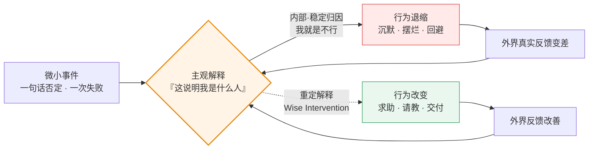

> [📚 总目录](./)　·　[下一篇 ➡️](roadmap-Ordinary-Magic-16主题演化地图.md)

---

> 📅 最后更新：2026-09-30 · 📖 **16 个主题** · 📝 约 4.2 万字（41,713 汉字 / 67,294 字符） · ⏱️ 约 55 分钟 · 🌐 简体中文（附英文版 `en/`）
> **一句话核心提炼：** 客观事实从来不致命，致命的是你对事实的**解释**；所谓「最小的努力」，就是把力气花在改写解释上，而不是死磕现实。
> **我的思维演化：** 从「用机制把人捆在一起逼出合作」（连坐、互审、双签、重罚），转向「先消灭作恶的物理杠杆，再用叙事重定每个人的身份」。尺子很硬：前 6 局我靠话术过关，后 6 局我靠制度过关，而真正把我打醒的，是 3 局我答不出来的。

> [!NOTE]
> **这份笔记是什么**：一份把格雷戈里·沃尔顿（Gregory M. Walton）的《Ordinary Magic》拆进 16 个高压决策场景的实战笔记。每个主题严格分成两块——📖「原书核心精髓」可以脱离我的经历独立读；⚡「我的演化与实践」是我自己在沙盘里的选择、被反杀的经过和留下的规则。
> **这份笔记不是什么**：不是原书摘要，也不是原书替代品。我没有原书全文，📖 部分的来源是 AI 陪练官对原书的转述，**未见原文引文**，故统一标「置信度：中」。书目信息已用出版社官方页面与 Google Books 目录页核验（置信度：高）。
> **核验状态**：全部引文、数字与目录对应关系，见 [附录 B：书目信息与数据核验](C-附录B-书目信息-ISBN-目录核验.md)。

📑 目录

**先读这里**
- [🚪 30 秒看懂这份笔记](00-导览-最小努力法则-30秒读懂.md)
- [🧭 学习演化地图](roadmap-Ordinary-Magic-16主题演化地图.md)

**深度拆解：精髓 vs 演化**
- [01. 向下螺旋：为什么一句平淡的否定能毁掉一个新人](01-向下螺旋-新人被否定-行为前置.md)
- [02. 我能做到吗：把「我们完了」降维成一张工单](02-习得性无助-归因维度-工单降维.md)
- [03. 我是谁：给他一个名词，再用这个名词锁住他的行为](03-身份重塑-名词的力量-撕标签.md)
- [04. 你爱/看重我吗：为什么越安慰，对方越觉得自己被看扁](04-受威胁的自尊-为什么安慰会适得其反.md)
- [05. 我能信任你吗：别自证清白，把结局摆到他面前](05-信任重建-猜忌-终局利益推演.md)
- [06. 我属于这里吗：不要让他融入，让他变得不可替代](06-归属感-局外人-功能性互补.md)
- [07. 宏观制度：制度传递的暗语，比制度条文更致命](07-制度设计-连坐-移情式纪律.md)
- [08. 大考一 · 临危受命：当三套正确的机制互相抵消](08-临危受命-横向否决权-非对称激励.md)
- [09. 大考二 · 定向爆破：你惩罚过的天才，会反过来敲诈你](09-刺头天才-勒索-希望的架构.md)
- [10. 大考三 · 吹哨人悖论：抽屉协议是你亲手递出去的刀](10-吹哨人悖论-抽屉协议-自首式披露.md)
- [11. 大考四 · 天才爆破手：你赢了规矩，输了资产负债表](11-明智反馈-元信号-天才爆破手.md)
- [12. 开场局 · 叙事重构总纲：整本书的第一性原理](12-叙事重构-禀赋效应-冷处理.md)
- [13. 群体常模：为什么「大家都想卷」是个沉默的谎言](13-群体常模-动态常模-私下信念差.md)
- [14. 超越性目的：为什么「科技向善」和「就是为钱」都是毒药](14-超越性目的-双重动机-沈博士.md)
- [15. 体制隐喻：为什么拆掉格子间比发奖金更管用](15-体制隐喻-支架型隐喻-洛哥雕塑.md)
- [16. 涟漪效应：为什么一场「奇迹」会在半年后打回原形](16-涟漪效应-递归循环-探针重构.md)

**附录与边界**
- [🧾 附录 A：60 条行动算法总表](A-附录A-60条行动算法总表.md)
- [⚠️ 方法论的边界与已知盲区](B-边界-心理干预13条失效条件.md)
- [📎 附录 B：书目信息与数据核验](C-附录B-书目信息-ISBN-目录核验.md)
- [🧩 收束：这份笔记真正改变的东西](Z-收束-结构与叙事的先后.md)

---

# 🚪 先读这里：30 秒看懂这份笔记

### 一、原书在讲什么

三句话：

1. 人不是被**客观现实**驱动的，而是被**自己对现实的解释**驱动的。
2. 一个微小的负面解释会自我喂养、越滚越大（**向下螺旋**）；反过来，在关键节点上改写一个解释，也能让行为反向自我强化（**向上螺旋**）。
3. 这种改写叫 **明智干预（Wise Interventions）**——它通常极短、极轻、甚至只有一句话或一个动作，却能改变一条人生轨迹。这就是书名「平凡的魔法 / Ordinary Magic」。

> **读法提示**：这张图里唯一值得你记住的，是中间那个方框——**同一个方框，既是崩盘的起点，也是翻盘的起点**。全书所有技巧都是在改这一个方框。

### 二、这个「沙盘」是怎么玩的

这不是读书会，是一场对抗式推演。循环是这样跑的：

1. **陪练官布场景** —— 抛出一个高压处境（空降主管、合伙人对峙、伴侣崩溃、IPO 前夜），你被放进一个具体的角色里。
2. **连环选择题** —— 2～3 道四选一，选项之间互为二阶后果。从第三局起，我要求陪练官**删掉选项后面所有提示性标签**（「诉诸专家身份建构」这类剧透），每条路看起来都合理。
3. **我给出选项组合 + 底层逻辑** —— 通常只有几个字母（`c和b`、`bcc`），加一句理由。
4. **后果推演 + 黑天鹅突变** —— 陪练官先推演我选对的部分，然后甩出一个「情境突变」把我打回原形：你稳住的那个人，反过来指控你 PUA 他。
5. **现场接招 → 收敛到第一性原理 → 四向全维扩张** —— 我用一句话接招；陪练官把它挂回原书某一章的第一性原理；再从四个维度（边界漏洞 / 跨领域映射 / 行动算法 / 时代版本）把它推到极限。

> ⚠️ **两句免责（必读）**
> **第一句**：笔记中所有沙盘场景、人物（小张、老雷、阿杰、老岳、沈澈……）、对话与情节，全部为 AI 陪练官构造的寓言，用于压力测试认知，**不对应任何真实个人、机构或事件**。文中出现的公司、门店、基金、交易所等均为虚构。
> **第二句**：陪练官引用、发挥的心理学概念与跨领域映射（行为经济学、量化金融、演化生物学、区块链等），**归属其自身发挥**；只有标注为「原书第一性原理」的部分，才代表《Ordinary Magic》的作者立场，且这部分我未见原文，置信度为「中」。

### 三、三个背景常识（缺了后面会看不懂）

| # | 常识 | 一句话说人话 | 不补的后果 |
| :--: | :--- | :--- | :--- |
| 1 | **明智干预（Wise Intervention）** | 不改动客观任务，只改动对方对这个任务的**解释** | 会把全书读成「话术大全」 |
| 2 | **螺旋的递归性（Recursive Cycle）** | 解释 → 行为 → 外界反馈 → 强化原解释，一圈一圈自我坐实 | 不懂为什么「一件小事」能滚成崩盘 |
| 3 | **五大核心拷问** | 原书把人生困境归为 5 个问题：我能做到吗 / 我属于这里吗 / 我是谁 / 你爱我吗 / 我能信任你吗 | 看不出 12 个沙盘的归类逻辑 |

> 五大拷问对应的章节：**我能做到吗** = Ch4 · **我属于这里吗** = Ch3 · **我是谁** = Ch5 · **你爱我吗** = Ch7 · **我能信任你吗** = Ch8。（置信度：高，来自 Google Books 目录页）

### 四、出场人物速查

| 人物 | 出现在 | 身份 | 他代表的困境 |
| :--- | :--- | :--- | :--- |
| 小张 | 主题 12 | 背锅后防御性摆烂的老员工 | 「我是一个正在被淘汰的人」 |
| 小白 | 主题 01 | 入职第一周被当众打断的应届生 | 一句否定滚成向下螺旋 |
| 老王 | 主题 01 | 被我寄望「现身说法」的老员工 | 善意谎言被现实戳穿 |
| CTO / 主设计师 | 主题 02 | 产品上线崩盘后的核心骨干 | 把失败归因为「基因不行」 |
| 阿杰 | 主题 03 | 被贴「刺头 / 不合作」标签的员工 | 行为标签 vs 身份标签 |
| 林 | 主题 04 | 苦战半年却惨败的伴侣 | 受威胁的自尊心 |
| 老赵 | 主题 05 | 认定公司要清洗他的资深老员工 | 绩效面谈里的零信任 |
| 老雷 | 主题 05 | 现金流危机中的联合创始人 | 猜忌中的合伙人对峙 |
| 小陈 | 主题 06 | 空降进「嫡系圈」的实战派技术 | 归属不确定性 |
| 名校骨干 | 主题 06 | 圈内既得利益者 | 部落式排外 |
| 老秦 | 主题 07 | 套现 8,000 元的资深老店长 | 系统性违规是谁的错 |
| 老张 / 小徐 | 主题 08 | 传统厂技术总监 / 空降产品经理 | 圈层割裂与双签死结 |
| 阿蒙 / 小刘 | 主题 09 | 天才架构师 / 被勒索的风控专员 | 被惩罚后反手敲诈 |
| 老岳 | 主题 10 | 越权抢下 8,000 万订单的功臣 | 立大功 + 捅大篓子 |
| 沈澈 | 主题 11 | 天才首席架构师，自尊薄如蝉翼 | 高难度反馈的送达 |
| 陪练官 | 全部 | 「杠精陪练官」 | 负责在每一局的后半段打我脸 |
| 沈博士 | 主题 14 | AI 医疗独角兽首席病理专家 | 「我的牺牲被当成理所当然的消耗品」 |
| 洛哥 | 主题 15 | 被收购工作室首席设计师 | 「创新就是财报数字，流程是勒死创作者的绞索」 |
| 集团 COO | 主题 15 | 跨国咨询集团新任 COO | 「买来的团队不是硬塞进模具，应是引领者」 |
| RM 试点组 | 主题 16 | 资管 MD 麾下 10 名垫底客户经理 | 「被客户拒绝 = 市场边界校准」的递归自持 |

🔤 一分钟术语急救包（39 条大白话）

| 术语 | 大白话 |
| :--- | :--- |
| 明智干预 (Wise Intervention) | 任务一点不改，只改对方对任务的想法 |
| 向下螺旋 (Spiraling Down) | 一件小事被解释成「我不行」，然后越做越差，越差越确信 |
| 向上螺旋 (Spiraling Up) | 反过来：一次小成功被解释成「我能行」，然后越做越好 |
| 叙事重构 (Narrative Reframing) | 给同一件事换一个说法，说法变了行为就变 |
| 归属不确定性 (Belonging Uncertainty) | 刚进新环境时，把每个冷场都解读成「这里不欢迎我」 |
| 逆境常态化 (Normalizing Adversity) | 「不是你不行，是来的人前三个月都这样」 |
| 习得性无助 (Learned Helplessness) | 摔太多次之后，认定做什么都没用，干脆不动 |
| 归因维度 (Attributional Dimension) | 把坏事归到「我整个人不行」还是「这 3 个 bug」 |
| 内部·稳定归因 | 归给自己、且认为永远改不了 → 最毒 |
| 外部·不稳定归因 | 归给环境、且认为只是暂时的 → 最健康 |
| 身份重塑 (Identity Reframing) | 不改行为，改「他是什么人」的定义 |
| 名词的力量 (Power of Nouns) | 「你很仔细」是形容词，「你是风险防御者」是名词；名词能锁行为 |
| 自我一致性偏误 (Self-Consistency Bias) | 人会自动做出符合自己人设的事 |
| 说即是信 (Saying-is-Believing) | 劝别人的时候，其实是在说服自己 |
| 倡导者效应 (Advocate Effect) | 让他去教新人，他为了教得像样，先把自己说服了 |
| 受威胁的自尊 (Threatened Ego) | 越挫败时，越把安慰听成嘲笑 |
| 同情即看扁 | 你说「没关系」，他听成「你也觉得我不行」 |
| 认知镜像反弹 | 把「你在鄙视我」反转成「是你对自己没信心了」 |
| 确认偏误 (Confirmation Bias) | 认定你要害他之后，你做什么都是在害他 |
| 恶意顺从 (Malicious Compliance) | 你说什么他做什么，绝不多做一步，哪怕前面是悬崖 |
| 过度理由效应 (Overjustification Effect) | 大张旗鼓地表扬，反而让他觉得「你是在可怜我」 |
| 悖论意向 (Paradoxical Intention) | 干脆承认最坏结果，恐惧反而消失 |
| 现实检验 (Reality Testing) | 别脑补最坏结果，去真问 10 个用户 |
| 暴露疗法 / 满灌 (Flooding) | 一次给足最猛的负面刺激，让恐惧脱敏 |
| 程序正义 (Procedural Justice) | 人可以接受被罚，但不能接受「底层割喉、高层豁免」 |
| 恢复性司法 (Restorative Justice) | 罚完给一条明确的、能重新赢回信任的路 |
| 超常目标 (Superordinate Goals) | 制造一个必须合作才能解决的共同危机 |
| 抽屉协议 (Side Letter) | 不能拿到董事会/审计师面前的私下承诺 = 定时炸弹 |
| 动态常模 (Dynamic Norms) | 不靠命令改行为，靠「变化正在发生」的信号改变群体默认 |
| 多元无知 (Pluralistic Ignorance) | 人人都厌恶陋习却误以为别人都正常，于是继续表演坐实假共识 |
| 谢林点 (Schelling Point) | 不用交流就默认的协调锚点（深夜秒回 = 忠诚） |
| 信息级联 (Information Cascades) | 看到别人抛售就跟着抛，不看基本面，只推断别人知道内情 |
| 双重动机 (Dual-Motive) | 超越性目的感 + 个体自我利益 的深度咬合，而非二选一 |
| 支架型隐喻 (Scaffolding Metaphor) | 制度不是定义你该是谁，而是向你独特性注入资源的传输协议 |
| 可供性 (Affordance) | 环境给新行为提供的客观支撑或阻力，盐碱地种不出庄稼 |
| 递归循环 (Recursive Cycle) | 信念→行为→环境反馈→强化信念 的自我维持引擎 |
| 关键窗口 (Critical Juncture) | 旧解释框架崩塌、极渴新解法的脆弱时刻，干预的最佳注入点 |
| 世代传承 (Intergenerational Transmission) | 先锋带新人跑通最小闭环，队列滚动扩散而非大水漫灌 |

---

---

> [📚 总目录](./)　·　[下一篇 ➡️](roadmap-Ordinary-Magic-16主题演化地图.md)
