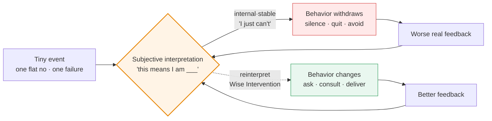

> [📚 Index](./)　·　[Next ➡️](roadmap-16-topic-evolution-map.md)

---

> 📅 Last updated: 2026-09-30 · 📖 **16 themes** · 📝 ~42k Chinese characters (≈ a 42k-character notebook) · ⏱️ ~55 min · 🌐 English (Chinese version in `docs/`)
> **One-line core takeaway:** Objective facts are never what's fatal — the interpretation you put on them is. The "minimum effort" is spending your effort rewriting the interpretation, not fighting reality.
> **My thinking evolution:** From "use mechanisms to bind people into cooperation" (collective punishment, mutual review, dual sign-off, harsh penalties) toward "first eliminate the physical leverage to do harm, then use narrative to redefine everyone's identity." The hard metric: in my first 6 rounds I won on rhetoric; the next 6 on system design — and what truly woke me up were the 3 rounds I couldn't answer.

> [!NOTE]
> **What this notebook is**: A practical reader's notebook thatbreaks down Gregory M. Walton's *Ordinary Magic* into 16 high-pressure decision scenarios. Each theme splits strictly into two blocks — 📖 "Author's Core Insight" reads independently of my experience; ⚡ "My Evolution & Practice" is my own choices in the sandbox, how I got counter-killed, and the rules I kept.
> **What this notebook is NOT**: Not a book summary, not a substitute for the book. I do not have the full text; the 📖 content is the AI sparring partner's retelling of the book, **with no direct quotations from the original**, hence uniformly marked "Confidence: Medium". Bibliography is verified against the publisher's official page and Google Books' table of contents (Confidence: High).
> **Verification status**: All quotations, numbers, and chapter correspondences are in [Appendix B: Bibliography & Verification](C-appendix-b-bibliography.md).

📑 Table of Contents

**Start Here**
- [🚪 30-Second Orientation](00-start-here-30-second-orientation.md)
- [🧭 Learning Evolution Roadmap](roadmap-16-topic-evolution-map.md)

**Deep Dive: Essence vs. Evolution**
- [01. Downward Spiral: How One Flat No Undoes a New Hire](01-downward-spiral-newhire.md)
- [02. Can I Do It: Downgrading "We're Doomed" to a Ticket](02-learned-helplessness-work-order.md)
- [03. Who Am I: Give Him a Noun, Then Lock His Behavior](03-identity-reframing-labels.md)
- [04. Do You Love Me: Why Comfort Backfires on the Wounded](04-threatened-ego-comfort-backfires.md)
- [05. Can I Trust You: Stop Self-Defending, Show Him the Endgame](05-trust-rebuilding-suspicion.md)
- [06. Do I Belong: Don't Make Him Fit In, Make Him Irreplaceable](06-belonging-outsider.md)
- [07. Macro System: What a System Whispers Matters More Than Its Text](07-institutional-design-linkage.md)
- [08. Trial I · Crisis Leadership: When Three Correct Mechanisms Cancel](08-crisis-leadership-veto.md)
- [09. Trial II · The Brilliant Jerk: The Genius You Punished Blackmails You](09-brilliant-jerk-blackmail.md)
- [10. Trial III · Whistleblower Paradox: The Side Letter Is the Knife You Handed Him](10-whistleblower-side-letter.md)
- [11. Trial IV · Wise Feedback: You Won the Rule, Lost the Balance Sheet](11-wise-feedback-meta-signal.md)
- [12. Opening Round · Narrative Reframing: The First Principle of the Book](12-narrative-reframing-endowment.md)
- [13. Dynamic Norms: Why "Everyone Wants to Grind" Is a Silent Lie](13-dynamic-norms-belief-gap.md)
- [14. Self-Transcendent Purpose: Why "Tech for Good" and "It's Just Money" Are Both Poison](14-self-transcendent-purpose-dual-motive.md)
- [15. Institutional Metaphor: Why Tearing Down Cubicles Beats Bonuses](15-institutional-metaphor-scaffolding.md)
- [16. Ripple Effects: Why a "Miracle" Reverts in Six Months](16-ripple-effects-recursive-cycle.md)

**Appendices & Boundaries**
- [🧾 Appendix A: 60 Action Algorithms](A-appendix-a-60-action-algorithms.md)
- [⚠️ Methodological Boundaries & Known Blind Spots](B-boundaries-13-failure-conditions.md)
- [📎 Appendix B: Bibliography & Verification](C-appendix-b-bibliography.md)
- [🧩 Closing: What This Notebook Actually Changed](Z-closing-structure-vs-narrative.md)

---

# 🚪 Start Here: 30-Second Orientation

### I. What the book is about

Three sentences:

1. People are driven not by **objective reality** but by **their interpretation of reality**.
2. A tiny negative interpretation feeds itself and snowballs (the **downward spiral**); conversely, rewriting one interpretation at a key moment makes behavior self-reinforce upward (the **upward spiral**).
3. This rewrite is called a **Wise Intervention** — usually extremely short, light, even a single sentence or gesture, yet it can bend a life's trajectory. That is the book's title: "ordinary magic."

> **How to read this**: The only box worth remembering is the middle one — **the same box is both the start of collapse and the start of turnaround**. Every technique in the book attacks this one box.

### II. How this "sandbox" works

This is not a book club; it is adversarial war-gaming. The loop runs like this:

1. **The sparring partner sets the scene** — drops you into a high-pressure situation (parachuted-in manager, founder standoff, partner breakdown, eve of IPO) with a specific role.
2. **Consecutive multiple-choice** — 2–3 four-option questions where options are second-order consequences of each other. From round 3 on, I asked the partner to **strip the hint labels** after each option (labels like "appeal to expert identity construction" spoiled the twist), so every path looked reasonable.
3. **I give the option combo + underlying logic** — usually just a few letters (`c and b`, `bcc`) plus one line of reasoning.
4. **Consequence simulation + black-swan mutation** — the partner first plays out what I got right, then throws a "situation mutation" that knocks me back: the person you stabilized turns around and accuses you of PUA.
5. **Live response → converge to first principle → four-dimension expansion** — I answer in one line; the partner hangs it back on a chapter's first principle; then pushes it to the limit across four dimensions (boundary holes / cross-domain mapping / action algorithm / era version).

> ⚠️ **Two disclaimers (must read)**
> **First**: All sandbox scenes, characters (Xiao Zhang, Old Lei, A-Jie, Old Yue, Shen Che…), dialogues, and plots in this notebook are **fictional parables constructed by the AI sparring partner** for stress-testing cognition. They **correspond to no real individual, organization, or event**. All companies, stores, funds, and exchanges mentioned are fictional.
> **Second**: The psychology concepts and cross-domain mappings the partner cites or improvises (behavioral economics, quantitative finance, evolutionary biology, blockchain, etc.) **belong to its own improvisation**; only the parts labeled "book's first principle" represent the author's stance of *Ordinary Magic* — and since I have not seen the original, their confidence is "Medium."

### III. Three background essentials (you'll be lost without them)

| # | Essential | Plain words | Cost of skipping |
| :--: | :--- | :--- | :--- |
| 1 | **Wise Intervention** | Change nothing about the objective task; only change his *interpretation* of it | You'll read the book as "a manual of rhetoric tricks" |
| 2 | **Recursive cycle of spirals** | interpretation → behavior → external feedback → reinforces the original interpretation, self-confirming round by round | You won't see why "one small thing" snowballs into collapse |
| 3 | **The five core questions** | The book reduces life's dilemmas to 5 questions: Can I succeed? / Do I belong? / Who am I? / Am I loved? / Can I trust you? | You won't see the classification logic of the 16 sandboxes |

> The five questions map to chapters: **Can I do it** = Ch4 · **Do I belong** = Ch3 · **Who am I** = Ch5 · **Am I loved** = Ch7 · **Can I trust you** = Ch8. (Confidence: High, from Google Books TOC.)

### IV. Character quick-reference

| Character | Appears in | Role | The dilemma he represents |
| :--- | :--- | :--- | :--- |
| Xiao Zhang | Theme 12 | Old hand who defensively slacks after taking the blame | "I am someone being phased out" |
| Xiao Bai | Theme 01 | New grad publicly cut off in week one | One negation snowballs into a downward spiral |
| Old Wang | Theme 01 | Senior I hoped would "lead by example" | A kindly lie punctured by reality |
| CTO / Lead Designer | Theme 02 | Core backbone after a product launch crashed | Attributing failure to "bad genes" |
| A-Jie | Theme 03 | Employee labeled "troublemaker / uncooperative" | Behavior label vs. identity label |
| Lin | Theme 04 | Partner who fought hard for half a year then lost | Threatened ego |
| Old Zhao | Theme 05 | Veteran who believes the company is purging him | Zero-trust in a performance review |
| Old Lei | Theme 05 | Co-founder in a cash-flow crisis | Suspicion in a founder standoff |
| Xiao Chen | Theme 06 | Field-tech parachuted into the "inner circle" | Belonging uncertainty |
| Elite backbone | Theme 06 | Entrenched insider | Tribal exclusion |
| Old Qin | Theme 07 | Veteran store manager who cashed out 8,000 yuan | Whose fault is systemic violation |
| Old Zhang / Xiao Xu | Theme 08 | Traditional-factory tech director / parachuted product manager | Circle rift and the dual-signoff deadlock |
| A-Meng / Xiao Liu | Theme 09 | Genius architect / extorted risk-control clerk | Blackmails after being punished |
| Old Yue | Theme 10 | Hero who overstepped and grabbed an 80M yuan order | Huge credit + huge blunder |
| Shen Che | Theme 11 | Genius chief architect, ego thin as tissue paper | Delivery of high-difficulty feedback |
| Sparring partner | All | "The contrarian sparring partner" | Tasked with slapping my face in the second half of every round |

🔤 One-Minute Glossary (39 plain-language terms)

| Term | Plain words |
| :--- | :--- |
| Wise Intervention | Change nothing about the task; only change how he sees it |
| Downward Spiral (Spiraling Down) | A small thing interpreted as "I can't," then worse and worse, more convinced |
| Upward Spiral (Spiraling Up) | Reverse: one small success interpreted as "I can," then better and better |
| Narrative Reframing | Give the same event a different framing; behavior changes when the framing does |
| Belonging Uncertainty | On entering a new environment, reading every awkward silence as "they don't want me" |
| Normalizing Adversity | "It's not that you're no good — everyone's first three months are like this" |
| Learned Helplessness | After enough falls, concluding nothing works, so you just stop |
| Attributional Dimension | Blaming a bad thing on "my whole self" vs. "these 3 bugs" |
| Internal·Stable attribution | Blaming yourself, and believing it's forever unfixable → most toxic |
| External·Unstable attribution | Blaming the environment, and believing it's only temporary → healthiest |
| Identity Reframing | Don't change behavior; redefine who he "is" |
| Power of Nouns | "You're careful" is an adjective; "you're a risk defender" is a noun — nouns lock behavior |
| Self-Consistency Bias | People automatically act consistent with their persona |
| Saying-is-Believing | When you persuade others, you're really convincing yourself |
| Advocate Effect | Make him teach the newbie; to teach well he first convinces himself |
| Threatened Ego | The more he fails, the more he hears comfort as mockery |
| Sympathy = condescension | You say "it's fine"; he hears "you also think I'm no good" |
| Cognitive Mirror Rebound | Flip "you look down on me" into "you're insecure about yourself" |
| Confirmation Bias | Once convinced you're out to get him, everything you do proves it |
| Malicious Compliance | He does exactly what you say, never a step more, even off a cliff |
| Overjustification Effect | Lavish praise makes him feel "you pity me" |
| Paradoxical Intention | Admit the worst outcome outright; the fear dissolves |
| Reality Testing | Don't fantasize the worst; actually ask 10 users |
| Flooding (exposure) | One maximal negative hit at once, to desensitize the fear |
| Procedural Justice | People accept being punished, but not "throat-cutting at the bottom, immunity at the top" |
| Restorative Justice | After punishing, give a clear path to re-earn trust |
| Superordinate Goals | Manufacture a common crisis that can only be solved by cooperating |
| Side Letter | A private promise that can't face the board/auditor = a time bomb |
| Dynamic Norms | Change group default not by command but by signals that "change is already happening" |
| Pluralistic Ignorance | Everyone hates the bad habit yet assumes others are fine with it, so keeps performing |
| Schelling Point | A coordination anchor assumed without discussion (late-night instant replies = loyalty) |
| Information Cascades | Seeing others sell, you sell too, ignoring fundamentals, assuming they know something |
| Dual-Motive | Transcendent purpose + self-interest, deeply meshed, not either/or |
| Scaffolding Metaphor | The system doesn't define who you should be; it's a protocol injecting resources into your uniqueness |
| Affordance | The objective support or resistance the environment gives new behavior; no crop in saline soil |
| Recursive Cycle | belief → behavior → environmental feedback → reinforces belief, a self-sustaining engine |
| Critical Juncture | The fragile moment when the old interpretive frame collapses and craves a new solution |
| Intergenerational Transmission | Pioneers bring a newbie to a minimal closed loop; the cohort rolls and spreads, not a flood |

---

---

> [📚 Index](./)　·　[Next ➡️](roadmap-16-topic-evolution-map.md)
