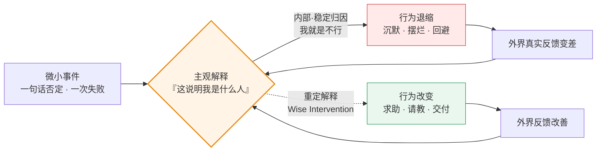

# 📘 《最小努力法则》(Ordinary Magic) — 核心精髓与思维演化笔记

> 📅 最后更新：2026-09-30 · 📖 **16 个主题** · 📝 约 4.2 万字（41,713 汉字 / 67,294 字符） · ⏱️ 约 55 分钟 · 🌐 简体中文（附英文版 `en/`）
> **一句话核心提炼：** 客观事实从来不致命，致命的是你对事实的**解释**；所谓「最小的努力」，就是把力气花在改写解释上，而不是死磕现实。
> **我的思维演化：** 从「用机制把人捆在一起逼出合作」（连坐、互审、双签、重罚），转向「先消灭作恶的物理杠杆，再用叙事重定每个人的身份」。尺子很硬：前 6 局我靠话术过关，后 6 局我靠制度过关，而真正把我打醒的，是 3 局我答不出来的。

> [!NOTE]
> **这份笔记是什么**：一份把格雷戈里·沃尔顿（Gregory M. Walton）的《Ordinary Magic》拆进 16 个高压决策场景的实战笔记。每个主题严格分成两块——📖「原书核心精髓」可以脱离我的经历独立读；⚡「我的演化与实践」是我自己在沙盘里的选择、被反杀的经过和留下的规则。
> **这份笔记不是什么**：不是原书摘要，也不是原书替代品。我没有原书全文，📖 部分的来源是 AI 陪练官对原书的转述，**未见原文引文**，故统一标「置信度：中」。书目信息已用出版社官方页面与 Google Books 目录页核验（置信度：高）。
> **核验状态**：全部引文、数字与目录对应关系，见 [附录 B：书目信息与数据核验](#appendix-b)。

<details><summary>📑 目录</summary>

**先读这里**
- [🚪 30 秒看懂这份笔记](#guide)
- [🧭 学习演化地图](#roadmap)

**深度拆解：精髓 vs 演化**
- [01. 向下螺旋：为什么一句平淡的否定能毁掉一个新人](#d01)
- [02. 我能做到吗：把「我们完了」降维成一张工单](#d02)
- [03. 我是谁：给他一个名词，再用这个名词锁住他的行为](#d03)
- [04. 你爱/看重我吗：为什么越安慰，对方越觉得自己被看扁](#d04)
- [05. 我能信任你吗：别自证清白，把结局摆到他面前](#d05)
- [06. 我属于这里吗：不要让他融入，让他变得不可替代](#d06)
- [07. 宏观制度：制度传递的暗语，比制度条文更致命](#d07)
- [08. 大考一 · 临危受命：当三套正确的机制互相抵消](#d08)
- [09. 大考二 · 定向爆破：你惩罚过的天才，会反过来敲诈你](#d09)
- [10. 大考三 · 吹哨人悖论：抽屉协议是你亲手递出去的刀](#d10)
- [11. 大考四 · 天才爆破手：你赢了规矩，输了资产负债表](#d11)
- [12. 开场局 · 叙事重构总纲：整本书的第一性原理](#d12)
- [13. 群体常模：为什么「大家都想卷」是个沉默的谎言](#d13)
- [14. 超越性目的：为什么「科技向善」和「就是为钱」都是毒药](#d14)
- [15. 体制隐喻：为什么拆掉格子间比发奖金更管用](#d15)
- [16. 涟漪效应：为什么一场「奇迹」会在半年后打回原形](#d16)

**附录与边界**
- [🧾 附录 A：60 条行动算法总表](#appendix-a)
- [⚠️ 方法论的边界与已知盲区](#limits)
- [📎 附录 B：书目信息与数据核验](#appendix-b)
- [🧩 收束：这份笔记真正改变的东西](#closing)

</details>

---

<a id="guide"></a>
## 🚪 先读这里：30 秒看懂这份笔记

### 一、原书在讲什么

三句话：

1. 人不是被**客观现实**驱动的，而是被**自己对现实的解释**驱动的。
2. 一个微小的负面解释会自我喂养、越滚越大（**向下螺旋**）；反过来，在关键节点上改写一个解释，也能让行为反向自我强化（**向上螺旋**）。
3. 这种改写叫 **明智干预（Wise Interventions）**——它通常极短、极轻、甚至只有一句话或一个动作，却能改变一条人生轨迹。这就是书名「平凡的魔法 / Ordinary Magic」。



> **读法提示**：这张图里唯一值得你记住的，是中间那个方框——**同一个方框，既是崩盘的起点，也是翻盘的起点**。全书所有技巧都是在改这一个方框。

### 二、这个「沙盘」是怎么玩的

这不是读书会，是一场对抗式推演。循环是这样跑的：

1. **陪练官布场景** —— 抛出一个高压处境（空降主管、合伙人对峙、伴侣崩溃、IPO 前夜），你被放进一个具体的角色里。
2. **连环选择题** —— 2～3 道四选一，选项之间互为二阶后果。从第三局起，我要求陪练官**删掉选项后面所有提示性标签**（「诉诸专家身份建构」这类剧透），每条路看起来都合理。
3. **我给出选项组合 + 底层逻辑** —— 通常只有几个字母（`c和b`、`bcc`），加一句理由。
4. **后果推演 + 黑天鹅突变** —— 陪练官先推演我选对的部分，然后甩出一个「情境突变」把我打回原形：你稳住的那个人，反过来指控你 PUA 他。
5. **现场接招 → 收敛到第一性原理 → 四向全维扩张** —— 我用一句话接招；陪练官把它挂回原书某一章的第一性原理；再从四个维度（边界漏洞 / 跨领域映射 / 行动算法 / 时代版本）把它推到极限。

> ⚠️ **两句免责（必读）**
> **第一句**：笔记中所有沙盘场景、人物（小张、老雷、阿杰、老岳、沈澈……）、对话与情节，全部为 AI 陪练官构造的寓言，用于压力测试认知，**不对应任何真实个人、机构或事件**。文中出现的公司、门店、基金、交易所等均为虚构。
> **第二句**：陪练官引用、发挥的心理学概念与跨领域映射（行为经济学、量化金融、演化生物学、区块链等），**归属其自身发挥**；只有标注为「原书第一性原理」的部分，才代表《Ordinary Magic》的作者立场，且这部分我未见原文，置信度为「中」。

### 三、三个背景常识（缺了后面会看不懂）

| # | 常识 | 一句话说人话 | 不补的后果 |
| :--: | :--- | :--- | :--- |
| 1 | **明智干预（Wise Intervention）** | 不改动客观任务，只改动对方对这个任务的**解释** | 会把全书读成「话术大全」 |
| 2 | **螺旋的递归性（Recursive Cycle）** | 解释 → 行为 → 外界反馈 → 强化原解释，一圈一圈自我坐实 | 不懂为什么「一件小事」能滚成崩盘 |
| 3 | **五大核心拷问** | 原书把人生困境归为 5 个问题：我能做到吗 / 我属于这里吗 / 我是谁 / 你爱我吗 / 我能信任你吗 | 看不出 12 个沙盘的归类逻辑 |

> 五大拷问对应的章节：**我能做到吗** = Ch4 · **我属于这里吗** = Ch3 · **我是谁** = Ch5 · **你爱我吗** = Ch7 · **我能信任你吗** = Ch8。（置信度：高，来自 Google Books 目录页）

### 四、出场人物速查

| 人物 | 出现在 | 身份 | 他代表的困境 |
| :--- | :--- | :--- | :--- |
| 小张 | 主题 12 | 背锅后防御性摆烂的老员工 | 「我是一个正在被淘汰的人」 |
| 小白 | 主题 01 | 入职第一周被当众打断的应届生 | 一句否定滚成向下螺旋 |
| 老王 | 主题 01 | 被我寄望「现身说法」的老员工 | 善意谎言被现实戳穿 |
| CTO / 主设计师 | 主题 02 | 产品上线崩盘后的核心骨干 | 把失败归因为「基因不行」 |
| 阿杰 | 主题 03 | 被贴「刺头 / 不合作」标签的员工 | 行为标签 vs 身份标签 |
| 林 | 主题 04 | 苦战半年却惨败的伴侣 | 受威胁的自尊心 |
| 老赵 | 主题 05 | 认定公司要清洗他的资深老员工 | 绩效面谈里的零信任 |
| 老雷 | 主题 05 | 现金流危机中的联合创始人 | 猜忌中的合伙人对峙 |
| 小陈 | 主题 06 | 空降进「嫡系圈」的实战派技术 | 归属不确定性 |
| 名校骨干 | 主题 06 | 圈内既得利益者 | 部落式排外 |
| 老秦 | 主题 07 | 套现 8,000 元的资深老店长 | 系统性违规是谁的错 |
| 老张 / 小徐 | 主题 08 | 传统厂技术总监 / 空降产品经理 | 圈层割裂与双签死结 |
| 阿蒙 / 小刘 | 主题 09 | 天才架构师 / 被勒索的风控专员 | 被惩罚后反手敲诈 |
| 老岳 | 主题 10 | 越权抢下 8,000 万订单的功臣 | 立大功 + 捅大篓子 |
| 沈澈 | 主题 11 | 天才首席架构师，自尊薄如蝉翼 | 高难度反馈的送达 |
| 陪练官 | 全部 | 「杠精陪练官」 | 负责在每一局的后半段打我脸 |
| 沈博士 | 主题 14 | AI 医疗独角兽首席病理专家 | 「我的牺牲被当成理所当然的消耗品」 |
| 洛哥 | 主题 15 | 被收购工作室首席设计师 | 「创新就是财报数字，流程是勒死创作者的绞索」 |
| 集团 COO | 主题 15 | 跨国咨询集团新任 COO | 「买来的团队不是硬塞进模具，应是引领者」 |
| RM 试点组 | 主题 16 | 资管 MD 麾下 10 名垫底客户经理 | 「被客户拒绝 = 市场边界校准」的递归自持 |

<details><summary>🔤 一分钟术语急救包（39 条大白话）</summary>

| 术语 | 大白话 |
| :--- | :--- |
| 明智干预 (Wise Intervention) | 任务一点不改，只改对方对任务的想法 |
| 向下螺旋 (Spiraling Down) | 一件小事被解释成「我不行」，然后越做越差，越差越确信 |
| 向上螺旋 (Spiraling Up) | 反过来：一次小成功被解释成「我能行」，然后越做越好 |
| 叙事重构 (Narrative Reframing) | 给同一件事换一个说法，说法变了行为就变 |
| 归属不确定性 (Belonging Uncertainty) | 刚进新环境时，把每个冷场都解读成「这里不欢迎我」 |
| 逆境常态化 (Normalizing Adversity) | 「不是你不行，是来的人前三个月都这样」 |
| 习得性无助 (Learned Helplessness) | 摔太多次之后，认定做什么都没用，干脆不动 |
| 归因维度 (Attributional Dimension) | 把坏事归到「我整个人不行」还是「这 3 个 bug」 |
| 内部·稳定归因 | 归给自己、且认为永远改不了 → 最毒 |
| 外部·不稳定归因 | 归给环境、且认为只是暂时的 → 最健康 |
| 身份重塑 (Identity Reframing) | 不改行为，改「他是什么人」的定义 |
| 名词的力量 (Power of Nouns) | 「你很仔细」是形容词，「你是风险防御者」是名词；名词能锁行为 |
| 自我一致性偏误 (Self-Consistency Bias) | 人会自动做出符合自己人设的事 |
| 说即是信 (Saying-is-Believing) | 劝别人的时候，其实是在说服自己 |
| 倡导者效应 (Advocate Effect) | 让他去教新人，他为了教得像样，先把自己说服了 |
| 受威胁的自尊 (Threatened Ego) | 越挫败时，越把安慰听成嘲笑 |
| 同情即看扁 | 你说「没关系」，他听成「你也觉得我不行」 |
| 认知镜像反弹 | 把「你在鄙视我」反转成「是你对自己没信心了」 |
| 确认偏误 (Confirmation Bias) | 认定你要害他之后，你做什么都是在害他 |
| 恶意顺从 (Malicious Compliance) | 你说什么他做什么，绝不多做一步，哪怕前面是悬崖 |
| 过度理由效应 (Overjustification Effect) | 大张旗鼓地表扬，反而让他觉得「你是在可怜我」 |
| 悖论意向 (Paradoxical Intention) | 干脆承认最坏结果，恐惧反而消失 |
| 现实检验 (Reality Testing) | 别脑补最坏结果，去真问 10 个用户 |
| 暴露疗法 / 满灌 (Flooding) | 一次给足最猛的负面刺激，让恐惧脱敏 |
| 程序正义 (Procedural Justice) | 人可以接受被罚，但不能接受「底层割喉、高层豁免」 |
| 恢复性司法 (Restorative Justice) | 罚完给一条明确的、能重新赢回信任的路 |
| 超常目标 (Superordinate Goals) | 制造一个必须合作才能解决的共同危机 |
| 抽屉协议 (Side Letter) | 不能拿到董事会/审计师面前的私下承诺 = 定时炸弹 |
| 动态常模 (Dynamic Norms) | 不靠命令改行为，靠「变化正在发生」的信号改变群体默认 |
| 多元无知 (Pluralistic Ignorance) | 人人都厌恶陋习却误以为别人都正常，于是继续表演坐实假共识 |
| 谢林点 (Schelling Point) | 不用交流就默认的协调锚点（深夜秒回 = 忠诚） |
| 信息级联 (Information Cascades) | 看到别人抛售就跟着抛，不看基本面，只推断别人知道内情 |
| 双重动机 (Dual-Motive) | 超越性目的感 + 个体自我利益 的深度咬合，而非二选一 |
| 支架型隐喻 (Scaffolding Metaphor) | 制度不是定义你该是谁，而是向你独特性注入资源的传输协议 |
| 可供性 (Affordance) | 环境给新行为提供的客观支撑或阻力，盐碱地种不出庄稼 |
| 递归循环 (Recursive Cycle) | 信念→行为→环境反馈→强化信念 的自我维持引擎 |
| 关键窗口 (Critical Juncture) | 旧解释框架崩塌、极渴新解法的脆弱时刻，干预的最佳注入点 |
| 世代传承 (Intergenerational Transmission) | 先锋带新人跑通最小闭环，队列滚动扩散而非大水漫灌 |

</details>

---

<a id="roadmap"></a>
## 🧭 学习演化地图 (Evolution Roadmap)

> **怎么读这张表**：左列是原书，中列是我。第一次看可以**只读中列**——它是脱离开沙盘也能用的结论；想知道出处再看左列。

| 章节/主题 | 🔑 原书核心精髓 (Author) | 💡 我的演化与实践 · 可迁移结论 (Me) | 目前状态 |
| :--- | :--- | :--- | :--- |
| Ch1-2 螺旋机制<br/>（主题 01） | 微小负面解释会递归放大 | **先允许触底，再剥离意义，再给一个无威胁的微小闭环**；不要在空中接一把落下的刀 | ✅ 已内化 |
| Ch4 我能做到吗<br/>（主题 02） | 无助感来自「普遍+永久」的归因 | **把存在主义危机降维成 Jira 工单**；禁定性词，强制定量 | ✅ 已内化 |
| Ch5 我是谁<br/>（主题 03） | 名词定义本质，能反向约束行为 | **给一个略高于事实的身份名词，他就必须按这个人设行事**；新身份 = 行为枷锁 | ✅ 已内化 |
| Ch7 你看重我吗<br/>（主题 04） | 受挫时，安慰会被翻译成同情 | **封锁同情 → 身份翻转（向他求助）→ 触发说即是信**；降低标准就是最彻底的蔑视 | ✅ 已内化 |
| Ch8 我能信任你吗<br/>（主题 05） | 猜忌中，一切自证都会被反转 | **冻结自证 → 认领最坏标签 → 快进到毁灭后 24 小时 → 用结构捆绑替代道德信任** | ✅ 已内化 |
| Ch3 我属于这里吗<br/>（主题 06） | 归属不确定性能自我坐实 | **禁止要求「融入」；把他的格格不入定义为稀缺资产**；用共同危机而非团建建立归属 | ✅ 已内化 |
| Ch6/9-11 宏观系统<br/>（主题 07，另见 13-16 专章） | 制度的隐含意义重于条文 | **禁连坐、责任原子化、把违规当系统 bug report、提供无耻辱修复路径** | ✅ 已内化 |
| 综合 · 主题 08 | 干预必须与权力和利益的支架咬合 | **先拔横向否决权 → 锁定单一主攻手 → 非对称激励 → 封装防守方价值** | 🔄 迭代中 |
| 综合 · 主题 09 | 系统若堵死救赎通道，就在制造恐怖分子 | **先物理截断勒索面 → 凿一条合法逃生舱 → 引入动态随机性 → 超短周期反馈** | 🔄 迭代中 |
| 综合 · 主题 10 | 暗箱利益补不了公开程序的窟窿 | **禁抽屉协议 → 动机/行为/结果三层切割 → 抢在吹哨前自首式披露 → 权限物理熔断** | 🔄 迭代中 |
| 综合 · 主题 11 | 处罚的杀伤力来自制度广播的元信号 | **剥离道德定性 → 双轨叙事包装 → 搭无损体面的下台阶梯 → 灰色地带制度化** | 🔄 迭代中 |
| 总纲 · 主题 12 | 行为由解释驱动，不由事实驱动 | **不改客观任务，只改主观解释**；求助是卸下防御最快的动作，冷处理是最高级的肯定 | ✅ 已内化 |
| Ch6 动态常模<br/>（主题 13） | 常模靠「变化正在发生」的信号改变 | **测私下信念差 → 宣传变化率 → 特例沙盒隔离 → 改默认值替代说教** | ✅ 已内化 |
| Ch9 自我超越<br/>（主题 14） | 动机真相是双重咬合 | **封杀二元宣教 → 微观动作锚定宏观影响 → 一线质量否决权 → 使命利益对称兑现** | 🔄 迭代中 |
| Ch10 体制隐喻<br/>（主题 15） | 体制传递的隐性意图重于条文 | **拆物理同化符号 → 低摩擦接口 → 非对称契约边界 → 征用反抗符号为雷达** | 🔄 迭代中 |
| Ch11 涟漪效应<br/>（主题 16） | 干预需形成递归自持循环 | **锁关键窗口 → 改环境可供性 → 探针定性 → 滚动世代带新 → 微观测仪表盘** | 🔄 迭代中 |

---

## 🧠 深度拆解：精髓 vs 演化

> **本节的读法**：每个主题分两块。📖 那块是原书在讲什么，可以单独读；⚡ 那块是我自己的沙盘，第一次看或者只对方法感兴趣的话，**看加粗的结论句就够了**，沙盘细节可以跳过。

<a id="d01"></a>
### 01. 向下螺旋：为什么一句平淡的否定，能毁掉一个新人

> **📌 一句话说人话：** 毁掉一个人的从来不是那件小事，而是他把小事翻译成「我不行」之后，开始按「我不行」的方式做事。
> **这一局对应原书 Ch1 Spiraling Down / Ch2 Spiraling Up。** 全书的地基：解释如何递归放大。

#### 📖 原书核心精髓

- **螺旋的起点极其微小。** 不是重大挫折，而是一句没被解释的话、一次没被邀请的午饭、一个没接住的眼神。
- **致命的不是事件，是归因的方向。** 同样的失败，归因到「**内部 + 稳定**」（我这个人不行，而且永远改不了）就会引发退缩；归因到「**外部 + 不稳定**」（我不熟悉这个行业规则，是暂时的）就不会。
- **递归是螺旋的发动机。** 解释 → 行为退缩 → 外界真实反馈变差 → 反过来「坐实」了原来的解释 → 再退缩。一圈比一圈紧。
- **语言在谷底是失效的。** 你没法「说服」一个认定自己是废物的人相信自己不是废物；唯一能打破螺旋的，是**诱导他做出一个与「废物」身份不相符的行为**——行为在前，信念在后。
- **黄金金句：**
  > 「客观事实并不致命，致命的是你对客观事实的『解释』。」
  > —— 陪练官转述的 Ch1-2 第一性原理｜**置信度：中**（AI 转述，未见原文）

#### ⚡ 我的演化与实践

> **🎯 可迁移结论**：**不要在空中接一把正在落下的刀。先允许他触底，再把任务上绑的所有宏大意义清零，最后亲自下场陪他完成一个踮脚就够得着的小闭环。** 因为向下螺旋的燃料是「这件事的附加意义」，把意义清零，火就灭了。
> <sub>下面这段进入沙盘语境（新人小白 / 数据整理表），可跳过。</sub>

- **认知盲点（Before）：** 我以为截断螺旋靠的是「把话说圆」——给那句否定补一个客观理由，再灌一句「你很棒」。我还把最关键的一环**外包给了第三方**（让老员工老王去现身说法），以为「大家都经历过」这句话自带治愈力。
- **思维演化（After）：** 陪练官让老王翻脸——「这破表我当年看一眼就会了，你要真弄不明白赶紧去报个班」。我的「善意谎言」被现实当众戳穿，小白平静地说「我明天就把离职申请发给 HR」。**真正打醒我的是：向下螺旋的谷底，语言是苍白的。** 我接住了他的离职，说「你都要走了，不如先把这张表做完，起码你来这里先做出一个东西，我们再评，我会教你」。这句话把「做这张表」从「求职面试」降格成「临走前的一个物理动作」——压力从 1000% 降到 0。
- **第 2 层演化：** 这个动作在结构上是一张**免费即将到期的深度价外看涨期权**：做砸了损失为 0（反正要走），做成了收益无限（重获自信并留下）。绝境里最有效的不是鼓励，是**构造非对称收益**。
- **第 3 层演化：** 「外包给第三方」是我这一局最大的管理失误。心理干预的最后一环，**不能交给你无法控制的人**。老王今天心情差，我的整个叙事就塌了。

```text
【反螺旋急救 · 3 步算法】
1. 🛑 允许触底 (Acknowledge the Bottom)
   他说「我不干了」→ 你回「可以，我理解」。先让情绪的引力势能释放干净。
2. ✂️ 剥离意义 (Decouple the Stakes)
   禁止说「这是为了你的前途」；改说「这玩意 15 分钟能搞定，弄完拉倒」。
3. 🪜 创造无威胁的微小闭环 (Micro-Win without Threat)
   亲自下场，把难度降到他踮脚绝对够得着（「我教你」）。用肌肉记忆完成一次成功。
```

<details><summary>📂 原始踩坑记录：小白的数据整理表</summary>

**场景**：入职第一周的应届生小白，在周例会上提了个幼稚想法，被我一句「这个在我们这行不通，先按现有流程跑吧，下一项」打断。周五他开始沉默、避开眼神接触、一份简单的数据整理拖到下班没交，也没主动沟通。向下螺旋已经成型。

**我的选择**：`1C + 2B`
- 1C —— 敲敲桌子：「周三你提的那个想法，我后来想了一下，那个思路其实很适合 2C 的互联网公司，但在我们这种 2B 传统行业，因为合规问题没法落地。这个行业的水很深，大家都需要时间适应。」
- 2B —— 「觉得自己什么都做不好？太好了！我们团队有个不成文的规矩，谁如果一开始觉得自己是天才，那他肯定完蛋。只有觉得自己笨的人，才会逼着自己去请教别人。去，现在去问问旁边的老王，当年他第一次做这个表的时候是怎么搞砸的。」

**陪练官的判词**：1C 精准，2B 是「魔法」——你把「笨拙」定义成了「团队的敲门砖」。

**被打回的部分**：黑天鹅在老王身上。老王那天被老婆骂、股票又跌，瞥了一眼表格冷笑：「谁告诉我当年搞砸过？这破表我当年看一眼就会了，花一个小时就建好模了。这都什么年代了，这点函数你还能卡一下午？」小白当场完成「平静的死亡期」，转身递辞呈。陪练官点破：你的战术在理论上完美无缺，但你**把心理干预的最后一环外包给了一个不可控的第三方**。

**我的接招**：「小白，你都尝试离职了，不如先把数据表做完。起码你来这里先做出一个东西，我们再评，我会教你。」

**留下的规则**：剥夺失败成本（Depriving the Cost of Failure）+ 行为前置（Action Precedes Belief）。在谷底不要说，要让他做。

</details>

---

<a id="d02"></a>
### 02. 我能做到吗：把「我们完了」降维成一张工单

> **📌 一句话说人话：** 团队说「我们完了」的时候，不要反驳他们的结论，要去拆他们的量词——把「完了」拆成「3 个 bug 和 1 个交互失误」。
> **这一局对应原书 Ch4 Can I Do It?** 无助感的解药是归因维度的切换。

#### 📖 原书核心精髓

- **习得性无助的本质是归因错了维度。** 同样的失败，被归因为「**普遍的**」（我们这个层级的人做不了）和「**永久的**」（这个项目没救了），人就会瘫；被归因为「**具体的**」和「**暂时的**」，人就会动手。
- **掌控感是唯一的解药。** 工程师不怕修 bug，他们只怕「基因不行」。把一团叫「彻底失败」的黑云，降维成一张可以打勾的任务清单，人的行动力会立刻回来。
- **失败之所以致命，是因为大脑把它当成「对个人身份的终极判决」。** 破解的方式是把失败重新定义为「通向下一个节点的客观数据」。
- **黄金金句：**
  > 「打破无助的唯一魔法，就是把失败重新定义为『通向下一个节点的客观数据』。」
  > —— 陪练官转述的 Ch4 第一性原理｜**置信度：中**（AI 转述，未见原文）

#### ⚡ 我的演化与实践

> **🎯 可迁移结论**：**禁止使用「好 / 坏 / 垃圾 / 完了」这类定性词；把所有评价强制翻译成数字。** 「用户觉得我们是垃圾」→「去收集 100 条具体的槽点」。定性词会激活身份防御，数字只激活执行。
> <sub>下面这段进入沙盘语境（创业团队 V1.0 上线即灾难），可跳过。</sub>

- **认知盲点（Before）：** 面对 CTO 那句「底层架构就选错了、大厂基因跟我们不一样、我们根本做不了这种量级的东西」，我的本能是**先把定性结论拆成定量任务**（1C），这步做对了。但第二题我选了「让主设计师亲自私信 10 个最狠的黑粉」（2B），理由是想做一次现实检验——我以为只要有一个人回「咦，这次改得不错」，宿命论就会崩塌。
- **思维演化（After）：** 结果 8 个已读不回、1 个拉黑、1 个回「早就卸载了，改出花来我也不会再用」。主设计师当众摔鼠标：「你非要让我去私信他们，就是让我自取其辱！」**我错在：我把「现实检验」押在了一个小样本的正反馈上，而小样本最容易给出最差的反馈。** 我的接招是把他的盾牌直接踩碎——「既然尊严都没有了，做什么都无所谓了，去问 100 个，去问 1000 个。」当「面子」这个最大包袱被强行卸下，剩下的只有纯粹的机械动作：找 bug、改代码、要反馈。
- **第 2 层演化：** 这一招在心理学上是**悖论意向（Paradoxical Intention）+ 满灌疗法（Flooding）**的叠加：他痛苦的来源不是被骂，而是「我想证明我不垃圾但我失败了」；你直接剥夺他「证明自己不垃圾」的权利，痛苦反而消失。
- **第 3 层演化：** 但这招**有明确的适用人群边界**。陪练官点破：对有股权、有野心、具备反脆弱能力的合伙人，这是猛药；对一个月薪两万、随时可以跳槽的普通员工说「没尊严了就去问 1000 个」，他会当场猝死或明天发起劳动仲裁。**心理干预不能替代物质回报的结构性缺失。**

```text
【反习得性无助 · 3 步算法】
1. 🔪 切割 Ego 与 Output
   白板上写死一句：「被骂的是产品 V1.0，不是我的人格」。物理级隔离。
2. 📉 启动触底反弹叙事 (Rock-Bottom Framing)
   主动承认最坏结果（「我们口碑已经没了」）。无法失去你已经没有的东西。
3. 🔢 模糊定性，极限定量
   禁用「好/坏/垃圾」。把「用户觉得我们是垃圾」→「去收集 100 条具体槽点」。
```

<details><summary>📂 原始踩坑记录：创业团队的 V1.0 灾难</summary>

**场景**：耗时一年半做出来的核心产品 V1.0 上线即灾难——服务器频繁崩溃、UI 被骂上热搜、退款率 40%。周一复盘会上 CTO 双手抱头说「我们一开始的底层技术架构就选错了，大厂的基因跟我们不一样，我们根本做不了这种量级的东西，市场根本不需要我们这个产品，承认吧，我们彻底失败了」。

**我的选择**：`1C + 2B`
- 1C —— 平静地调出后台数据，把上千条恶评和崩溃日志拆解归类为 3 个具体 bug 和 1 个交互设计失误，当场分配到人。
- 2B —— 要求主设计师亲自带着修复好的新版本，逐一私信当初骂我们 UI 最狠、写了上千字差评的那 10 个核心黑粉，请他们重新体验。

**陪练官的判词**：1C 精准踩中「更改归因维度」，把一个存在主义危机变成了一张 Jira 任务清单；2B 是残酷但极效的暴露疗法。

**被打回的部分**：两天后结果出来——8 人已读不回、1 人直接拉黑、最后 1 人回「别来烦我了，你们家这破软件我早就卸载了，改出花来我也不会再用」。主设计师摔鼠标：「我说了没用吧！你非要让我去私信他们，就是让我自取其辱！现在好了，连最后一点尊严都没了。」**糟糕的客观反馈反而「证实」了他的宿命论。**

**我的接招**：「你尊严都没有了，所以现在做什么都无所谓被骂了。只要做好更新、找 bug、更多问用户体验。去问 100 个，去问 1000 个试试。」

**留下的规则**：向死而生。把「自我价值的毁灭」切换成「无情境的数据采集」。尊严是最大的滑点（Slippage）。

</details>

---

<a id="d03"></a>
### 03. 我是谁：给他一个名词，再用这个名词锁住他的行为

> **📌 一句话说人话：** 想改一个人的行为，别去纠正动作，去改他「是什么人」的定义——因为人会自发做出符合自己人设的事。
> **这一局对应原书 Ch5 Who Am I?** 名词定义本质，动词只描述动作。

#### 📖 原书核心精髓

- **动词描述行为，名词定义本质。** 「你爱挑毛病」是动词，改的是动作；「你是一个敏锐的问题发现者」是名词，改的是身份。改身份远比改动作省力。
- **正向身份标签不只是鼓励，更是一副无形的枷锁。** 一旦他接受了「帮助团队落地的优化专家」这个身份，他就不能再像泼妇一样毫无底线地推翻一切——**新身份会限制他的行为路径**。
- **启动的是自我一致性偏误（Self-Consistency Bias）。** 为了维持你赋予他的高级人设，他必须让自己的行为与之相符。
- **黄金金句：**
  > 「当你给一个人贴上正向的身份标签时，这个标签不仅是一种鼓励，更是一种无形的行为枷锁。」
  > —— 陪练官转述的 Ch5 第一性原理｜**置信度：中**（AI 转述，未见原文）

#### ⚡ 我的演化与实践

> **🎯 可迁移结论**：**三步走：先提纯负面行为背后的正面动机，再把这个动机铸成一个带权威感的名词（不要说「你很仔细」，要说「你是风险防御者」），最后立刻给一个能在新身份下完成的最小动作。** 身份没有行为落地，就只是奉承。
> <sub>下面这段进入沙盘语境（被贴「刺头」标签的阿杰），可跳过。</sub>

- **认知盲点（Before）：** 面对一个被全公司贴满「刺头 / 不合作」标签的员工，我的本能是**事前给他戴帽子 + 事中当众重新框定他的发言**（1C + 2C）。这一步做对了，而且是这一局我最漂亮的操作。
- **思维演化（After）：** 但我没料到他会**拿我赋予的「专家权威」去打公司的既定战略**：阿杰走到白板前画了个大叉，「这系统的底层逻辑就是一坨垃圾，唯一的方案是把这个花了几百万买来的破系统直接退掉，我们技术部自己花一个月写个轻量级的。其他任何修修补补，都是在给猪涂口红！」HR 总监就在现场。**我亲手把刀递给了他。** 我的接招是「谢谢阿杰发现的数据架构、审批流两大问题，大家围绕这个方向讨论落地方案，这个需要各部门配合才能找出 bug，我们迭代」——**我只接住他的前半句（发现问题），绝口不提他的后半句（退掉系统）**，把一场核打击降维成「找 bug」。
- **第 2 层演化：** 这是「管理太极 / 心理合气道」：**接住他的面子 → 阉割他的毁灭性结论 → 强制把焦点从「要不要用」（价值判断）切回「怎么用下去」（执行步骤）。** 三方同时得救：阿杰赢麻了（他找出了连供应商都没发现的问题），HR 有台阶（战略颜面保住了），会议回到了正轨。
- **第 3 层演化：** 名词魔法的边界在**「事实的微弱支撑」**。阿杰确实懂技术，所以叫他「专家」成立；如果你对一个天天迟到、连 Excel 都用不好的人说「你是细节把控大师」，那不叫干预，叫荒谬的捧杀——当标签与客观事实存在巨大认知失调时，对方会认为你在极度虚伪地嘲弄他。

```text
【撕标签 · 3 步算法】
1. 🔍 提纯负面行为的正面动机
   他爱抬杠 → 他「关注细节」；他很拖延 → 他「追求完美不想出错」。
2. 🏷️ 铸造「名词化护身符」
   不要说「你其实很仔细」（形容词）→ 要说「你是团队的『风险防御者』」（名词）。
3. 🏗️ 搭建符合人设的脚手架
   立刻给一个极小极安全的任务，让他能在新身份下做出第一个动作。
   行为一旦发生，身份就此固化。
```

<details><summary>📂 原始踩坑记录：阿杰与那套「花了几百万的系统」</summary>

**场景**：阿杰性格特立独行，总在会上提让人下不来台的问题，被全公司贴上「刺头」「不合作者」标签。公司推行新内部协作系统，HR 暗示他再不改年底可能要走人。我的任务是在全体推广会上帮他撕掉标签。

**我的选择**：`1C + 2C`
- 1C —— 「阿杰，我一直认为你是一个『敏锐的问题发现者』。明天的会议，我们非常需要你这样的『发现者』来帮我们找出新系统可能存在的盲点，并提出建设性的解决方案。」
- 2C —— 「大家看，这就是我为什么一定要阿杰参加这个会的原因。阿杰提出的这个『审批流』问题非常关键。作为我们团队的『效率优化专家』，阿杰，你能不能具体说说，如果由你来重新设计这段审批流，你会怎么做？」

**陪练官的判词**：「教科书级别的大脑外科手术」——你没去改他的行为，你直接篡改了他的身份。

**被打回的部分**：阿杰当场走到白板前画了个大叉：「既然主管认可我是效率专家，那我就直说了。这个系统的底层逻辑就是一坨垃圾……唯一的方案就是把花了几百万买来的破系统直接退掉，我们技术部自己花一个月写个轻量级的。其他任何修修补补，都是在给猪涂口红！」HR 总监脸黑成锅底。**他利用你赋予的专家权威，对公司的既定战略发起了核打击。**

**我的接招**：「谢谢阿杰发现的数据架构、审批流两大问题。大家围绕这个方向讨论落地方案，这个需要各部门配合，才能找出 bug，我们迭代。」

**留下的规则**：身份重塑（Identity Reframing）。既然他接受了「帮团队落地的优化专家」这个身份，他就不能再毫无底线地推翻一切——**他的新身份限制了他的行为路径（只能迭代，不能毁灭）**。

</details>

---

<a id="d04"></a>
### 04. 你爱/看重我吗：为什么你越安慰，对方越觉得被看扁

> **📌 一句话说人话：** 对一个刚被击碎的人，「没关系、大不了不做」不是安慰，是宣判——你在替他注销这半年的意义。
> **这一局对应原书 Ch7 Do You Love Me?** 受威胁的自尊心，会把所有善意翻译成居高临下。

#### 📖 原书核心精髓

- **人在防御性崩溃边缘时，大脑会把常规安慰、建议、鼓励统统翻译成「嘲笑、同情与居高临下」。** 这是自动翻译，不是他矫情。
- **不要去修补对方的自尊，要让他自己去调用自尊。** 你替他撑起来的自尊是假的，一松手就塌。
- **「降低标准」是最彻底的蔑视。** 对一个付出极大沉没成本的人来说，承认「我只是去陪跑的」，比直接杀了他还难受。
- **（陪练官给出的本局最优路径）** 向他求助 + 让他去教别人。求助传递的暗语是「你在我眼里依然是个强者」；让他教别人，触发的是**说即是信（Saying-is-believing）**——他为了鼓励别人而从自己嘴里说出「要坚持」时，是在对自己的大脑深度洗脑。
- **黄金金句：**
  > 「不要去修补对方的自尊，而要让他自己去调用自尊。」
  > —— 陪练官转述的 Ch7 第一性原理｜**置信度：中**（AI 转述，未见原文）

#### ⚡ 我的演化与实践

> **🎯 可迁移结论**：**对受挫的人，封锁所有同情（禁说「没关系」「大不了不做」「你已经很好了」），然后找一件与他当下挫折无关的事向他求助，最后创造机会让他去教资历更浅的人。** 同情是自上而下的高地位信号，求助是平级甚至仰视的信号——后者才能关掉他的杏仁核警报。
> <sub>下面这段进入沙盘语境（伴侣林的资格考试溃败），可跳过。</sub>

- **认知盲点（Before）：** 我选了 `1B + 2D`——抱住他说「没关系的，大不了我们不考了」，再劝他把这次当「陪跑」积累经验。**这是我 12 局里最典型的本能错误：我把「降低标准」当成了保护。**
- **思维演化（After）：** 陪练官的推演很锋利：在一个防御性崩溃、极度渴望证明自己的人耳朵里，「大不了不考了」会被瞬间翻译成「连最亲近的人都觉得我考不过」；而「当陪跑」则彻底引爆——你本意是替他卸压，客观上却**抽干了他这半年努力的所有意义感**。陪练官给出本局最优解其实是 `1C + 2B`：**转移战场向他求助**（「我表弟在职场上被主管针对，你以前处理这种办公室政治最厉害了，快帮我参谋参谋」），以及**倡导者效应**（让一直把他当偶像的学妹约他喝咖啡请教「新手怎么避坑」）。
- **第 2 层演化：** 当林逼问「你是不是根本就不相信我能成功」时，我没有自证清白，也没有继续发廉价的同情，而是用了**认知镜像反弹**：「我一直对你有信心，但你好似对自己失去信心了。」这句话把**外部归因**（你在鄙视我）的矛头，扭成了**内部觉察**（原来是我自己在恐惧）——我拒绝接下他投过来的「被害者」剧本，把主导权和责任重新塞回他手里。
- **第 3 层演化：** 边界在哪？两个地方会失效。一是**能力与预期的结构性断层**——如果他报的是量子物理博士而连微积分都没及格，你说「我对你有信心」不叫干预，叫合谋式妄想。二是**毒性羞耻感**——如果他原生家庭给他植入了极深的「我不配得到好结果」，你的信心会引发冒名顶替综合症的极端反弹：他为了证明你是错的，会无意识地做出更多自我毁灭的行为。

```text
【自尊急救 · 3 步算法】（切忌发放无用的温柔）
1. 🚫 封锁同情 (No Pity)
   禁说「没关系」「大不了不做了」「你已经很好了」。封死所有会导致目标降维的退路。
2. 🔄 身份翻转 (Role Reversal)
   不要做他的人生导师。找一个与他当下挫折无关的领域，丢给他一个需要他提供高价值的问题：
   「我这有个急事，只有你能帮我看一眼。」
3. 🗣️ 触发倡导者效应 (Advocate Trigger)
   创造机会，让他去向资历更浅的人解释「如何面对失败/困难」。让他用自己的嘴说服自己的大脑。
```

<details><summary>📂 原始踩坑记录：伴侣林的那场模拟考</summary>

**场景**：林为考取一个含金量极高的职业资格证连续熬夜苦战半年，第一次模拟考惨败，连及格线的边都没摸到。此后他像一只行走的刺猬——我好心倒杯水，他就冷嘲热讽「你是不是觉得我很可悲？看我这半年像个傻子一样白忙一场，你心里是不是在看笑话？」，扬言要撕了书、放弃考试。

**我的选择**：`1B + 2D`
- 1B —— 走过去抱住他：「我知道你现在很难受，这个考试本来就变态，通过率那么低。没关系的，大不了我们不考了，你在我心里已经是最棒的了。」
- 2D —— 温和地建议：「可能我们一开始的目标定得太高了。不如这次我们就当去『陪跑』积累经验，不看分数，能把题做完就算胜利，怎么样？没有压力才能发挥好。」

**陪练官的判词**：「温柔的二次凌迟」。你这把「爱的降落伞」，很可能变成勒死对方自尊心的绞肉机。

**被打回的部分**：林一把推开我吼道：「什么叫我大不了不考了？我这半年的心血在你眼里就是个随时可以放弃的笑话吗？！」接着 2D 引爆炸药桶——对于付出极大沉没成本的人来说，承认「我只是去陪跑的」比杀了他还难受。**你以为你在降低标准保护他，但对受损的自尊心来说，降低标准就是最彻底的蔑视。**

**对方的致命追问**：「所以，你其实打从心底就不相信我能赢，对吧？你现在的这些安慰，只是在为我最终的失败提前找台阶下。既然连你都觉得我是个废物，我还有什么好考的？」

**我的接招**：「我一直对你有信心，但你好似对自己失去信心了。」

**留下的规则**：认知镜像反弹。把「你在鄙视我」的外部归因，扭成「是我自己在恐惧」的内部觉察；拒绝接下「被害者」剧本，把主导权塞回他手里。

</details>

---

<a id="d05"></a>
### 05. 我能信任你吗：别自证清白，把结局摆到他面前

> **📌 一句话说人话：** 当一个人认定你要害他，你做的每一件好事都会被他的确认偏误自动翻译成阴谋——所以别再解释，直接把「你赢之后呢」摆到他面前。
> **这一局对应原书 Ch8 Can I Trust You?** 猜忌的解药不是道德表白，是结构性透明。

#### 📖 原书核心精髓

- **信任不是靠「道德表白」建立的，猜忌也从来不能被「语言自证」消除。** 当信任破产时，任何试图证明「我是好人」的行为，都会被翻译成狡猾的陷阱。
- **化解猜忌的解法是抽离善恶道德，建立「命运共同体的极限透明度」。** 不是劝大家互相体谅，而是向双方展示一个冷酷的客观现实：**我们被锁死在同一个系统里，任何单方面的背叛，代价都是全体覆灭。**
- **「逻辑自证」在信任破产者耳中是负分的。** 你说「我本可以走董事会强推」，他听到的不是「我守程序」，而是「原来你早就盘算过用董事会架空我的路径」——你展示了动机和能力，而不是清白。
- **黄金金句：**
  > 「信任从来不是靠『道德表白』建立的；猜忌也从来不能被『语言自证』消除。」
  > —— 陪练官转述的 Ch8 第一性原理｜**置信度：中**（AI 转述，未见原文）

#### ⚡ 我的演化与实践

> **🎯 可迁移结论**：**四步：冻结自证（绝不解释）→ 平静认领对方扣过来的最坏标签 → 把对话快进到毁灭后 24 小时（「就算你整死我，明早 9 点这摊烂摊子你打算怎么收？」）→ 用法律文件或客观流程把博弈从「道德信任」切成「利益捆绑」。** 自证是把审判权拱手让人。
> <sub>下面这段进入沙盘语境（联合创始人老雷的猜忌对峙），可跳过。</sub>

- **认知盲点（Before）：** 我选了 `1C + 2C`——反锁会议室门、把手机扔桌上甩通牒（「要么把怀疑全说出来，要么拿名单走人」），再用纯逻辑反问（「我要真想踢你，何必找你签字？我大可以趁你不在召开董事会强行通过」）。**我以为坦荡的霸气能击碎猜忌，纯逻辑能证明清白。两条都错了。**
- **思维演化（After）：** 在已经陷入被害妄想的人眼里，反锁门叫「图穷匕见与权力霸凌」；而那句逻辑反问，在法庭辩论上得满分，在修罗场上是负分——**他看见的不是「我没做」，而是「你有做这件事的动机和能力」**。老雷面无表情地点头：「行，终于把心里话说出来了。原来你连董事会强推这条路都研究透了。门打开吧，我们法庭上见。」当晚核心供应商终止函就发到了我邮箱。
- **第 2 层演化：** 我的接招是掀桌破局——「好好好，我是恶人。你也可以这样做，你也召开董事会把我踢出局。然后我问你，你下一步是什么？」这三句完成了三层操作：**认领最坏人设**（他的蓄力重拳打在棉花上）、**对称展示毁灭能力**（把「强势 CEO 霸凌弱小合伙人」的单向受害叙事，拉平成两颗随时互掷的核弹）、**终极一问**（强行重启他的前额叶皮层：把公司搞垮之后呢？2000 万欠款谁还？竞品公司真会把一个背叛老东家的丧家之犬当核心供着吗？）。
- **第 3 层演化：** 这套推演成立有一个**硬前提：对方本质上还想活着、还在乎自身利益**。如果他已经有病态自毁倾向，或者仇恨超过了求生欲（「我宁可破产坐牢也要拉你一起死」），你问「下一步是什么」，他会回「下一步就是看你跳楼」。另外，如果他走进会议室之前竞品已经把签约金打进了他的海外隐秘账户，他有真正的无风险退出机制——**心理干预永远无法弥补真实筹码的致命缺失。**

```text
【信任拆弹 · 4 步算法】
1. 🛑 冻结自证 (Freeze Self-Defense)
   咬碎牙也绝不说「你听我解释」「我不是那种人」「我对你发誓」。自证 = 交出审判权。
2. 🎭 主动认领标签 (Absorb the Slur)
   平静接下对方的道德审判（「对，你说得没错，我就是自私」）。剥夺他在道德高地上的开火借口。
3. ⏩ 快进到毁灭后 24 小时 (Fast-Forward to T+1)
   跳过当前的利益争夺，锚定极端冲突后的残局：「就算你整死我/告赢我/撕破脸，
   明天早上 9 点，这摊烂摊子你打算怎么收？」
4. ⛓️ 构造背叛的物理障碍 (Structural Safeguards)
   不要试图修复感情。立刻拿出具法律效力、互相牵制的合约或客观流程，
   把未来的博弈从「道德信任」切换为「利益捆绑」。
```

<details><summary>📂 原始踩坑记录：老雷与那份「降薪裁员方案」</summary>

**场景**：和大学同学老雷合伙开跨境电商，前两年赚钱，今年平台规则大改陷入现金流危机。我作为 CEO 天天在外面找融资，负责供应链的老雷天天在仓库面对供应商催款。长期缺乏沟通后他心理防线崩溃，认定我频繁见投资人是「做高估值，然后把他这个只懂苦力的联合创始人踢出局」。他开始拒签付款、私下接触竞品、准备带走核心供应商名单。我手里有一份刚敲定的降薪裁员方案（为拿融资必须断臂求生）。

**我的选择**：`1C + 2C`
- 1C —— 什么方案都不拿出来。把门锁上，把自己的手机扔在桌上：「老雷，外面怎么传我不管。今天晚上，你要么把对我的怀疑全说出来，我一条条给你解释；你要么现在就拿著供应商名单走人，我绝不拦你。」
- 2C —— 顺著他的阴谋论反问：「如果我真的要踢你出局，我为什么还要拿这份需要你签字才能生效的方案来找你？我大可以趁你这一周不在公司，直接召开董事会强行通过。」

**陪练官的判词**：「硬核逻辑引发的信任雪崩」。你用「坦荡的霸气」击碎猜忌、用「纯粹的逻辑」证明清白，无异于火上浇油。

**被打回的部分**：老雷看著被反锁的门，听完我「本可以走董事会强推」的言论，眼神彻底冰冷：「行，终于把心里话说出来了。原来你连董事会强推这条路都研究透了。不用演了，门打开吧，我不签字，你明天去开董事会踢我好了。我们法庭上见。」——当晚核心供应商合作终止函发到邮箱，竞品挖角公告在行业群传开。**我用纯理性的「能力展示」回击一个陷入「情感背叛感」的合伙人，客观上成了推动他背叛的最后推手。**

**我的接招**：「好好好，我是恶人。你也可以这样做，你也召开董事会把我踢出局。然后我问你，你下一步是什么？」

**留下的规则**：当信任死于猜忌时，一切逻辑自证都会被大脑自动反转为狡辩与威胁。**要剥离善恶道德，用客观生存因果律完成拆弹。**

> 📌 **本局还有一个未作答的场景**（同一章 Ch8）：空降到一个刚裁完员、全员恶意顺从的边缘部门，必须给一位认定公司在清洗老员工的资深员工老赵打「C」。四个开场选项是：诉诸委屈与「我也是迫不得已」／只谈客观数据／「我给你 C 是因为我们未来的标准极度苛刻，而我无比确信你能达到，但这半年对不起你自己的水平」／三明治反馈法。这一局我未作答——当时我打断了推演，要求先拿到全书目录再逐项推进。**这个打断本身是对的：在没有全景地图之前作答，只会在局部最优里打转。**

</details>

---

<a id="d06"></a>
### 06. 我属于这里吗：不要让他融入，让他变得不可替代

> **📌 一句话说人话：** 「你多跟大家聊聊、主动融入」是一句有毒的话——它在暗示他现在不正常。归属感的正解是把他的格格不入重新定义成系统的稀缺资产。
> **这一局对应原书 Ch3 Do I Belong?** 沃尔顿在斯坦福一战成名的招牌研究：归属不确定性。

#### 📖 原书核心精髓

- **进入新环境时，大脑处于极度敏感的「雷达预警状态」。** 任何一个微小社交挫折——一句无心的玩笑、一次没被邀请的午餐——都不会被视为随机事件，而会被直接解码成终审判决：「这里不属于我，我永远是个局外人」。
- **归属不确定性会自我坐实。** 你越是防备、回避、不主动，别人越不带你，于是坐实了「我不属于这里」。
- **真正的归属感不是把边缘人同化为圈内人，也不是逼着群体相亲相爱。** 明智干预的终极支点是**功能性互补（Functional Complementarity）**：把他「格格不入」的部分，重新定义为系统不可或缺的稀缺资产；同时把强势群体的傲慢，收编为服务于该资产的配套工具。
- **建立在「我们彼此相爱」上的归属感极度脆弱；建立在「我们因各有所长而必须共同求生」上的归属感才是反脆弱的。**
- **黄金金句：**
  > 「当归属感建立在『我们因各有所长而必须共同求生』的客观结构上时，它就是反脆弱的。」
  > —— 陪练官转述的 Ch3 第一性原理｜**置信度：中**（AI 转述，未见原文）

#### ⚡ 我的演化与实践

> **🎯 可迁移结论**：**四步：严禁要求融入 → 把他的外部背景包装成「稀缺盲区清道夫」，把老团队的守旧包装成「工程稳定性护城河」→ 不要搞团建，直接把两方丢进一个时间紧、资源缺、出事全体问责的高压闭环任务 → 把文化道德之争降维成可量化的产出与真金白银。** 归属感靠共同危机，不靠破冰游戏。
> <sub>下面这段进入沙盘语境（空降进「嫡系圈」的技术骨干小陈），可跳过。</sub>

- **认知盲点（Before）：** 第一题我做对了（`1B`）：一句「两年前那个名校骨干刚来时，也写过类似的申请。在我们这，任何人前三个月都会觉得自己像个闯入别人客厅的陌生人。这种格格不入不是因为你的背景，而是每个新人跨过门槛时必须交的『入场税』」——把自尊危机降维成一次所有人都必须经历的生理期。但第二题我选了 `2D`「利益捆绑」：建立双人 Code Review 与交付机制，把小陈和那位名校骨干锁死在同一核心模块，**出任何事故两人扣除相同比例的季度奖金**。
- **思维演化（After）：** 陪练官的判断是：1B 教科书级别，2D 却把一个「社交排斥」的心理问题亲手升级成一场职场权力绞杀。**在没有心理安全感的前提下，负向的利益连坐从来不会催生团结，只会引发极致的猜忌与防御性甩锅。** 名校骨干的反应不是「我要好好辅导他」，而是「这家伙是个行走的负债」；Code Review 异化为像素级挑刺和留痕自保；小陈则从「没人陪吃午饭」变成「每天上班接受敌对势力的政治审查」。
- **第 2 层演化：** 发布前 48 小时内存泄漏、服务器崩溃，两人同时掀桌。我的接招是三刀：**技术去神圣化**（「出问题是正常，没有代码运行是无敌通顺，那就是假象」——把政治审判还原成客观物理规律）、**重塑互补叙事**（「名校擅长找 bug，小陈擅长外部视角重构」——把「审查者 vs 被审查者」的阶级对立，重定义为「重型火炮手 + 近防拦截系统」）、**终极利益锚定**（「故意让你们产生矛盾，对每个人都没好处，我们工作就是为了一份奖金薪酬」）。
- **第 3 层演化：** 边界有两条。一是**非对称下行风险**——如果发布失败，名校骨干凭人脉随时可以跳槽，小陈却面临职业生涯断崖；当双方的沉没成本与风险敞口严重不对称时，你的「奖金捆绑」对骨干只是一笔小钱，对小陈却是一场豪赌，互补机制会瞬间解体。二是**地位零和博弈**——如果团队正面临年底「二选一」的晋升名额，任何「互补」的说辞都是笑话。

```text
【边缘人归属重建 · 4 步算法】
1. 🚫 严禁要求「融入」
   永远不要说「你多和大家聊聊、主动融入」。这等于暗示他「你当前是不正常的」。
2. 🏷️ 提炼特异性功能标签
   新人的「外部背景」→「稀缺盲区清道夫」；老团队的「固步自封」→「工程稳定性护城河」。
3. 🚜 创造物理级共同危机
   不要组织尴尬的聚餐团建。直接把两方丢进一个时间紧迫、缺乏资源、
   出事全体问责的高压闭环任务中。
4. 💰 货币化考核结果
   把文化、道德与玄学争论降维为可量化的产出与真金白银的得失，
   用经济理性强行冷却原始的部落主义排他本能。
```

<details><summary>📂 原始踩坑记录：小陈与那封抄送 HR 的调岗邮件</summary>

**场景**：小陈是我力排众议从普通背景挖来的实战派技术，进组三周专业交付无可挑剔，但融不进那个清一色名校校友的「嫡系圈」——午饭永远一个人，开会时大家笑著聊内部梗他只能低头看手机。跨部门对齐会上他提了个偏激进的提案，散会时名校骨干半开玩笑甩了一句「果然不是老周带出来的，节奏跟我们名校帮就是不太一样哈」。今早，一封抄送 HR 的内部调岗邮件躺在我邮箱：「主管，我感觉自己与团队的基因和文化严重不匹配，强行磨合徒增内耗，申请调去后勤运营部门。」而他是下个月核心产品发布唯一的技术顶梁柱。

**我的选择**：`1B + 2D`
- 1B —— 平静地看著小陈：「你这两年前那个名校骨干刚来的时候也写过类似的。在我们这，任何人前三个月都会觉得自己像个闯入别人客厅的陌生人。这种格格不入不是因为你的背景，而是每个新人跨过门槛时必须交的『入场税』。」
- 2D —— 建立双人代码审查与交付机制，把小陈与那位名校骨干锁死在同一个核心模块，并设定规则：该模块出任何事故，两人扣除相同比例的季度奖金。

**陪练官的判词**：1B 精准（归属不确定性常态化）；2D 是「把两只刺猬绑在一起只会扎死彼此」。

**被打回的部分**：发布倒计时 48 小时出现严重内存泄漏、服务器全面崩溃。名校骨干摔出厚厚的审查记录：「这代码是小陈硬要提交的！我在审查时打过问号他根本不听！这根本不是名校不名校的问题，是他底层野路子的写法就不合格！」小陈撕下工牌拍在桌上：「你当初说什么每个人都要交入场税，全是套路！你转头就让他天天卡我的代码、查我的户口！你从头到尾根本就信不过我！」

**我的接招**：「出问题是正常，没有代码运行是无敌通顺，那就是假象。名校擅长找 bug，因为有项目经验；小陈擅长外部视角重构。你们捆绑是因为各自擅长，很契合。故意让你们产生矛盾，对我们每个人都没有好处，我们工作就是为了一份奖金薪酬。」

**留下的规则**：拒绝同化，建立功能性互补与超常目标。把两个阵营的注意力从「谁比谁强」，强行拉到「我们缺了谁都活不成」。

</details>

---

<a id="d07"></a>
### 07. 宏观制度：制度传递的暗语，比制度条文更致命

> **📌 一句话说人话：** 一套需要四个人盖章才能报销 50 块的流程，传递的暗语是「我们认定你们全是贼」——而暗语比条文更能决定人们怎么做事。
> **这一局对应原书 Ch6 Reducing Global Poverty / Ch9–11** ——把个体心理干预升级为制度设计。

#### 📖 原书核心精髓

- **制度的「隐含意义（Implicit Meaning）」永远重于条文。** 传递「防贼」信号的制度，只会大规模批量生产出真正的贼。
- **当系统出现普遍性违规时，违规者不是病因，而是「系统骨折」时排出的脓水。** 惩罚若只停留在抓贼与示众，只会加剧对立防御。
- **移情式纪律（Empathic Discipline）**：处罚其「手段上的越界」（必须付出对等的代价），但公开复盘其「动机背后的系统阻碍」（修订不合理的底层规则）。
- **人类大脑对「不公」的敏感度远超对「损失」的敏感度。** 基层不在乎被罚，但在乎「底层被割喉、高层在分肉」——**双标是摧毁任何制度合法性的终极毒药。**
- **黄金金句：**
  > 「制度设计不要把人假设为天使，也不要把人防成魔鬼；当系统出现漏洞时，把每一次违规当作系统的代码报错（Bug Report）。」
  > —— 陪练官转述的 Ch6/9-11 第一性原理｜**置信度：中**（AI 转述，未见原文）

#### ⚡ 我的演化与实践

> **🎯 可迁移结论**：**制度四查：① 剔除任何形式的连坐（责任必须原子化）；② 检查流程是否在传递恶意防范预期；③ 把每次违规切成「行为责任」与「结构缺陷」两半分别处理；④ 受罚后必须给一条无耻辱的、能重新赢回信任的客观路径。** 连坐是管理者把监管成本转嫁给群众，它从来不产生监督，只产生沉默的黑帮同盟。
> <sub>下面这段进入沙盘语境（50 家门店的系统性造假），可跳过。</sub>

- **认知盲点（Before）：** 我选了 `1D + 2B`。1D 是「群众自治 + 利益共享 + 连坐」：员工互相审核报销与工时，季度未超标则节省费用的 20% 平分全员，但**一人造假被查，该门店全员年终奖清零**。2B 是「共情式纪律」：私下约谈老秦、不公开通报、让他带队修订报销白名单。
- **思维演化（After）：** 陪练官判这是**双重标准引发的全员暴动**。1D 的致命处在于：当惩罚是毁灭性的（全员清零），群体的理性选择必然是集体隐瞒总部——自治委员会一周内异化成「攻守同盟洗白委员会」，谁举报谁就是砸全店饭碗的叛徒。而 2B 撞上 1D 才是最致命的死穴：我刚颁布「一人违规全员清零」，三周后却对老秦私下柔性处理，整个组织瞬间读出一句潜台词——**「所谓全员清零只是用来整肃无名小卒的，只要资历深、跟高管关系好，套现上万也能内部消化」**。
- **第 2 层演化：** 这一局我在极限施压环节停住了，没有给出反击。陪练官直接调用原书解法完成拆盘，下面是**我事后整理出的三步闭环**（原话不录，只留结构）：
  1. **拆除绞刑架，公开废除连坐条款（止血）** —— 召开全员大会推翻 1D：「连坐是总部管理偷懒的产物，它把管理者的无能转嫁给了一线。即日起，门店一人犯错全员清零的规定作废，老秦门店的无辜员工年终奖评定不受任何牵连。」这不是妥协，这是把无辜者从老秦的战车上强行解绑，瞬间瓦解「全员合谋的防御同盟」。
  2. **把「犯罪审判」重塑为「系统 Debug 流程」（定性）** —— 公开事实，绝不暗箱包庇：「老秦套现了 8,000 元，这是严重的违规，款项必须全额追回，其个人年终管理津贴取消。」紧接着公布结构性真相：「但我们深入调查发现，这 8,000 元里有 6,500 元是他自掏腰包给门店换了爆掉的水管，因为总部过去的审批要走两周。老秦违了规，但总部制定了弱智的流程逼良为娼。该罚的是老秦的流程违规，该杀的是总部的官僚主义。」
  3. **恢复性司法与机制重构（再生）** —— 总部拨款报销那笔合规的维修费，老秦因虚假套现承担违规罚款；同时让他担任「营运流程优化监督员」，戴罪立功地把门店所有「不造假就无法运转」的荒谬条款全部挑出来，重写《门店紧急采购快速通道》。
- **第 3 层演化：** 边界两条。一是**组织性黑灰产的渗透**——如果门店已被职业诈骗团伙或外部倒卖灰产接管，他们的目的是纯粹掏空公司资产变现，此时任何「理解动机、恢复性司法」都会被视为软弱可欺，唯有法律制裁与物理隔离。二是**透明度的公关外溢风险**——在上市公司或强监管行业，公开承认「总部制度逼良为娼」可能直接引发监管立案或做空机构狙击。**组织内部的认知重塑，必须以承受外部利益相关者审查的压力为边界。**

```text
【制度架构师 · 4 条检核清单】（建立新规/考核/合伙协议/家庭规则前强制过一遍）
1. 🚫 剔除任何形式的「集体道德绑架与连坐」
   责任必须原子化 (Atomic Accountability)。一人犯错，只审查其独立节点。
2. 🔍 检查制度是否在「传递恶意防范预期」
   如果报销 50 块需要 4 个人盖章，这套流程的暗语就是「我们认定你们全是贼」。
   防御成本一旦超过潜在损失，制度本身就是最大的浪费。
3. ⚖️ 将违规拆解为「行为责任」与「结构缺陷」
   处罚其手段上的越界（对等的代价），但必须公开复盘其动机背后的系统阻碍（修订底层规则）。
4. 🔓 提供「无耻辱的修复路径」(Restorative Exit)
   受罚者在承担后果后，系统必须给出重新赢得信任的客观动作，
   绝不能把犯错者推入「反正我已经是个烂人，不如烂到底」的向下螺旋。
```

<details><summary>📂 原始踩坑记录：老秦的 8,000 元与那道「沉默之墙」</summary>

**场景**：50 家门店、近千名一线员工的连锁企业，全员系统性造假与跑冒滴漏，每月灰色开支数百万元，客诉率创新高，离职率 45%。前任主管发起「铁腕肃清」：50 元以上开支四重审批 + AI 摄像头微表情与工时监控（离工位超 15 分钟自动扣绩效）+ 匿名举报奖励被举报人罚款的 50%。结果系统彻底休克——修个水管要等两周，员工用假发票对付假审批，造假手段反而升级，骨干纷纷离职。董事会罢免前任，把烂摊子交给我，要求下季度把灰色成本砍掉 80%，同时修复客诉与流失率。**而我手里没有额外发奖金的预算。**

**我的选择**：`1D + 2B`
- 1D —— 四重审批权下放给各门店员工委员会，由员工互相审核彼此的报销和工时；季度内未超标，节省下来的费用 20% 平分全员；但若有一人造假被查，该门店全员年终奖清零。
- 2B —— 私下约谈老秦，严肃指明违规红线并令其全额退款，暂停门店评优半年；不公开通报羞辱，深入挖掘套现背后的真实结构性原因（总部维修物料定价脱离市场等），并指派老秦带领小组重新修订实报实销白名单。

**陪练官的判词**：「你亲手造就了一个『底层连坐受罚、高层特权豁免』的制度地狱。」

**被打回的部分**：1D 的连坐清零让自治委员会一周内异化为「攻守同盟洗白委员会」；2B 的特权私了则引爆双标——老秦门店的基层员工冲进人事部拍桌子：「凭什么老秦贪污 8,000 块，我们全店无辜员工的年终奖要被连坐清零？老秦自己都没被开除，甚至还升官去牵头改革！」其余 49 家门店店长在群里冷嘲：「新官的制度就是个擦屁股的废纸！」老秦门店 20 名基层已集体在劳动仲裁投诉单上签名，内部论坛出现匿名热帖直指我「包庇亲信、双标执法」。

**我在这里停住了。** 陪练官直接调用原书关于「移情式纪律与制度逆向归因」的第一性原理完成拆盘，闭环见正文第 2 层演化。

**留下的规则**：制度传递的隐含意义永远重于条文；违规者是系统骨折时排出的脓水，不是病因。

</details>

---

<a id="d08"></a>
### 08. 大考一 · 临危受命：当三套各自正确的机制互相抵消

> **📌 一句话说人话：** 三枚各自完美的齿轮，咬合在同一个系统里会互相卡死——心理干预若不和权力、利益的支架咬合，就会被客观利益碾碎。
> **这一局是全书第一次综合大考**，横跨 Ch3（归属）、Ch5（身份）、Ch7-8（信任）与 Ch1-2/4（螺旋与无助）。

#### 📖 原书核心精髓

- **明智干预从来不是悬空的口头洗脑，它必须与「权力与利益的客观支架」严密咬合。** 这套支架在原书里叫 **智慧环境（Wise Environments）的制度支架（Institutional Scaffolding）**。
- **如果制度本身保留了「互相卡脖子的死锁节点」与「吃大锅饭的模糊分配」，再精巧的心理重塑都会被客观利益碾得粉碎。**
- **大师级干预的顺序是：先用制度把利益与权责划分到极致不对称（主攻拿大头），再用叙事将弱势方封装为不可或缺的防护网。**
- **黄金金句：**
  > 「真正的明智干预，是先调整客观支架，再调整主观叙事；顺序反了，叙事就是谎言。」
  > —— 陪练官转述的综合章第一性原理｜**置信度：中**（AI 转述，未见原文）

#### ⚡ 我的演化与实践

> **🎯 可迁移结论**：**四步系统重构：① 拔除所有横向否决权（平级互签一律降为「通知抄送」，裁决权垂直收拢）；② 公开指定单一主攻手，并把项目成败与他的命运绑死；③ 奖金池绝对禁止大锅饭，70% 超额奖励明码标价给主攻团队；④ 把防守方封装成「灾难拦截器」——只找致命 bug，不干预前进方向。** 让两个敌对阵营「共同签字」，等于发给他们合法的互相勒索权。
> <sub>下面这段进入沙盘语境（传统厂与互联网团队强拼的亏损子公司），可跳过。</sub>

- **认知盲点（Before）：** 我选了 `1B + 2C + 3A`——用 1B 构建「底层安全架构师 vs 极限市场爆破手」的互补身份，用 2C 击碎老张的烈士殉道叙事，用 3A 设立「最具价值失败奖」启动向上螺旋。**在单点战术上每一招都切中了人性的杠杆，陪练官称之为「格雷戈里·沃尔顿信徒」级别的答卷。**
- **思维演化（After）：** 但三枚齿轮咬合后发生了**互斥爆震**：
  - **1B 的「双签否决权」制造了合法的系统性瘫痪。** 「没有两人共同签字，董事会一分钱不拨」在心理学上叫超常目标，在政治博弈中等同于给敌对双方合法的互相勒索权。老张保守、小徐激进，结果整整三周项目预算一分钱没批下来。
  - **2C 的「兄弟道义」彻底激怒了正规军。** 老张手下故意漏配参数导致重大数据丢失事故，我却跟老张大谈「手下老兄弟的生计」，对真正的破坏者提都不提。小徐认定：这个新主管骨子里就是偏袒老臣的伪君子。
  - **3A 的「失败奖」演变成荒谬的眼镜蛇效应。** 在习惯摸鱼的 190 名老员工眼里，「把项目做砸然后写一份文采飞扬、痛哭流涕的《逆境复盘手册》」易如反掌，而做成百万项目要脱三层皮。两周内我的邮箱塞满了千奇百怪的「失败总结」，没一个人在真正推进交付。
- **第 2 层演化：** 小徐带着互联网团队 15 封辞职信拍在我桌上。我的接招是把引信直接拔掉——「你们是主攻手，我给你们最大的权限，但审批权在我手里，老张卡不了你的脖子，但可以安全兜底、提供建议；奖金最大份额也在你们这里。」这四句话同时完成：**破除横向否决权**（审批权垂直收回到最高指挥官）→**非对称利益重构**（主攻手吃肉，辅助位喝汤，清空 3A 带来的荒谬感）→**保留老臣体面**（老张被包装成「安全兜底」，自尊被保护但权力被无声阉割）→**辞职信的杠杆归零**（他要的自主权与利益主导权全部砸在他脸上，这时再走就不是反抗不公，而是逃避战斗）。
- **第 3 层演化：** 这套架构有两个自带的风险。一是**最高决策者的带宽熔断**——把两派审批权全收回到自己手里，等于把自己变成单点故障；一旦在某个专业细节上判断失误，两派会同时把责任甩给我。二是**恶意不作为的安全兜底**——老张被架空为「只提建议的顾问」后，心态会转向冷眼旁观：当小徐的架构真出现致命隐患时，他会闭嘴看着对方撞墙，然后在事故爆发时幽幽地说「我早就说过，但审批权在主管手里」。

```text
【系统解毒与权责重组 · 4 条算法】（接手内耗/派系林立/全员摆烂的团队时依序执行）
1. ✂️ 拔除「横向否决权」(Remove Horizontal Vetoes)
   凡是需要「平级部门互相盖章才能推进」的节点一律砍掉。
   平级审批降维为「通知抄送」，裁决权强制收缩至垂直主管。
2. 🎯 锁定单一「主攻手」(Designate the Primary Spear)
   公开指定谁是攻坚核心，并把该项目的成败与该角色的命运绑死，
   给予最大排兵布阵权力，杜绝「集体负责 = 集体不负责」。
3. 💰 构建「非对称激励敞口」(Asymmetric Upside)
   奖金池绝对禁止大锅饭。70% 超额奖励明码标价直接分配给主攻团队，
   辅助与风控团队获取固定保障与防御性奖励。
4. 🛡️ 封装防守方的「特异性价值」(Seal the Safety Net)
   不要逼老派势力「跟着创新」，而是将其定义为「灾难拦截器」：
   只找致命 Bug，不干预前进方向，并为其拦截的重大事故单独给予通报与奖励。
```

<details><summary>📂 原始踩坑记录：那 15 封拍在桌上的辞职信</summary>

**场景**：被集团空降到亏损最严重的创新业务板块。这家子公司由传统实业老厂与收购来的互联网创业团队强行拼凑：圈层割裂（「泥腿子」vs「正规军」，会议上冷嘲热讽）、习得性无助（两年立项三个大项目全败，中层形成「反正干什么都会死，不如摸鱼保平安」的共识）、信任破产（上任为抓考勤推严苛审批罚款，一线把总部任何改革都解读为变相裁员）。董事会给了六个月窗口期。

**我的选择**：`1B + 2C + 3A`
- 1B —— 「这场争吵证明董事会的合并是正确的。老张的本质是我们的『底层安全架构师』，小徐的本质是我们的『极限市场爆破手』。没有安全架构的爆破是自焚，没有市场爆破的安全是慢性死亡。这方案如果没有你们两人共同签字，董事会一分钱都不会拨。」
- 2C —— 「老张，别急着给自己领烈士剧本。你故意搞砸系统，就是为了向我证明『你被迫害了』？如果你真想带走文档搞死公司，你现在不会坐在这里跟我废话。你带走文档，公司清算，你手下那批老兄弟明天就失业；你留下来把这个坑填上，新业务成了，老厂技术就成了功臣。这道选择题，你现在替你手下的人做决定。」
- 3A —— 废除一切针对创新项目的失败惩罚指标，设立每月「最具价值失败奖」；试错失败的团队必须公开发布《逆境复盘手册》，重点阐述「我们验证了哪条路走不通」，作者自动获得下一期创新孵化基金的优先审核权。

**陪练官的判词**：「在微观执行上精明至极，但在系统咬合上互相抵消。」每一招都切中杠杆，三招合起来引发系统性溃堤。

**被打回的部分**：周一上午，小徐带著互联网团队 15 名核心骨干推门而入，把 15 封辞职信整齐拍在桌上：「当初中你搞『双签制』给了老张卡我们脖子的权力；他们手下故意拔网线搞砸系统，你为了保老张的面子连凶手都不抓；现在更可笑，搞了个『失败奖』，老厂那帮人天天写垃圾复盘就能拿奖金，我们天天熬夜写代码的人反倒成了陪衬！这家公司奖励无能、纵容破坏、美化失败！」与此同时，老张带著老厂工人站在门口冷眼旁观。

**我的接招**：「你们是主攻手，我给你们最大的权限，但审批权在我手里，老张卡不了你的脖子，但可以安全兜底、提供建议；奖金最大份额也在你们这里。」

**留下的规则**：智慧环境的制度支架。先用制度把权责与利益划到极致不对称，再用叙事把弱势方封装为不可或缺的防护网。**顺序反了，叙事就是谎言。**

</details>

---

<a id="d09"></a>
### 09. 大考二 · 定向爆破：你惩罚过的天才，会反过来敲诈你

> **📌 一句话说人话：** 你把一个人打到底层、堵死他所有合法上升通道，又同时给了他一把能锁死队友的钥匙——他一定会用这把钥匙开黑市。
> **这一局是专门针对我前几轮思维死穴设计的「定向爆破」，横跨身份、信任与制度三章。**

#### 📖 原书核心精髓

- **希望的架构（The Architecture of Hope）：当一个系统把犯错者彻底打入「无求生通道」的深渊时，系统实际上是在亲手批量制造恐怖分子。**
- **明智干预的铁律：惩罚其既往，但必须为其当下立刻解锁一条阻力最小、收益极高的合法救赎通道。**
- **绝不要依赖人性去克服诱惑，必须用拓扑结构（随机化、解绑横向依赖）直接消弭作恶的杠杆。**
- **黄金金句：**
  > 「不要依赖人性去克服诱惑，要用结构直接消弭作恶的杠杆。」
  > —— 陪练官转述的第一性原理｜**置信度：中**（AI 转述，未见原文）

#### ⚡ 我的演化与实践

> **🎯 可迁移结论**：**四步：① 排查他手上是否握有能直接判定他人生死的独占权力，有就改成多节点轮换或客观系统判定（先拔刀）；② 公开惩戒其违规手段的同时，私下明码标价开一条「超常交付换超常回报」的窄门（凿逃生舱）；③ 在考核、审查、分工环节打破「固定对子」，引入动态随机性；④ 把反馈周期从季度/月压缩到 24–48 小时。** 一个被剥夺希望的人 + 一把定点清除的钥匙 = 精准勒索。
> <sub>下面这段进入沙盘语境（21 天交付死线上的量化支付引擎），可跳过。</sub>

- **认知盲点（Before）：** 陪练官先复盘了我三大思维雷区：① 执着于「机制连坐与交叉互审」，误以为把两个敌对阵营绑在一根绳上就能逼出团结；② 面对核心功臣违规时本能地「私下共情、免于公审」，击穿程序正义；③ 试图用「包容失败、奖励复盘」打破习得性无助，却忽略了这会被引申为合法的套利工具。这一局我**在意识层面已经精准识别了这三个盲区**——选了 `1B + 2C + 3C`，亲手避开了前几轮挖的所有坑。
- **思维演化（After）：** 但**三种「各自正确」的机制拼在一起，暗雷在深水区悄然引爆**：
  - **1B 与 3C 的自我矛盾。** 我在 1B 里英明地宣布「废除横向会签，由客观沙盒决定代码命运」；却在 3C 里设计了「1 名工程师 + 1 名合规专员二人搭档、共同签字领取 5,000 元」。**被我缴下的「人身否决权」换了身皮又回来了**——合规人员为了确保自己稳拿 5,000 且不承担沙盒报警风险，会疯狂逼迫工程师只写最保守的代码，甚至私下暗示「这个模块你得听我的，否则我不签字，这 5,000 块谁也别想拿」。
  - **2C 与 3C 的化学剧毒。** 我在 2C 里当众免了阿蒙的总监职务、扣光其全部项目奖金，让他作为无权限的纯代码执行者戴罪立功——法理上赢得满堂彩；但阿蒙是全团队唯一懂那套算法核心极限的人。**一个自负的天才被当众扒光荣誉、剥夺宏观利益，转头你又推出「签个字现场发 5,000 元」**，他的反应绝不是感恩戴德，而是冷笑着启动精准套利。
- **第 2 层演化：** 阿蒙的勒索录音被拍在我桌上——「刘哥，这个模块我能压进 3 毫秒保证跑通沙盒。但我总监没了、年底几十万奖金也被扣光了。你把你那 5,000 转我，另外私下补我 10,000 咨询费，我就把最后两行代码填上；不给？我按常规写法提交，沙盒百分之百超时报警。反正我已经是个受处分的烂人了，5,000 块我不稀罕，但你这个月的绩效可就彻底泡汤了。」我的拆解是三合一手术刀：**拆除二人捆绑**（代码交付不再绑定具体风控人员，改为进入公用审核池由后台随机分派）→**动态随机搭配**（阿蒙不再拥有对某个具体同事的定点清除能力）→**拉升单人高额奖金池**（单模块极限优化单人奖金翻倍至 3 万，现金立结、上不封顶）。阿蒙的前额叶会重新算账：冒坐牢风险勒索同事 1 万，对比靠真本事合法敲两行代码拿 3 万，哪个划算？
- **第 3 层演化：** 边界两条。一是**公共模块的公地悲剧**——当单人突破奖金被拉得极高，全员会疯狂去抢那些容易出彩、能拿高奖金的极限算法模块，而「底层文档整理、日志清洗、边界异常捕捉」这类耗时无奖金但对系统生死攸关的苦活将无人问津。二是**随机池的默契串谋**——如果风控组总共只有 3–4 人，阿蒙依然可以私下搞定所有人（「未来不管谁抽到我的代码一律秒过，奖金我私下返点 20%」）。**在小样本封闭群体中，随机性会被强大的熟人社交网络迅速穿透并失效。**

```text
【刺头收编与系统解锁 · 4 步算法】
1. ✂️ 物理截断勒索面 (Sever Extortion Surfaces)
   排查他是否握有能直接判定他人死活的独占权力。只要有，
   立即改为「多节点轮换」或「客观系统判定」。先拔掉他手里的刀。
2. 🚪 凿穿一条「极限合法逃生舱」(Engineer a Legal Escape Hatch)
   绝不把他逼入墙角。公开惩戒其违规手段的同时，
   私下明码标价开放一条「超常交付换取超常回报」的窄门。
3. 🎲 引入局部「动态随机性」(Inject Dynamic Randomness)
   在考核、审查、分工环节打破「固定对子」，防止底层形成防御性的微观利益联盟。
4. ⏱️ 实施「超短周期反馈」(Hyper-Short Feedback Loops)
   对濒临失控的个体，把反馈周期从「季度/月」压缩至「24–48 小时」，
   用连续不断的微小成功与现金兑现，强行置换其大脑中的受害者叙事。
```

<details><summary>📂 原始踩坑记录：阿蒙的录音与刘哥的眼泪</summary>

**场景**：跨国金融科技公司新收购业务线负责人，距向主权财富级出资方交付「跨境量化支付结算引擎」只剩 21 天。团队分裂为「原厂老兵派」（风控合规组，掌握清算牌照人脉与历史底层数据库，保守、怕背锅）与「空降精锐派」（算法工程组，崇尚极速迭代，鄙视老兵派低效）。上周算法组擅自切换未经合规组备案的测试 API，触发海外清算通道风控警报，业务中断两小时，两派在管理层群里爆发激烈互相举报。21 天内不能保质保量上线，出资方将撤资 5,000 万美元，团队就地解散。

**我的选择**：`1B + 2C + 3C`
- 1B —— 彻底废除横向会签。把合规要求规则化、参数化，转化为一套硬性的「自动化代码检测沙盒」；风控组只负责在沙盒中设定死线阈值（Kill-Switch），代码跑通沙盒即自动具备部署权限；禁止就具体代码争吵，争议由我一人终审裁决。
- 2C —— 当天召开全员大会公开定性：阿蒙的行为属于不可接受的重大流程违规，当场免去项目总监职务、扣除全部项目奖金；同时宣布其作为无任何决策权的纯代码执行者戴罪完成最后 7 天工作，且提交的每一行代码须经风控组独立隔离重写。
- 3C —— 冻结所有常规评比，设置「72 小时关键节点奖励池」：不奖励个人，只奖励「最小闭环单元」（1 名工程师 + 1 名合规专员的二人搭档）；凡在 24 小时内共同签字闭环一个核心模块，系统即时给予双方各 5,000 元不可撤回的现金奖励；若模块未通过客观沙盒，奖励清零但无额外追责。

**陪练官的判词**：「你在意识层面已精准识别了自己的三大盲区，但你把三种各自正确的机制拼在一起时，底层的暗雷在深水区悄然引爆。」

**被打回的部分**：倒计时第 5 天，与阿蒙搭档的风控组小刘脸色惨白、浑身发抖地冲进办公室，把手机录音拍在桌上。阿蒙的声音平静甚至带戏谑：「刘哥，这个核心清算模块的数学延迟我能压进 3 毫秒，保证跑通沙盒。但我现在总监没了，年底几十万奖金也被主管扣光了。按规矩这个模块签字跑通咱俩各拿 5,000 对吧？这样，你把你那 5,000 转我，另外私下补我 10,000 咨询费，我就把最后两行代码填上；不给？行啊，我现在就按常规写法提交，沙盒百分之百超时报警。反正我已经是个受处分的烂人了，5,000 块我不稀罕，但你这个月的绩效和奖金可就彻底泡汤了。」

**我的接招**：提升单人奖金池，将二人捆绑拆除，变成随机搭配、不是固定搭子，让破罐子破摔的阿蒙看到希望。

**留下的规则**：希望的架构与非对称解耦。**系统若堵死一个人的救赎通道，就是在亲手制造恐怖分子。**

</details>

---

<a id="d10"></a>
### 10. 大考三 · 吹哨人悖论：抽屉协议是你亲手递出去的刀

> **📌 一句话说人话：** 公开羞辱他、再私下塞给他一张不能见光的补偿协议——你不是在平衡，你是在给自己戴上手铐，然后把钥匙递给他。
> **这一局横跨信任、制度与合规，是我 12 局里代价最高的一场。**

#### 📖 原书核心精髓

- **制度性真诚（Institutional Authenticity）：在高压制度博弈中，消灭毁灭性勒索的唯一方法不是私下妥协，而是主动把房间里所有大象全部拖到聚光灯下。当一切转化为客观程序时，威胁者的杠杆会在一瞬间失去力矩。**
- **公开羞辱会摧毁最后的人格底线。** 人在极端羞耻下，理性计算会全面让位于复仇本能——他哪怕不要钱、哪怕坐牢，也要拉着所有人一起跳崖。
- **「出错后主动披露 + 整改闭环」叫主动改进风控；「被外部检举揭发」叫系统性欺诈舞弊。两者在法律责任和资本市场定价上相差一个量级。**
- **黄金金句：**
  > 「试图用『暗箱利益补偿』来修补『公开程序正义』，必然制造出一个手握毁灭性筹码的复仇怪物。」
  > —— 陪练官转述的第一性原理｜**置信度：中**（AI 转述，未见原文）

#### ⚡ 我的演化与实践

> **🎯 可迁移结论**：**四条铁律：① 严禁签署任何「抽屉协议」——凡是不能拿到董事会、审计师或公证处面前的协议一律不签；② 对功臣违规做「动机 / 行为 / 结果」三层精确切割；③ 抢在外部吹哨前完成自首式披露；④ 把合规审批权限从「人的自觉」转化为「系统的不可篡改日志」。** 你以为的暗箱平衡术，在对方律师眼里是一份随时可以引爆的自认书。
> <sub>下面这段进入沙盘语境（赴港 IPO 聆讯前 10 天的数据越权），可跳过。</sub>

- **认知盲点（Before）：** 我选了 `1B + 2B + 3B`。**1B 堪称神来之笔**：我没有跟老岳争论功与过，也没有用法律恐吓一只随时准备扑火的飞蛾，而是一句话挑明他内心深处的恐慌——「你带着举报材料来找我，证明你根本不想毁掉这家公司，你只是害怕公司在成功渡劫后，会反手把你当抹布扔掉。」这一刀瞬间卸下了他的全部防御。3B 的「紧急商务特批通道（Fast-Track Sandbox）」也在制度层面给前线装上了急刹车与变速箱。**毁掉全局的是 2B。**
- **思维演化（After）：** 2B 是「明面上通报批评、降级为普通商务、扣除全额提成，私下签《上市股权激励补充协议》以期权对等补偿」。陪练官的判断是：**在赴港 IPO 聆讯前 10 天，任何未经薪酬委员会批准、未在招股书中完整披露、私下承诺的股权补充协议，在法律上统统被定性为重大虚假陈述与欺诈上市。** 更致命的是后续链条：老岳拿到协议后，律师朋友一眼就会告诉他「这份协议根本无法合法落实，上市后被查就是废纸一张，公司甚至可以反咬你敲诈勒索」——他会瞬间得出结论：你刚才说的第一性动机全是骗他，你用一份违法的废纸忽悠他背了全公司的黑锅、当众羞辱了他。
- **第 2 层演化：** 黑天鹅在聆讯倒计时第 7 天引爆：老岳委托独立律师把补充协议发到保荐人公证邮箱，要求计入重大关联方交易并在招股书风险章节披露「降级处分纯属形式表演」，同时放话要么恢复其发起人股东地位、要么文件明天送达香港证监会；审计方正式通知拒绝在会计师报告上签字，聆讯取消。**我在这里停住了。** 陪练官调用「制度性真诚」的第一性原理完成拆盘，下面是**我事后整理出的三步解法**：
  1. **当着审计与律师的面刺穿「同归于尽」的伪博弈（破除杠杆）** —— 「这份协议在香港法律下本就属于无效约定。老岳如果坚持向证监会举报，公司上市流产，但他涉嫌非法侵入数据库的刑事罪名将在 24 小时内由律政司接管。他拿不到一分钱，还要面临 5 年以上监禁，而公司手握 8,000 万合约只是推迟上市。**这不是同归于尽，这是他单方面的刑事自毁。**」一句话把恐怖平衡降维成「你单死，我重伤」的非对称代价。
  2. **非对称合规置换——把「非法黑合约」转化为「合法招股书披露条款」（重置诱因）** —— 当场销毁无效协议，反向重构：「我们在招股书『附录：高级管理层及核心业务顾问长期激励计划』中，公开披露一项董事会特批的『海外市场拓展三年期专项留任与里程碑期权池』。老岳作为该业务的首席架构顾问，只要在未来三年内完成这 8,000 万订单的合规落地与续约，合法享有该激励份额。」他要的是钱和安全感，你给他受法律保护、审计认可、全市场公开见证的合法暴利——**他手里的「同归于尽」按钮瞬间变成「保护公司顺利上市」的保险栓**。
  3. **自首式整改披露（重获签字）** —— 转向审计方与保荐人：「我们不掩盖数据权限越权问题。立即出具《上市前内部控制缺陷识别与专项整改报告》，作为招股书风险因素章节的特别注释；同时 48 小时内委托独立第三方数据合规律所出具法律意见书，并与海外客户补签《数据接口追溯合规确认函》。审计方出具的是『经审计并完成整改的无保留意见』。」**把「欺诈」主动降维为「已知并已修复的内部控制缺陷」。**
- **第 3 层演化：** 边界两条。一是**实质性客观违法（Per Se Violation）的不可修复性**——如果越权行为触犯的是具有绝对禁止条款的国家级安全法律（敏感数据非法出境、窃取核心机密），任何事后的合规追认与第三方意见书在监管机关面前都是废纸。**程序正义只能修复流程与合规瑕疵，无法洗白实质性刑事违法。** 二是**非理性殉道狂热者**——如果他的效用函数中「报复带来的快感大于坐牢的负效用」，任何合法期权池置换都将失效，唯有司法控制与物理隔离。

```text
【功臣越权与合规拆弹 · 4 条算法】
1. 🚫 严禁签署任何「抽屉协议」(Ban Side Letters)
   无论形势多危急、对方功劳多大，凡是不能拿到董事会/审计师/公证处面前公开的协议，
   一律不签。抽屉协议 = 你亲手给自己打造的定时炸弹。
2. ⚖️ 实施「动机、行为、结果」的三层精确切割
   动机（为公司抢订单）→ 公开道德肯定；
   行为（越权擅改数据）→ 严肃流程问责（剥夺相应权限）；
   结果（挽救公司利润）→ 对等的、公开合规的长效收益分享。
3. ☀️ 抢在外部吹哨前完成「自首式披露」
   主动披露 + 整改闭环 = 主动改进风控；被外部检举 = 系统性欺诈舞弊。
   两者在法律责任与资本市场定价上相差一个量级。
4. ⛓️ 建立「流程越权的物理熔断」
   把合规审批权限从「人的自觉」转化为「系统的不可篡改日志 (Audit Trail)」。
   当核心数据库具备不可逆的只读审计链时，员工就不再面临
   「要不要铤而走险帮公司立功」的人性折磨。
```

<details><summary>📂 原始踩坑记录：那份被送到保荐人公证邮箱的补充协议</summary>

**场景**：估值数十亿、正处赴港 IPO 关键审查期的科技独角兽 COO。港交所聆讯前 10 天，内部稽核亮起最高级别红灯：占业绩 40% 的王牌业务线负责人老岳，未经法务与合规委员会审批，私下调用并篡改底层数据库权限，绕过客户二要素授权，强行抢在季度结算前跑通一笔 8,000 万的海外战略订单。**客观上这笔订单拯救了当季财报，没有它 IPO 将因业绩不达标而流产；但老岳的行为在法律层面构成严重的数据合规越权，一旦在上市审计或海外监管中被抽检引爆，公司将面临巨额罚款乃至聆讯终止。**

**我的选择**：`1B + 2B + 3B`
- 1B —— 平静直视他：「你带着举报材料来找我，证明你根本不想毁掉这家公司，你只是害怕这家公司在成功渡劫后，会反手把你当抹布扔掉。把法律威胁收起来，我们今天只谈一个问题：怎么保住你拿命换来的 8,000 万成果，同时不让它变成炸死我们所有人的引线。」
- 2B —— 通报批评老岳并扣除全额项目提成，降级为普通商务，以此向法务与审计证明公司绝不姑息越权；同时私下与老岳签署「上市股权激励补充协议」，承诺 IPO 成功后以期权形式对等补偿其被扣罚的金钱与地位。
- 3B —— 建立「紧急商务特批通道」：业务端可申请 48 小时极速特批，但须提交个人担保金与双人风险评估报告；若合规部门 48 小时内未给出明确判定，决策权自动上浮至 COO 办公室裁决。

**陪练官的判词**：「1B 神来之笔；2B 在整家公司赴港 IPO 聆讯前夜，亲手埋下一颗足以让全体高管集体承担刑事责任的核级合规地雷。」

**被打回的部分**：保荐人律师与审计合伙人面色铁青地反锁了办公室门，把两份文件摔在桌上——第一份是老岳篡改数据库的底层日志；第二份赫然是我亲笔签字、加盖公章、承诺上市后补偿老岳数千万期权的《上市股权激励补充协议》。老岳半小时前已委托独立律师将协议发到保荐人公证邮箱，要求计入本次上市重组的重大关联方交易与股权激励成本，并在招股书风险章节完整披露「降级处分纯属形式表演」；审计方正式通知：在该重大合规舞弊与阴阳合同争议解决前，拒绝在会计师报告上签字，下周聆讯取消。

**我在这里停住了。** 陪练官调用「制度性真诚与深层博弈重构」的第一性原理完成拆盘，三步解法见正文第 2 层演化。

**留下的规则**：**凡是不能拿到董事会、审计师或公证处面前公开的协议，一律不签。** 用暗箱利益补偿修补公开程序羞辱，等于给自己戴上手铐并把钥匙递给对方。

</details>

---

<a id="d11"></a>
### 11. 大考四 · 天才爆破手：你赢了规矩，输了资产负债表

> **📌 一句话说人话：** 处罚的杀伤力从来不取决于处罚有多重，而取决于这次处罚向全公司广播了一句什么话。
> **这一局是全书最后一次极限压力测试：高难度反馈（Wise Feedback）如何送达，以及如何修复一次「赢了规矩、输了资产」的崩盘。**

#### 📖 原书核心精髓

- **人对处罚与冲突的反应，从来不取决于处罚本身有多重，而取决于制度传递的「底层元信号（Meta-Signal）」。**
- **明智反馈（Wise Feedback）的双重归因结构**：先给一个远高于平均的**高标准**（「我对你的评价标准，远高于公司其他任何人」），再给一个诚实的**低评分**（「这份方案目前只有 60 分」）。高标准让人感到被看重，低评分才不会触发防御。
- **行为前置 + 最小阻力闭环**：在对方精神防线断裂时，不要要求「推倒重写 40%」，只要求他填三个参数——**用最小的动作绕过抗拒本能**。
- **黄金金句：**
  > 「规则本质上只是降低协同摩擦的工具；当遵守规则造成的价值损失远大于违反规则带来的潜在风险时，死守规则本身就是最大的渎职。」
  > —— 陪练官的判断｜**置信度：低**（此为陪练官自身发挥，未标注为原书立场）

#### ⚡ 我的演化与实践

> **🎯 可迁移结论**：**四步：① 立刻在内部封杀「背叛、自私、官僚、不负责任」等道德词汇，把争论锁死在客观物理指标上；② 双轨叙事包装——对外把激进违规说成「受控的边界压力测试」，对内把外部残酷审查说成「顶级成果的终极验收舞台」；③ 绝不逼核心功臣当众认错，用一个更高级别的战略使命覆盖掉局部个人恩怨；④ 事态平息后 7 天内，把引发冲突的灰色地带转成有明文规则的「创新沙盒」。** 你要的是净收益，不是道德上的完美秩序。
> <sub>下面这段进入沙盘语境（5 亿美元标案答辩前夜的天才架构师），可跳过。</sub>

- **认知盲点（Before）：** 我选了 `1D + 2B + 3A`。**1D + 2B 是这一局我最漂亮的操作**：1D 用「高标准 + 低评分」的双重归因稳住沈澈的自尊溢价（「我对你的评价标准远高于公司其他任何人……这份方案目前只有 60 分，它只解决了技术的极限，却没解决了出资方的生存焦虑」）；2B 用「最小阻力闭环」绕过他的抗拒本能（「没人让你推倒重写。这 90 页保留作技术白皮书附录一页不删，正文只加 3 页纸——一页解决合规顾虑，两页画两年分期交付曲线。框架我现在写在白板上，你只用填三个参数，填完我们去吃夜宵」）。**结果公司拿到了 5 亿美元，这是系统总福利的绝对最大化。**
- **思维演化（After）：** 但我在获胜之后按下了 `3A`——召开全员警示大会，公布这次标案「差点因为技术忽视合规而暴毙」的复盘细节，并对两名抗拒合规最严重的年轻工程师全员通报批评、扣除季度奖金。**为了维护抽象的管理权威与合规教条，我把组织未来数亿美元的净产出推进了碎纸机。** 在沈澈的账本里：他连续熬夜三周、顶着极限压力交出成果，转头在全员大会上听到你把自己的心血定性为「差点害死公司的反面教材」——**投入与产出遭受了毁灭性的不对称背叛**。他不会闹事，但他会把未来的技术创新降级为最低标准的平庸交付，或直接带着核心代码库跳槽竞品。而处分两名新人则确立了一个冰冷事实：**「在我们公司，冒险创新可能被当众处决，而平庸推诿却能安稳度日」**——全员立刻倒向「恶意合规」，每一行代码都要求签字，进度拖延 300%。**我消灭了两只狂妄的麻雀，却亲手毒死了生金蛋的天鹅。**
- **第 2 层演化：** 沈澈断联，办公桌清理干净，只留一句：「既然我的设计只是个及格线附近的危险品，那接下来 5 亿美元交付的系统落地与主权基金审查，就请法务和风控的专家们亲自去写吧。我不奉陪了。」72 小时后尽调团队将抵达。**我在这里停住了。** 陪练官调用「元信号」的第一性原理完成拆盘，下面是**我事后整理出的三步解法**：
  1. **叙事反转：把「管理内讧」重构为「红蓝军极限压力测试」** —— 绝不发辟谣或道歉信，由合伙人办公室正式发布《5 亿战略架构红蓝军极限对抗公告》：技术激进探索 = 蓝军（极限技术突破），法务风控审查 = 红军（主权级合规防御），两名新人的违规代码 = 在沙盒边界测试中的越界承压操作。这一刀把一场「高层卸磨杀驴的丑闻」，反向扭转为出资方眼中「该机构具备全球顶级的自我风控与红白军自我博弈能力」。
  2. **筹码重置：把「请他救场」重塑为「他的封神答辩」** —— 找到沈澈，既不道歉也不谈大局观，把对方技术委员会主席名单拍给他：「你以为这场答辩是为了救我的公司？这是你唯一一次让全球顶级资本承认你的技术领先业界三年的机会。对方首席技术官带队来，不是来听法务读合规手册的，他是来亲自验证你的架构能否承受未来十年的高并发。你现在躲在房间里生闷气，等于亲手把这顶技术王冠让给了一帮只会套用开源代码的平庸之辈。**你要是真觉得你的设计是艺术品，就亲自上台把它彻底打进这帮专家的脑子里。**」——不要求他救火，用他视为生命的**专业骄傲**逼他重回战场。
  3. **程序修补：用「特区创新豁免权」体面置换「公开处罚」** —— 对两名新人**不撤销处分**（否则制度权威暴毙），而是启动制度叠代：宣布成立「极限技术孵化特区」，处分保留在档案中，但依新颁布的《创新沙盒特区管理条例》，扣罚奖金转入「沙盒风险保证金」，只要在 72 小时内跑通出资方的代码尽调，该处分自动转化为「特殊探索贡献备案」并予以封存。**规则没有退让，但规则进化出了弹性边界。**
- **第 3 层演化：** 边界两条。一是**病态自恋型人格（Malignant Narcissism）的不可逆性**——沃尔顿的理论假设对方是「因自尊受挫而开启自我防卫的正常人」；如果他的核心驱动力是对控制权的绝对病态瘾，任何赋权都会被解读为管理层软弱的信号，进而提出更反常识的勒索（如要求开除法务总监），**心理学干预无法治疗精神病理学缺陷**。二是**客观技术时间尺度的硬约束**——如果 18 个月部署周期在物理规律上无法压缩（涉及跨国物理光纤铺设、芯片流片周期），任何叙事包装都是在向出资方进行金融欺诈。

```text
【高压崩溃修复 · 4 步 Wise Repair 清单】
1. 🛑 剥离道德性定性，重塑物理事实 (Depolarize the Context)
   内部会议中封杀「背叛、自私、官僚、不负责任」等道德词汇。
   把争论锁定为客观物理指标：「代码延迟差几毫秒？审批卡在第几行条款？」
2. 🎭 实施「双轨叙事包装」(Execute Dual-Track Narrative)
   对外：把内部的激进违规包装为「受控的边界压力测试」；
   对内：把外部的残酷审查包装为「顶级成果的终极验收舞台」。
3. 🪜 搭建「无损体面的下台阶梯」(Build a Face-Saving Ramp)
   绝不逼核心功臣当众认错。用一个更高级别的战略使命覆盖局部个人恩怨，
   让其回归被解读为「大局担当」而非「认怂妥协」。
4. ⚙️ 将人身依赖转化为「制度特区」(Codify into Sandboxes)
   事态平息后 7 天内，把引发冲突的灰色地带转化为具备明文规则的「研发创新沙盒」，
   用客观准入规则取代管理者的随意性特批。
```

<details><summary>📂 原始踩坑记录：沈澈清理干净的办公桌</summary>

**场景**：顶级战略咨询/技术架构机构的管理合伙人。明早 9:00 是向某主权财富基金进行 5 亿美元核心战略标案的最终决选答辩，标案决定整个事业部未来三年生死。晚 8:00，团队「技术国宝兼首席架构师」沈澈把 120 页最终架构方案拍在桌上：「这是我的集大成之作。每个模块都是全球最顶尖的设计。明早 9 点直接上台讲这个，一个标点符号都不准动。」我花一小时翻完，冷汗浸透衬衫：技术深度无可挑剔甚至领先业界三年，但部署周期被设为 18 个月，且完全没考虑基金董事会最看重的跨国合规审查与前两季度现金流回本路径——**明早拿这份去提案，评委会 15 分钟内就会把我们淘汰。** 而半年前，前任负责人因为当面严厉质疑过他一份方案，他当场砸碎笔记本电脑、请病假两个月，导致那个季度千万级项目全面瘫痪。晚 9:15，距答辩不足 12 小时，方案必须推倒重写至少 40%，而明天必须由他亲自主讲。

**我的选择**：`1D + 2B + 3A`
- 1D —— 「沈澈，我对你的评价标准，远高于公司其他任何人。也正因为我知道你具备全球顶级的解题能力，我才必须直接指出：这份方案目前只有 60 分，它只解决了技术的极限，却没解决出资方的生存焦虑。我们今晚得把它打磨到 100 分，否则就是对你天赋的浪费。」
- 2B —— 递给他一罐冰咖啡：「没人让你今晚推倒重写。现在这份方案保留 90 页作为技术白皮书附录，一页都不用删。正文只加 3 页纸：一页解决他们的合规顾虑，两页画出两年分期交付曲线。这 3 页纸的框架我现在写在白板上，你只需要用你的技术常识填三个参数，填完我们就去吃夜宵。」
- 3A —— 召开全员大会，正式公布这次 5 亿标案背后「差点因为技术忽视合规而暴毙」的复盘细节；同时对近期抗拒业务合规最严重的两名下属工程师进行全员通报批评并扣除季度奖金，彻底击碎「技术可以凌驾一切」的幻想。

**陪练官的判词**：「1D+2B 是产出奇迹；3A 是一场得不偿失的杀鸡儆猴。你为了消除一点局部的管理杂音，让全公司的总体产能付出了数倍的溢价代价。」

**被打回的部分**：两名被处分的工程师在行业社交平台实名公开处罚通报，控诉公司「用完即弃、卸磨杀驴」，引发技术圈大规模同情；沈澈一整天没出现，办公桌被清理干净，只留下一封私人短讯：「你昨天说得对，技术确实没那么重要，合规才是你们的核心资产。既然我的设计只是个及格线附近的危险品，那接下来 5 亿美元交付的系统落地与主权基金审查，就请法务和风控的专家们亲自去写吧。我不奉陪了。」而对方的尽调团队将在 72 小时后抵达进行第一轮代码架构审查。

**我在这里停住了。** 陪练官调用「元信号」的第一性原理完成拆盘，三步解法见正文第 2 层演化。

**留下的规则**：**人不是在对处罚本身做出反应，而是在对处罚所广播的元信号做出反应。** 3A 之所以引爆全员叛变，不是因为处分了两个人，而是这次处分向全公司广播了一句致命的话——「这家公司本质上认为技术一文不值，官僚合规才是唯一主子」。

</details>

---

<a id="d12"></a>
### 12. 开场局 · 叙事重构总纲：整本书的第一性原理

> **📌 一句话说人话：** 不要改变他手上的任务，只改变他对这个任务的解释——任务一点没动，人却变了。这就是「平凡的魔法」。
> **这一局是整场推演的开场**，陪练官在此给出全书总纲；它未对应某个单一章节，而是贯穿 Ch1–Ch11 的第一性原理。

#### 📖 原书核心精髓

- **明智的心理干预（Wise Interventions），本质上就是「叙事重构」。**
- **人的行为往往不是由「客观现实」决定的，而是由「他们如何解释这个现实（主观叙事）」决定的。** 你把「写避坑指南」解释成「被榨干」，我不需要改变「写指南」这个客观任务（最小努力），我只需要改变你对这个任务的解释（平凡的魔法）。
- **求助是卸下防御最快的动作。** 人不会对向自己请教的人发脾气——求助把对方的叙事从「被审判者」瞬间扭成「被需要者」。
- **冷处理是最高级的肯定。** 大张旗鼓的表扬反而会触发**过度理由效应（Overjustification Effect）**，让对方觉得「你这是在同情我、治愈我」；像对待任何一个正常核心员工一样对待他，传递的隐含信息才是：**你本来就这么优秀，这很正常，我们从未把你当成问题员工。**
- **黄金金句：**
  > 「你不需要改变他『写指南』这个客观任务（最小努力），你只需要改变他对这个任务的『解释』（平凡的魔法）。」
  > —— 陪练官转述的全书第一性原理｜**置信度：中**（AI 转述，未见原文）

#### ⚡ 我的演化与实践

> **🎯 可迁移结论**：**三步：① 诊断「叙事病毒」——问自己「他现在脑子里正在给自己讲什么悲惨故事？」；② 寻找「阿基米德支点」——不反驳他的故事，而是找一个模糊的客观事实，为它赋予全新的、能抬高他身价的意义；③ 创造「行为证据」而非口头承诺——只给一个微小的、但只有在「新叙事」下才合理的操作指令。** 说「我看好你」是最廉价的；让他去给新人写避坑指南，才是证据。
> <sub>下面这段进入沙盘语境（背锅后防御性摆烂的小张），可跳过。</sub>

- **认知盲点（Before）：** 我选了 `1C + 2B`，**避开了所有管理者最爱用的「大棒与胡萝卜」**。1C 不提他过去的失败、也不谈新项目的重要性，只是淡淡地说：「这个新项目有个环节，跟你在两年前做得很成功的 X 项目很像。你能不能抽空帮团队的新人梳理一份『避坑指南』？他们很需要你的经验。」——诉诸专家身份建构。2B 在他给出正向反馈后，只在群里回一句「建议不错，就按这个思路推进」，然后什么都不多做。
- **思维演化（After）：** 陪练官给出机制：1C 用的是**禀赋效应（Endowment Effect）**——我不谈他现在的失败，而是借用他过去成功的专案（他的专属禀赋）向他**求助**，瞬间卸下防御机制；2B 避开了「用力过猛」的陷阱——**大肆表扬会触发过度理由效应**，让他觉得你在同情他；而冷处理传递的是最强的隐含信息：**你本来就这么优秀，这很正常。**
- **第 2 层演化：** 但真正考验在后面。小张交出了高质量的《避坑指南》，两天后却私下质问我：「既然你觉得我两年前的经验对这个新项目这么有价值，**为什么这次新项目的核心模块不直接交给我，而是让我给新人做辅导？**你是不是想让我把核心经验全交出来，好让新人无缝接替我，然后把我放进 PIP 踢走？」——**我的「精准心理干预」被他解读成了「榨干剩余价值的职场 PUA」。** 我的接招是**借力打力，顺势升维**：「我认同你的判断，树立未来骨干是前辈经验者才能完成的。我希望你带起团队，接下来另一个新项目核心由你担纲。」——我没有急着自证清白（「我没有要开除你」），也没有陷入防御（「你怎么能这么想我」），而是**顺着他的逻辑，把他的「被害叙事」拔高成了「接班叙事」**：让新人不是因为你只配带新人，而是因为下一盘大棋需要先培养出能接替你干杂活的兵。
- **第 3 层演化：** 陪练官点出了这招的**隐性代价**：你交出的是一张「未来的空头支票」。如果下一个新项目迟迟未到，或者核心不是他，遭到反噬的破坏力将是现在的十倍。**这是一场走钢丝的博弈。** 另外两条边界：一是**客观资源枯竭的零和博弈**——如果公司预算已经砍到底或真的要裁员，任何叙事重构都会变成令人作呕的 PUA，**当环境的结构性恶化超过个体的心理承受阈值，魔法就会变成毒药**；二是**重度心理防御与病理性抑郁**——沃尔顿的干预对象是「处于正常心理波动期的普通人」，如果对方已陷入临床意义的抑郁或具备反社会人格，这种「轻推（Nudge）」是无效的，他们会将任何正面信号扭曲为威胁。

```text
【叙事重构 · 3 步算法】
1. 🔍 诊断「叙事病毒」
   问自己：「他现在脑子里正在给自己讲什么悲惨故事？」（例如：他在证明自己是个受害者）
2. 🔀 寻找「阿基米德支点」
   不要反驳他的故事，而是寻找一个模糊的客观事实，为其赋予全新的、能抬高他身价的意义。
3. 🎬 创造「行为证据」而非口头承诺
   给他一个微小的、但只有在「新叙事」下才合理的操作指令
   （你让他给新人写指南，而不是简单地对他说「我看好你」）。
```

<details><summary>📂 原始踩坑记录：小张与那份《避坑指南》</summary>

**场景**：空降到一家互联网公司担任业务主管。团队里的小张曾经是个潜力股，半年前因为一个大项目搞砸背了锅，从此陷入「防御性摆烂」——开会坐角落不发言、交办的任务总是踩着死线且质量刚好及格、别人给建议第一反应是找借口反驳。HR 建议直接把他放进 PIP（绩效优化计划）边缘化汰换，但我手头缺人、重新招聘成本极高，必须用「最小的努力」重新激活他。

**我的选择**：`1C + 2B`
- 1C —— 不提他过去的失败，也不谈新项目的重要性。只是淡淡地说：「这个新项目有个环节，跟你在两年前做得很成功的 X 项目很像。你能不能抽空帮团队的新人梳理一份『避坑指南』？他们很需要你的经验。」
- 2B —— 在他按时交了报告、还主动在群里提出不错的优化建议后，我在群里回一句「建议不错，就按这个思路推进」，然后什么都不多做，像对待团队里最普通、最正常的优秀员工一样对待他。

**陪练官的判词**：「一套极具隐蔽性与破坏力的认知骇客连招。你没有费一兵一卒，也没有动用任何奖金资源，就用『最小努力』把他的心理基线拉回了常态。」

**被打回的部分**：小张确实交出了高质量的《避坑指南》，新人也受益匪浅。但两天后他私下敲开办公室，语气比之前更阴沉：「主管，既然你觉得我两年前的经验对这个新项目这么有价值，**为什么这次新项目的核心模块不直接交给我，而是让我给新人做辅导？**你是不是想让我把核心经验全交出来，好让新人无缝接替我，然后把我放进 PIP 踢走？」——**我的「微操」被阴谋论反噬，这层窗户纸被他带着敌意直接捅破。**

**我的接招**：「我认同你的判断，树立未来骨干是前辈经验者才能完成的。我希望你带起团队，接下来另一个新项目核心由你担纲。」

**留下的规则**：**不改客观任务，只改主观解释。** 同时记住代价——这是一张未来的空头支票，兑现不了时反噬十倍。

</details>

---

<a id="d13"></a>
### 13. 群体常模：为什么「大家都想卷」是个沉默的谎言

> **📌 一句话说人话：** 群体里最毒的压迫不是制度，是「人人都在演，人人都以为只有自己在演」——你以为别人都自愿卷，其实 90% 的人私下都想停，只是没人敢先停。
> **这一局对应原书 Ch6（沙盘将其重构为「动态常模与群体隐性暴政」）。** 全书宏观系统中最隐蔽的一章：常模不是被命令改变的，是被「变化正在发生」的信号改变的。

#### 📖 原书核心精髓

- **多元无知（Pluralistic Ignorance）是群体陋习的发动机。** 每个人都私下厌恶无效加班、不敢提问、过度开会，却都误以为「别人都觉得这很正常」，于是继续表演，把虚假的共识坐实成真的常模。
- **静态常模会死，动态常模才活。** 说「现在只有少数人做到」是在宣传统计劣势；说「加入新实践的团队每周翻倍」是在宣传统计加速度——后者改变行为，前者让人放弃。
- **谢林点（Schelling Point）是常模的锚。** 全员深夜秒回，本质是一个病态的协调博弈谢林点：不用交流，晚上 11 点亮着的头像就是「忠诚」的默认坐标。破除旧常模不是打破旧点，而是人为标定一个更清晰的新谢林点（例如常规邮件统一设为次晨定时发出，提前发出的在系统内自动隐藏）。
- **默认架构（Default Architecture）胜过一万句道理。** 把所有非工作时间的内部通讯默认设为次工作日早晨发出，比讲一百次「别卷」都有效——改默认值就是改行为。
- **黄金金句：**
  > 「常模干预只能解决协调博弈（Coordination Games），无法解决零和背叛博弈。」
  > —— 陪练官转述的 Ch6 第一性原理｜**置信度：中**（AI 转述，未见原文）

#### ⚡ 我的演化与实践

> **🎯 可迁移结论**：**面对任何群体陋习，先测「私下信念差」再动手；永远宣传变化率而非绝对值；把不可避免的特例移入专用沙盒隔离；用系统默认值替代说教。** 因为群体行为是被「我以为别人都这样」的幻觉驱动的，戳破幻觉比下命令有效一百倍。
> <sub>下面这段进入沙盘语境（组织陋习、深夜秒回、表演性加班），可跳过。</sub>

- **认知盲点（Before）：** 我过去的本能是「自上而下发禁令」——发邮件说「请各位注意工作生活平衡」。结果零作用：因为没人相信别人会真的停，禁令反而成了新的表演素材。
- **思维演化（After）：** 陪练官点破——群体常模的死穴是「多元无知」。真正的杠杆是**测量并公布私下信念差**：发起极简匿名投票，不问「你支不支持加班」，而是问「你私下是否希望终止无效沟通」，用压倒性百分比打破「大家都想卷」的沉默螺旋。
- **第 2 层演化：** 信息级联（Information Cascades）解释了「表演性加班」——第一个没走的人可能只是在看球赛，第二个人却推断「今晚有大事」，最终整层楼无人敢关灯。所以**示范真实的新行为，比宣讲新口号重要**。
- **第 3 层演化：** 零和生存博弈（末位 10% 强制淘汰）会瞬间蒸发任何健康常模——只要一个人选择通宵卷，其他人就为不成倒数而陪跑。所以常模干预有前提：**它只解协调博弈，不解救零和背叛博弈**。

```text
【破除群体陋习 · 4 步算法】
1. 📊 测量并公布「私下信念差」(Expose the Gap)
   极简匿名投票，问「你私下是否希望终止无效沟通」，用真实压倒性百分比破沉默螺旋。
2. 📈 永远宣传「变化率」(Leverage Trajectory)
   用动态动词「加入新实践的团队每周翻倍」；绝不用静态陈述「目前只有少数人做到」。
3. 🛡 剥离特例的光环，建「特例应急沙盒」
   不可避免的救火，给经济奖励但归咎「后勤排期缺陷」，移入专项应急通道防污染日常常模。
4. ⏱ 设置「延迟发送」的默认架构 (Default Architecture)
   所有非工作时间内部通讯默认次工作日早晨发出；改默认值 > 讲 100 次道理。
```

<details><summary>📂 原始踩坑记录：深夜秒回的病态谢林点</summary>

**场景**：远程与混合办公时代，「全员深夜秒回」「绿色头像常亮」成了默认的忠诚坐标。前任负责人发过无数封「注意平衡」的邮件，零作用——因为没人相信别人会真的停。

**我的选择（来自四向扩展的收敛）**：不靠禁令，改靠四步——① 匿名投票测出「87% 的人私下希望终止无效沟通」；② 把内部通讯系统默认设为次晨 8:30 定时发出，提前发出的常规邮件在系统内自动隐藏；③ 把一次不可避免的救火归咎「后勤排期缺陷」并移入专项应急通道；④ 宣传「改用新实践的团队每周翻倍」。

**陪练官的判词**：常模干预只能解协调博弈。一旦组织进入「末位 10% 强制淘汰」的零和生存博弈，任何动态常模都会在一秒内化为乌有——因为只要一个人选择通宵卷，其他人就为不成倒数而自发陪跑。

**留下的规则**：改默认值（Default Nudge）> 讲道理；先测私下信念差再动手；零和博弈里常模干预无效，要先改博弈结构。
**来源注明**：Ch6 的原始沙盘场景与我的具体选项未包含在本次提供的素材中（仅含第三阶段的四向全维扩展），故本主题的 ⚡ 演化部分由四向扩展收敛而来，未虚构用户原始作答。

</details>

---

<a id="d14"></a>
### 14. 超越性目的：为什么「科技向善」和「就是为钱」都是毒药

> **📌 一句话说人话：** 让人忍受极致枯燥痛苦的工作，靠加钱会瞬间疲软，靠喊口号只会催生犬儒；唯有「超越自我的目的感」能在不花一分钱的前提下，把「被剥削的屈辱」置换成「承担代价的崇高」。
> **这一局对应原书 Ch9（沙盘重构为「自我超越与深层目的感」）。** 全书最容易被高管误读成廉价鸡汤、实则是最硬核动机核武器的一章。

#### 📖 原书核心精髓

- **虚伪的崇高与冷酷的市侩，都是动机毒药。** 空洞道德说教（「我们是一家伟大公司」）被高智商精英瞬间识别为「用大饼进行道德剥削」；纯粹功利主义（「别装清高，大家都是为了混口饭」）一旦剥除神圣感，员工大脑就启动精确代价对账——「我每一小时都要对齐你给的那点工资」。
- **双动机构模型（Dual-Motive Architecture）。** 人类最强悍、抗挫最持久的状态，既不是纯利他（圣人）也不是纯利己（雇佣兵），而是「超越自我的目的感」与「个体自我利益」的深度咬合。
- **正确的重构话术**：不侮辱对方智商、不兜售廉价情怀，把商业的现实残酷重新定义为「保护神圣成果的重型装甲」——「我们受这份罪，是在用商业的重型武器替绝望家庭抢回活命机会」。
- **黄金金句：**
  > 「自我超越的目的感是一柄极锋利的双刃剑。你一旦借用了人性的神圣性，就必须用同等的神圣性去承接它的重负；若企图用市侩的算计去套现它，必遭神圣性的反噬焚毁。」
  > —— 陪练官转述 Ch9 第一性原理｜**置信度：中**（AI 转述，未见原文）

#### ⚡ 我的演化与实践

> **🎯 可迁移结论**：**封杀「全盘市侩」与「纯粹圣人」的二元宣教；把微观动作与宏观影响直接锚定；赋予一线「因质量不达标而踩刹车」的否决权；让崇高使命与现实利益对称兑现。** 因为动机的真相是双重咬合——只给神圣感会被当成 PUA，只给钱会被当成剥削。
> <sub>下面这段进入沙盘语境（AI 医疗独角兽、60 名病理分析师、FDA 死线），可跳过。</sub>

- **认知盲点（Before）：** 我本能地以为「加钱（计件加班费翻倍）」或「打鸡血（科技向善横幅）」二选一就能解决枯燥高压。前任试过——员工拿了两周钱依然离职：「再看下去眼球要爆了」；横幅被骂成「用大饼道德绑架高学历廉价劳动力」。
- **思维演化（After）：** 我选了 1B（自我超越写作 + 客观校准集）+ 3B（把主动休息重定义为「对生命负责的质量控制」），精准激活了超越性目的，把「枯燥像素打标」编码为守护患儿大脑的圣战。但在沈博士极限疲劳黑天鹅时，我慌乱掏出 2C（关门利益冷酷对账：谈 FDA 署名、谈沉没成本、成年人要么忍要么滚）。
- **第 2 层演化：** 2C 这一刀把前面所有神圣性资产凌迟处死。沈博士听到的不是理性分析，而是一记耳光——「原来拯救患儿全是骗人的鬼话，领导眼里只有 FDA 和公司估值」。他随即启动「极端恶意顺从」：把 800 张 MRI 切片标注置信度统一调到 99.9%、耗时缩短 70%，把整组灵魂污染成「如何合规做假数据拿钱走人」的流水线。比全员辞职恐怖一万倍。
- **第 3 层演化：** 我的接招（唯物主义重拳「承认我们商业就是为了上线，你们那么清高吗？」）也错了——这扒掉了他们的「精神防弹衣」。原书逻辑下的破局话术应是双动机构：撕掉伪善、承认商业，但把商业定位为「神圣目的的载体与仆人」。

```text
【双重动机重构 · 4 步算法】
1. 🚫 封杀「全盘市侩」与「纯粹圣人」的二元宣教
   严禁说「别谈情怀就是为赚钱」，也严禁说「为大局牺牲一切个人回报」。
2. 🔗 微观动作与宏观影响直接锚定 (Direct Beneficiary Link)
   不宣讲「公司估值」，把枯燥动作具象化——「这 10 行代码的异常捕捉决定下周产线工人会不会被机械臂砸手」。
3. 🛡 专业底线高于行政考核的裁决权
   公开赋予一线因质量不达标主动踩刹车的否决权；主管愿为长远意义容忍短期排期延迟时，神圣感才生根。
4. 💰 崇高使命与现实利益对称兑现
   突破后团队不仅获精神表彰，更在期权池、职级、利润分红中获得不可撤销的实质沉淀。
```

<details><summary>📂 原始踩坑记录：沈博士的极端恶意顺从</summary>

**场景**：AI 医疗独角兽，60 名高薪病理分析师做儿童罕见神经胶质瘤 MRI 像素级打标，标注错误率两周从 0.8% 飙到 4.2%，7 名骨干递辞呈，FDA 死线剩 45 天。

**我的选择**：1B + 2C + 3B，并补一句「承认我们商业就是为了上线，你们那么清高吗？」

**陪练官的判词**：1B、3B 毒辣；2C 是精神分裂——你在神坛点圣火，转身在后巷卖赎罪券。把「崇高事业」降维成「踩着病重亲生骨肉换个人名利」的冷血交易，沈博士的意义感瞬间化为剧毒自我厌恶。

**黑天鹅**：沈博士没辞职，启动「极端恶意顺从」——把 800 张切片置信度调高到 99.9%、耗时砍 70%，整组从「救人」变成「如何合规做假数据拿钱走人」。

**留下的规则**：超越性目的感是双刃剑，必须用同等的神圣性承接；用市侩算计套现神圣性必遭反噬；二元宣教（纯圣人/纯市侩）都死。

</details>

---

<a id="d15"></a>
### 15. 体制隐喻：为什么拆掉格子间比发奖金更管用

> **📌 一句话说人话：** 人脑是一台永不停止的「隐性意图解码器」——员工信不信任你，不取决于你开会说了什么漂亮话，而取决于门禁闸机的形状、报销单上的免责声明、办公室的空间动线这些微小环境线索在无意识中锚定的信号。
> **这一局对应原书 Ch10（沙盘重构为「体制隐喻与系统性改革」）。** 全书最隐蔽、最容易被「硬汉派管理者」蔑视为形而上学的一章。

#### 📖 原书核心精髓

- **制度传递的「隐性意图（Implicit Intent）」决定个体对系统的所有神经反应。** 一个充满「防贼、隔离、特权、审查」隐喻的空间，哪怕口号喊得再动听，也只会激发持续的威胁警报，批量生产冷漠、防御与隐性破坏。
- **失败的改革永远推「同化型隐喻（Assimilative Metaphor）」**：要求边缘群体磨平棱角、削足适履穿上统一制服，被大脑编码为「文化清洗与存在性威胁」。
- **明智的制度设计推「支架型隐喻（Scaffolding Metaphor）」**：制度的存在不是为了定义你「应该成为谁」，而是作为一套客观的「传输协议（Protocol）」，向你的独特性持续注入资源与保护。
- **黄金金句：**
  > 「当制度无法承载实质的权力再平衡时，任何表面的符号收编，都会在瞬间引爆真假撕裂的核灾难。」
  > —— 陪练官转述 Ch10 第一性原理｜**置信度：中**（AI 转述，未见原文）

#### ⚡ 我的演化与实践

> **🎯 可迁移结论**：**剥离「物理同化」符号（拆监控/特权办公室/威胁性字眼）；建立低摩擦单向接口（指定唯一接口人翻译总部官僚）；锁定非对称契约边界（放弃对文化的定义权，保留对合规底线的问责权）；把反抗符号征用为系统自省雷达。** 因为体制向个体传递的隐性意图，比条文更致命。
> <sub>下面这段进入沙盘语境（跨国集团收购极客工坊、洛哥的反抗雕塑、CEO 视察），可跳过。</sub>

- **认知盲点（Before）：** 我本能地以为「给钱、写清条文、言辞客气」就够了。但前任把先锋工作室「体制化格式化」后，90 天内新提案暴跌 75%，首席设计师洛哥公开冷笑「这地方连呼吸都在提醒我们是被监控的奴隶」。
- **思维演化（After）：** 我选了 1B（拆高管特权墙、把闸机移入核心机房、标语换成未完成白板）+ 2B（重写报销文本，删威胁词、建 5000 元自主采购绿色通道、把财务从「审查裁判」重塑为「报销辅助专员」）。但 3B（把洛哥的挑衅雕塑包装成「自我警示展品」）犯了致命的「认知霸权错误」——我单方面替一个充满敌意的造反者写了和解脚本。
- **第 2 层演化：** 洛哥当着 CEO 和全体董事撕掉我的铭牌，雕塑底座刻着 CEO 缩写与「按流程死去的灵魂」。我陷入生死 60 秒：砸雕塑开除洛哥=工作室全員罢工、数亿收购打水漂；和稀泥=被 CEO 解职。
- **第 3 层演化：** 我的接招（接口论）成了破局——「买来的团队不是硬塞进不合的模具，他应是引领者；你们不是自由职业、不是打散工，不需要融入系统，但和系统建立联系获得资源注入」。一句话把洛哥的「道德绑架」悬空、把 CEO 的暴怒重构为战略威严。

```text
【异端团队整合 · 4 步算法】
1. ✂ 剥离「物理同化」符号 (Strip Assimilative Cues)
   清查空间，拆带「监控/等级/防贼」色彩的非必要硬件；把审批文本中的威胁性字眼全数替换为客观程序说明。
2. 🔌 建立「低摩擦单向接口」 (Build Low-Friction APIs)
   指定唯一接口人，总部的财务/法务/行政流程由接口人翻译封装，禁止各职能部门把官僚手册甩在一线创作者脸上。
3. ⚖ 锁定「非对称契约边界」 (Define Asymmetric Boundaries)
   公开声明放弃对其工作方式/个人风格/内部文化的定义权；但绝对锁定外部合规底线与关键里程碑交付的验收标准。
4. 🎨 征用「反抗符号」作系统边界预警器 (Appropriate Symbols)
   出现抗议符号时绝不在羞辱感中暴力拆除，转为中立的「系统自省雷达」，公开标定其提醒意义。
```

<details><summary>📂 原始踩坑记录：洛哥的复仇雕塑</summary>

**场景**：跨国科技咨询集团收购先锋工作室「极客工坊」50 人，前任推行「体制化格式化」，90 天内创新产能暴跌 75%。董事会给 60 天死线，但财务合规/数据保密红线绝对不能推翻。

**我的选择**：1B + 2B + 3B（把洛哥的讽刺雕塑包装成《浴火重生：献给管理层的警示之作》）。

**陪练官的判词**：1B+2B 是教科书级行为科学降维；3B 犯了「认知霸权错误」——你单方面替敌人写了解释脚本，还一厢情愿假设 CEO 有哲学家皇帝的度量。你把一个可技术拆除的定时炸弹抱到了权力聚光灯中央。

**黑天鹅**：洛哥当着全体董事撕掉铭牌，雕塑底座刻着 CEO 缩写与「按流程死去的灵魂」，冷笑「这尊雕塑就是我对你们体制吸血鬼的控诉」。CEO 给 60 秒解释。

**我的接招**：对洛哥「你们不是自由职业、不是打散工，不需要融入系统但要建立联系获得资源注入」；对 CEO「买来的团队不是硬塞进不合的模具，他应是引领者」。

**留下的规则**：同化型隐喻=文化清洗；支架型隐喻=传输协议；反抗符号是系统自省雷达而非必须摧毁的敌人；接口论优于强制同化。

</details>

---

<a id="d16"></a>
### 16. 涟漪效应：为什么一场「奇迹」会在半年后打回原形

> **📌 一句话说人话：** 任何培训、激励、干预刚推出都神采奕奕，过一两个月就衰退回原样——除非你让它形成「信念→行为→环境响应→强化信念」的自我维持递归循环，并在野生环境的关键裂缝里扎根。
> **这一局对应原书 Ch11（沙盘重构为「涟漪效应与自持循环」）。** 全书的真正大结局：当干预结束、管理者离场，这枚微小的魔法要如何对抗时间的熵增。

#### 📖 原书核心精髓

- **明智干预只是「触发催化剂」，不是灵丹妙药。** 它只在「精确的时间窗口（Critical Junctures）」注入，借重构解释框架推动新行为；新行为引发外部正向反馈，反馈反过来坐实新信念——唯有形成这种**递归循环（Recursive Cycle）**，变革才能对抗熵增。
- **环境是「可供性（Affordance）」的土壤。** 如果外部环境是一片盐碱地（缺乏结构性支架），任何心理魔法都会在现实撞击下枯萎。
- **扩散靠「世代传承（Intergenerational Transmission）」而非大水漫灌。** 先锋者跑通闭环后不是去「教导」别人，而是各自认领处于挫折期的新人，队列滚动膨胀（30→50→80→500），旧常模自然失血消亡。
- **黄金金句：**
  > 「任何依赖外部人为特权温室维持的干预，一旦失去温室就会立刻暴毙；真正的自持，必须直接在野生环境的关键裂缝里扎根。」
  > —— 陪练官转述 Ch11 第一性原理｜**置信度：中**（AI 转述，未见原文）

#### ⚡ 我的演化与实践

> **🎯 可迁移结论**：**拒绝全域宣发，锁定关键受体窗口；物理改造环境可供性（改客观利益链）；赋予先锋队「排雷探针」的合法标签；实施动态滚动世代带新；设立正向反馈的微观测仪表盘。** 因为热度和特权都会退潮，唯有在野生泥潭里自持的引擎能长效生长。
> <sub>下面这段进入沙盘语境（资管 MD、10 名 RM 试点奇迹、董事会强推 500 人、股债双杀），可跳过。</sub>

- **认知盲点（Before）：** 我本能地以为「把成功手册标准化、全员强制考核」或「造神巡回宣讲」就能复制奇迹。董事会也只看 KPI，下令 30 天强推 500 人。
- **思维演化（After）：** 我选了 1B+D（种子裂变 + 30 人封闭特战队的特权特区）、2C（把后台审批时效与 RM 客户满意度挂钩、划出 5% 管理分成注入中后台奖金池）、3B（把「开户金额」滞后指标置换为「每日萃取 3 条客户恐慌原话」的微观测验沙盒）。2C、3B 是教科书级；但 1B+D 暴露了战略扩散上最致命的贪婪与怯懦——既想修道院纯洁又想传教士扩张。
- **第 2 层演化：** 特区（D）把种子（B）变成了组织自体免疫系统的「外来抗原」——470 名常规员工认定「那 30 人出业绩是因为特权资源」，分公司老总联名递抗议函，开户率同比降 12%，董事长给 24 小时最后通牒。
- **第 3 层演化：** 我的接招（探针重构）救了场——「这 30 人不是特权明星队，是替全公司 500 人测水温、排暗礁的第一代受体测试员；他们的每次开拓复盘都是在替身后的兄弟试错挡刀」。再用「30→30+20→500 滚动带新」把特权孤岛改装成野生泥潭里的正向反馈发动机，并用「说即是信」让心态滑坡的老兵去带新人，反向焊死其信念。

```text
【抗衰减递归干预 · 5 步算法】
1. 🛑 拒绝全域宣发，锁定「关键受体窗口」(Critical Junctures)
   只在个体遭遇「新入职/连续受挫/晋升卡点」等旧框架崩塌、极渴新解法的脆弱时刻注入干预。
2. 🛡 物理改造「环境可供性」(Affordance Retrofitting)
   推行新信念前先动刀修改客观利益与物理阻力链（如给后台分润 5%）；别试图在盐碱地里靠心理学种庄稼。
3. 🏷 赋先锋队「排雷探针」合法性标签 (Probe Framing)
   对外声明试点团队是「承担失败代价的工伤测试组」而非「享超额红利的特权阶级」，拔除全组织的嫉妒天线。
4. 🔄 实施「动态滚动世代带新」(Generational Mentorship)
   阶梯式扩散（30→30+20→500）；先锋巩固信念的唯一验收标准，是带 1 名新人跑通最小成功闭环（说即是信）。
5. 📊 设立「正向反馈的微观测仪表盘」(Micro-Feedback Loops)
   宏观大势冰封时，果断把滞后交付指标降维置换为微观行为过程因果指标，让系统在严冬仍持续分泌自持多巴胺。
```

<details><summary>📂 原始踩坑记录：30 人特区的自体免疫排异</summary>

**场景**：资管 MD 操盘微型破局试点，挑 10 名垫底 RM，用心理干预使其 cold-call 转化率飙升 400%、诞生 3 个销冠。半年后 4 人心态滑坡，董事会强令 30 天推广至 500 人；第四季度遭遇股债双杀、拒绝率 98%。

**我的选择**：1B+D + 2C + 3B（B=种子裂变关键窗口带新，D=30 人封闭特战队特权特区；2C=后台分润 5%；3B=微观测验沙盒）。

**陪练官的判词**：2C、3B 顶级系统架构师操作；1B+D 暴露贪婪与怯懦——想既要修道院纯洁又要传教士扩张。特区与全域渗透是不可调和的生死天敌。

**黑天鹅**：20 家分公司老总联名递《资源分配严重不公抗议函》，470 名 RM 整体开户率同比降 12%，董事长摔信：「10 人的奇迹变成 470 人的兵变，24 小时内要么撤特区要么滚蛋。」

**我的接招**：「测试员是开拓会复盘，成功经验将由 30+20 逐渐依旧带新直到 470 全部变为 500」——把特权阶层打散成排雷探针，把一次性休克推广换成滚动世代拓扑。

**留下的规则**：精英特区与全域渗透互斥；探针定性赢法理合法性；动态队列消灭组织排异；说即是信反向锁死老兵信念；可供性支架提供现实肥力。

</details>

---

<a id="appendix-a"></a>
## 🧾 附录 A：60 条行动算法总表

> 这是整份笔记的**成品化交付**：16 个沙盘分别沉淀出的 60 条算法，按使用场景归为 7 组。
> **怎么用**：先看下面这张决策树定位场景，再翻到对应组找条目。每条都写成「触发信号 → 动作」，可以直接当成检查清单用。

### A0 · 一张决策树

```text
看到一个人 / 一个团队「不对劲」
   │
   ├─ 他在退缩、沉默、「我不行」            → 第 1 组  归因与螺旋
   ├─ 他在攻击、找茬、防御性反驳            → 第 2 组  自尊与身份
   ├─ 他在指控你「你在害我」                → 第 3 组  信任
   ├─ 他在说「我不属于这里」                → 第 4 组  归属与群体
   ├─ 不止一个人这样 / 这是制度问题         → 第 5 组  制度与权责
   ├─ 你想改群体常模 / 组织文化 / 体制隐喻   → 第 7 组  常模·目的·体制·自持
   └─ 有人违规了 / 你准备处罚               → 第 6 组  违规、惩罚与修复

动手前先过一遍「三不」：
   🚫 不要求他「融入」      （暗示他现在不正常）
   🚫 不发放廉价同情        （「没关系」「大不了不做」）
   🚫 不签任何不能公开的协议（抽屉协议 = 定时炸弹）
```

### 第 1 组 · 归因与螺旋（9 条）

| # | 触发信号 | 动作 | 出处 |
| :--: | :--- | :--- | :--- |
| 1 | 要改变一个人的行为之前 | **诊断「叙事病毒」**：他现在脑子里正在给自己讲什么悲惨故事？ | T12 |
| 2 | 你想反驳他的故事时 | **寻找「阿基米德支点」**：不反驳故事，找一个模糊的客观事实，赋予它全新的、能抬高他身价的意义 | T12 |
| 3 | 你想说「我看好你」时 | **创造「行为证据」而非口头承诺**：给一个只有在「新叙事」下才合理的微小指令 | T12 |
| 4 | 他说「我不干了」 | **允许触底**：回「可以，我理解」，先让情绪的引力势能释放干净 | T01 |
| 5 | 你想说「这是为了你的前途」 | **剥离意义**：改说「这玩意 15 分钟能搞定，弄完拉倒」 | T01 |
| 6 | 他完全不动了 | **创造无威胁的微小闭环**：亲自下场，把难度降到他踮脚绝对够得着 | T01 |
| 7 | 团队开始人身化地互相指责 | **切割 Ego 与 Output**：白板上写死「被骂的是产品 V1.0，不是我的人格」 | T02 |
| 8 | 所有人都不敢提最坏结果 | **启动触底反弹叙事**：主动承认最坏结果——无法失去你已经没有的东西 | T02 |
| 9 | 有人在说「好/坏/垃圾/完了」 | **模糊定性，极限定量**：把「用户觉得我们是垃圾」→「去收集 100 条具体槽点」 | T02 |

### 第 2 组 · 自尊与身份（6 条）

| # | 触发信号 | 动作 | 出处 |
| :--: | :--- | :--- | :--- |
| 10 | 某人被贴了撕不下来的负面标签 | **提纯负面行为的正面动机**：爱抬杠 → 关注细节；拖延 → 追求完美不想出错 | T03 |
| 11 | 你想夸他「其实很仔细」 | **铸造名词化护身符**：改说「你是团队的『风险防御者』」——名词锁行为，形容词不锁 | T03 |
| 12 | 他刚接受了新身份 | **搭建符合人设的脚手架**：立刻给一个能在新身份下完成的最小动作；行为一旦发生，身份才固化 | T03 |
| 13 | 你想说「没关系」「大不了不做」 | **封锁同情（No Pity）**：封死所有会导致目标降维的退路——降低标准就是最彻底的蔑视 | T04 |
| 14 | 他在无差别攻击身边的人 | **身份翻转（Role Reversal）**：找一个与他当下挫折无关的领域，丢给他一个只有他能解决的问题 | T04 |
| 15 | 他嘴硬但心里其实想放弃 | **触发倡导者效应**：创造机会让他去向资历更浅的人解释「如何面对失败」——让他用自己的嘴说服自己的大脑 | T04 |

### 第 3 组 · 信任（4 条）

| # | 触发信号 | 动作 | 出处 |
| :--: | :--- | :--- | :--- |
| 16 | 你想说「你听我解释」 | **冻结自证**：咬碎牙也绝不解释、不辩白、不发誓——自证就是交出审判权 | T05 |
| 17 | 他给你扣了一顶道德帽子 | **主动认领标签**：平静接下最坏判决（「对，我就是自私」），剥夺他在道德高地上的开火借口 | T05 |
| 18 | 双方陷入当下的利益争夺 | **快进到毁灭后 24 小时**：「就算你整死我，明早 9 点这摊烂摊子你打算怎么收？」 | T05 |
| 19 | 你想修复感情 | **构造背叛的物理障碍**：不修感情，改修结构——拿出互相牵制的合约或客观流程 | T05 |

### 第 4 组 · 归属与群体（4 条）

| # | 触发信号 | 动作 | 出处 |
| :--: | :--- | :--- | :--- |
| 20 | 你想说「你多和大家聊聊、主动融入」 | **严禁要求「融入」**：这句话等于暗示他「你当前是不正常的」 | T06 |
| 21 | 新人的背景与团队格格不入 | **提炼特异性功能标签**：「外部背景」→「稀缺盲区清道夫」；「固步自封」→「工程稳定性护城河」 | T06 |
| 22 | 你想组织破冰团建 | **创造物理级共同危机**：把两方丢进一个时间紧、资源缺、出事全体问责的高压闭环任务 | T06 |
| 23 | 团队在争论文化与价值观 | **货币化考核结果**：把玄学争论降维为可量化的产出与真金白银，用经济理性冷却部落本能 | T06 |

### 第 5 组 · 制度与权责（8 条）

| # | 触发信号 | 动作 | 出处 |
| :--: | :--- | :--- | :--- |
| 24 | 你在写「一人违规，全员受罚」 | **剔除连坐，责任原子化**：一人犯错只审查其独立节点——连坐不产生监督，只产生沉默的同盟 | T07 |
| 25 | 设计一个审批流程时 | **检查是否在传递恶意防范预期**：报销 50 块要 4 个人盖章 = 暗语「我们认定你们全是贼」 | T07 |
| 26 | 要处罚一个违规者 | **把违规切成两半**：行为责任（手段越界，付出对等代价）+ 结构缺陷（公开复盘并修订底层规则） | T07 |
| 27 | 处罚决定已下达 | **提供无耻辱的修复路径**：给出重新赢得信任的客观动作，绝不让他「不如烂到底」 | T07 |
| 28 | 流程里有「平级互相盖章」 | **拔除横向否决权**：平级审批降为「通知抄送」，裁决权垂直收拢 | T08 |
| 29 | 一个项目没人真正负责 | **锁定单一主攻手**：公开指定攻坚核心，并把项目成败与他的命运绑死 | T08 |
| 30 | 奖金池准备平均分 | **构建非对称激励敞口**：70% 超额奖励明码标价给主攻团队，禁止大锅饭 | T08 |
| 31 | 老派势力在消极抵抗 | **封装防守方的特异性价值**：定义为「灾难拦截器」——只找致命 Bug，不干预前进方向 | T08 |

### 第 6 组 · 违规、惩罚与修复（12 条）

| # | 触发信号 | 动作 | 出处 |
| :--: | :--- | :--- | :--- |
| 32 | 某人握有判定他人生死的独占权 | **物理截断勒索面**：改为多节点轮换或客观系统判定，先拔掉他手里的刀 | T09 |
| 33 | 你把一个能人彻底打到底层了 | **凿穿极限合法逃生舱**：公开惩戒的同时，明码标价开放一条「超常交付换超常回报」的窄门 | T09 |
| 34 | 团队里形成了固定的「对子」 | **引入动态随机性**：考核、审查、分工环节打破固定搭档，防止微观利益联盟 | T09 |
| 35 | 某人濒临失控 | **实施超短周期反馈**：把反馈周期从季度/月压缩到 24–48 小时，用连续微小成功置换受害者叙事 | T09 |
| 36 | 有人拿一份私下协议找你签字 | **严禁抽屉协议**：凡是不能拿到董事会/审计师/公证处面前的，一律不签 | T10 |
| 37 | 功臣立了大功也捅了大篓子 | **动机 / 行为 / 结果三层切割**：动机给公开肯定，行为给流程问责，结果给长效收益分享 | T10 |
| 38 | 合规事故已经发生 | **抢在吹哨前自首式披露**：主动披露+整改闭环 = 改进风控；被外部揭发 = 系统性欺诈 | T10 |
| 39 | 有人靠「违规帮公司抢跑」立功 | **建立流程越权的物理熔断**：把审批权限从人的自觉转化为系统的不可篡改日志 | T10 |
| 40 | 会议里开始出现「背叛/官僚/自私」 | **剥离道德性定性**：封杀道德词汇，把争论锁死在客观物理指标上 | T11 |
| 41 | 内部丑闻即将外溢 | **双轨叙事包装**：对外 = 受控的边界压力测试；对内 = 顶级成果的终极验收舞台 | T11 |
| 42 | 核心功臣撂挑子了 | **搭建无损体面的下台阶梯**：用更高级别的战略使命覆盖局部恩怨，绝不逼他当众认错 | T11 |
| 43 | 你在用「特批」处理灰色地带 | **灰色地带制度化**：7 天内把它转成有明文规则的创新沙盒，取代管理者的随意性 | T11 |

### 第 7 组 · 常模 / 超越性目的 / 体制隐喻 / 自持循环（17 条）

| # | 触发信号 | 动作 | 出处 |
| :--: | :--- | :--- | :--- |
| 44 | 你想自上而下发「注意平衡」的禁令 | **测量并公布私下信念差**：匿名问「你私下是否希望终止无效沟通」，用压倒性百分比破沉默螺旋 | T13 |
| 45 | 你想说「现在只有少数人做到」 | **永远宣传变化率**：用动态动词「加入新实践的团队每周翻倍」，绝不用静态陈述 | T13 |
| 46 | 不可避免的救火式特例发生 | **建特例应急沙盒**：给经济奖励但归咎「后勤排期缺陷」，移入专项通道防污染日常常模 | T13 |
| 47 | 非工作时间的内部通讯泛滥 | **改默认值架构**：所有非工作时间通讯默认次工作日早晨发出，改默认值 > 讲 100 次道理 | T13 |
| 48 | 你想用「科技向善」横幅激励团队 | **封杀二元宣教**：严禁纯圣人式口号，也严禁「别装清高只为赚钱」的纯市侩 | T14 |
| 49 | 枯燥动作与人类意义脱节 | **微观动作锚定宏观影响**：把动作具象化为「这 10 行代码决定产线工人会不会被机械臂砸手」 | T14 |
| 50 | 一线因质量不达标想让步 | **赋一线质量否决权**：公开允许因质量踩刹车，主管愿容忍短期排期延迟时神圣感才生根 | T14 |
| 51 | 项目突破后团队只拿精神表彰 | **使命利益对称兑现**：期权池/职级/分红中给不可撤销的实质沉淀，用神圣感唤灵魂、用真金捍体面 | T14 |
| 52 | 空间/制度在传递「防贼」隐喻 | **剥离物理同化符号**：拆监控闸机/特权办公室，把审批文本威胁字眼替换为客观程序说明 | T15 |
| 53 | 总部官僚手册甩在一线脸上 | **建低摩擦单向接口**：指定唯一接口人翻译封装财务/法务/行政流程，禁止职能部直怼创作者 | T15 |
| 54 | 你想要求被收购团队「融入文化」 | **锁定非对称契约边界**：放弃对其文化的定义权，但锁定外部合规底线与里程碑交付的问责 | T15 |
| 55 | 出现抗议符号（雕塑/横幅） | **征用为系统自省雷达**：绝不在羞辱感中暴力拆除，转为中立提醒「不搞官僚窒息也不搞摆烂」 | T15 |
| 56 | 你想全员强制宣发一套方法论 | **锁关键受体窗口**：只在个体遭遇新入职/连续受挫/晋升卡点时注入，拒绝全域大水漫灌 | T16 |
| 57 | 新信念缺乏客观利益支撑 | **物理改造环境可供性**：先改客观利益与阻力链（如给后台分润 5%），别在盐碱地靠心理学种庄稼 | T16 |
| 58 | 先锋队被当成特权阶级围攻 | **赋「排雷探针」合法标签**：对外声明是承担失败代价的测试组，拔除全组织嫉妒天线 | T16 |
| 59 | 试点跑通后需要规模扩散 | **动态滚动世代带新**：30→30+20→500，先锋带 1 名新人跑通最小闭环（说即是信）验收 | T16 |
| 60 | 宏观大势冰封、滞后指标失效 | **设微观测仪表盘**：把交付指标降维置换为微观行为因果指标，让严冬仍分泌自持多巴胺 | T16 |

---

<a id="limits"></a>
## ⚠️ 方法论的边界与已知盲区

### 一、这份笔记本身的边界（最重要，先读）

| 边界 | 说明 |
| :--- | :--- |
| **📖 部分不是原文** | 本笔记所有「📖 原书核心精髓」的内容，来源是 **AI 陪练官对原书的转述**，我**没有原书全文、无法核对原文引文**。故统一标「置信度：中」。若你要引用原书观点做正式用途，请务必回原书核对。 |
| **黄金金句是转述** | 文中 12 条「黄金金句」全部转述自陪练官的表述，**不是沃尔顿原书的直接引文**。 |
| **沙盘全部虚构** | 12 个场景、所有人物与对话均为 AI 构造的寓言，不对应任何真实个人、机构或事件。 |
| **跨领域映射归属陪练官** | 行为经济学、量化金融、演化生物学、区块链、期权定价等映射，是陪练官的发挥，不代表原书立场（已在文中逐条标注置信度，部分标「低」）。 |
| **目录以真实出版信息为准** | 对话中陪练官给出的章节顺序有误（把 Ch6 排到 Ch7 之后）。本笔记已按 Google Books 目录页校正，详见附录 B。 |

### 二、方法论本身的 13 条边界（心理学干预什么时候会失效）

这些是陪练官在各局「维度一：边界测试与漏洞挖掘」中给出的，也是这份笔记里**最该记住的部分**——知道魔法什么时候会变成毒药，比知道怎么用更重要。

| # | 边界 | 出处 |
| :--: | :--- | :--- |
| 1 | **客观资源枯竭的零和博弈**——预算已砍到底、真要裁员时，任何叙事重构都会变成令人作呕的 PUA。**环境的结构性恶化超过个体心理承受阈值时，魔法就是毒药。** | T12 |
| 2 | **重度心理防御与病理性抑郁**——干预对象是「正常心理波动期的普通人」；临床抑郁或反社会人格会把任何正面信号扭曲为威胁。 | T12 |
| 3 | **能力与预期的结构性断层**——对方连微积分都没及格，你说「我对你有信心」不叫干预，叫**合谋式妄想**。 | T04 |
| 4 | **毒性羞耻感与冒名顶替反弹**——被植入「我不配得到好结果」的人，为了证明你是错的，会无意识地做出更多自我毁灭行为。 | T04 |
| 5 | **打工人阈值与深渊凝视效应**——「没尊严了就去问 1000 个」对有股权、有反脆弱能力的合伙人是猛药；对月薪两万随时可跳槽的普通员工，是当场猝死或劳动仲裁。收集超出常规的有毒数据还会造成真实 PTSD。 | T02 |
| 6 | **虚假人设的反噬**——标签与客观事实存在巨大认知失调时（对一个连 Excel 都用不好的人说「你是细节把控大师」），对方会认为你在极度虚伪地嘲弄他。 | T03 |
| 7 | **系统性标签的碾压**——如果 KPI 就是唯结果论、不容许任何试错，给员工贴「勇敢的创新者」也是徒劳的。**心理干预无法替代系统性的制度改革。** | T03 |
| 8 | **同归于尽型殉爆者**——若对方的仇恨已超越求生欲（「我宁可破产坐牢也要拉你一起死」），终局推演完全失效。 | T05 |
| 9 | **非对称安全通道**——若对方已拿到竞品的境外签约金、拥有真正的无风险退出机制，任何推演都失效。**心理干预永远无法弥补真实筹码的致命缺失。** | T05 |
| 10 | **非对称下行风险 / 地位零和博弈**——双方风险敞口严重不对称，或正面临「二选一」的晋升名额时，互补机制瞬间解体。 | T06 |
| 11 | **组织性黑灰产 / 透明度外溢**——若违规者是职业诈骗团伙，唯有法律制裁与物理隔离；在上市公司或强监管行业，公开承认「制度逼良为娼」可能引发监管立案或做空狙击。 | T07 |
| 12 | **实质性客观违法不可修复 / 非理性殉道狂热者**——程序正义只能修复流程与合规瑕疵，无法洗白实质性刑事违法；若对方效用函数中「报复快感 > 坐牢负效用」，任何置换都失效。 | T10 |
| 13 | **病态自恋人格 / 客观技术时间尺度**——心理学干预无法治疗精神病理学缺陷；若 18 个月周期在物理规律上无法压缩，任何叙事包装都是金融欺诈。 | T11 |

### 三、一条操作护栏（关于素材本身）

> **沙盘场景不得依赖个人画像。** 这场推演中，陪练官曾试图调用跨对话记忆里的个人背景（地域、行业、职业画像）来定制场景，被当场叫停。规则：**凡是依赖个人身份信息生成的场景，一律不纳入笔记**；涉及个人的内容只抽象为脱敏的方法论规则，不出现任何身份、地域、行业信息。这条对任何使用 AI 陪练做推演的人都适用——**你的画像一旦进入场景，产出就不再是可公开的知识资产。**

### 四、我这 12 局的思维雷区（陪练官复盘）

| # | 我的本能 | 为什么错 |
| :--: | :--- | :--- |
| 1 | **执着于「机制连坐与交叉互审」**——把两个敌对阵营绑在一根绳上 | 不会逼出团结，只会批量生产政治勒索与攻守同盟（T06、T07、T08） |
| 2 | **核心功臣违规时「私下共情、免于公审」** | 直接击穿程序正义，引爆「底层割喉、高层豁免」的基层叛乱（T07、T09、T10） |
| 3 | **用「包容失败、奖励复盘」打破习得性无助** | 在缺乏硬核交付约束时，会被摸鱼群体反向利用为合法的套利工具（T08、T11） |

**贯穿三者的根因**：我一直在试图用**人际层面的精巧设计**去解决**结构层面的权责与利益错配**。而全书的答案是——**先改结构，再改叙事；顺序反了，叙事就是谎言。**

---

<a id="appendix-b"></a>
## 📎 附录 B：书目信息与数据核验

### B1 · 书目信息

| 项 | 值 | 置信度 | 核验来源 |
| :--- | :--- | :--- | :--- |
| 原书名 | *Ordinary Magic: The Science of How We Can Achieve Big Change with Small Acts* | 高 | Penguin Random House Higher Education 官网 |
| 中文译名 | 《最小努力法则》 | 中 | 由素材提供；**未查到正式中译本的出版社、译者与 ISBN** |
| 作者 | Gregory M. Walton, PhD | 高 | 出版社官网作者简介 |
| 作者身份 | 斯坦福大学心理学教授，Dweck-Walton Lab 联合主任 | 高 | 出版社官网作者简介 |
| 出版社 /  imprint | Harmony（Harmony/Rodale/Convergent，Penguin Random House） | 高 | 出版社官网、Kobo |
| 出版日期 | 2025-03-25 | 高 | 出版社官网、Kobo、Google Books |
| 页数 | 464 页 | 高 | 出版社官网、Google Books、Kobo |
| ISBN-13（精装） | 9780593580899 | 高 | 出版社官网、Google Books |
| ISBN-13（电子书） | 9780593580905 | 高 | Kobo |
| 官方推荐语 | Carol S. Dweck（《Mindset》作者）："…how we can answer the universal questions that define our lives: Can I succeed? Do I belong? Am I loved?" | 高 | 出版社官网 |

> ⚠️ **待补项**：中文译本的出版社、译者、出版年份与 ISBN。若你手上有实体书或电子版版权页，补上后这一项即可升为「高」。

### B2 · 真实目录与章节对应（已校正）

| 章 | 英文名 | 起始页 | 本笔记对应主题 |
| :--: | :--- | :--: | :--- |
| Ch1 | Spiraling Down | 3 | 主题 01 |
| Ch2 | Spiraling Up | 18 | 主题 01 |
| Ch3 | Do I Belong? | 63 | 主题 06 |
| Ch4 | Can I Do It? | 117 | 主题 02 |
| Ch5 | Who Am I? | 168 | 主题 03 |
| Ch6 | Reducing Global Poverty（沙盘重构为「动态常模」） | 209 | 主题 13 |
| Ch7 | Do You Love Me? | 225 | 主题 04 |
| Ch8 | Can I Trust You? | 276 | 主题 05 |
| Ch9 | Improving School for the Most Vulnerable Children（沙盘重构为「自我超越」） | 331 | 主题 14 |
| Ch10 | Toward a Better World（沙盘重构为「体制隐喻」） | 345 | 主题 15 |
| Ch11 | Making School Wise（沙盘重构为「涟漪效应」） | 364 | 主题 16 |

> **校正留痕**：对话中陪练官给出的目录把 Ch6「Reducing Global Poverty」排在 Ch7 之后；按 Google Books 目录页的实际页码，Ch6（p.209）位于 Ch5（p.168）与 Ch7（p.225）之间。本笔记以真实出版信息为准。
> **已补齐章节**：Ch6 / Ch9 / Ch10 / Ch11 四章此前仅在主题 07 合并处理，现已在补充素材中**单独拆解**为 主题 13（动态常模）、主题 14（自我超越）、主题 15（体制隐喻）、主题 16（涟漪效应）。需说明：陪练官在沙盘中将这四章的英文原名重新诠释为「动态常模 / 自我超越 / 体制隐喻 / 涟漪效应」等主题，**与原书章节标题并非字面对应**；本笔记以沙盘推演内容为准，原书真实章节名与页码见上表。

### B3 · 引文与数据的置信度总表

| 类别 | 置信度 | 说明 |
| :--- | :--- | :--- |
| 书目信息（书名/作者/出版社/ISBN/页数/出版日） | **高** | 出版社官网 + Google Books + Kobo 三方一致 |
| 章节名与起始页码 | **高** | Google Books 目录页 |
| Carol Dweck 推荐语 | **高** | 出版社官网原文 |
| 📖「原书核心精髓」的机制论述 | **中** | AI 陪练官转述，未见原书原文 |
| 12 条「黄金金句」 | **中** | 陪练官转述的表述，非原书直接引文 |
| 跨领域映射（期权、贝叶斯、演化生物学、区块链等） | **低～中** | 陪练官自身发挥，已在正文逐条标注 |
| 陪练官给出的「实验数据」（如「一页纸信件降低再犯率 40 个百分点」「明信片活动使自杀率减半」） | **中** | 与出版社官方宣传文案一致，但**未见原始论文**，沙盘推演中未展开 |
| 沙盘场景、人物、对话、数字（8,000 元 / 5,000 万美元 / 21 天等） | **不适用** | 全部为虚构寓言，不可作为事实引用 |

### B4 · 核验来源清单

1. Penguin Random House Higher Education — *Ordinary Magic*（ISBN 9780593580899）图书页
2. Google Books — *Ordinary Magic* 目录页（章节名与起始页码）
3. Rakuten Kobo — *Ordinary Magic* 电子书页（ISBN 9780593580905、页数、出版日）
4. BiggerBooks — *Ordinary Magic* 书目页（ISBN、作者传记）
5. 原始素材：`职场微干预沙盘推演.pdf`（76 页 AI 对话链，2026-09-29 导出）

---

<a id="closing"></a>
## 🧩 收束：这份笔记真正改变的东西

把 16 局连起来看，我的变化不在「学了多少个技巧」，而在**三层判断的顺序被彻底重排了**。

**第一层：从「改行为」到「改解释」。**
开场局（小张）我就摸到了这一点——不用奖金、不用谈话、不用 PIP，只把「写避坑指南」这个客观任务换了一个解释，人就变了。这是全书最省力的一招，也是我以前最不会用的一招：我过去总在改任务、改流程、改 KPI，从来没想过改解释。

**第二层：从「改解释」到「改结构」。**
但前 6 局我一直在人际层面打转，直到第 7 局（50 家门店）和第 8 局（15 封辞职信）才被打醒：**如果制度里还留着「互相卡脖子的死锁节点」和「吃大锅饭的模糊分配」，再精巧的叙事都会被客观利益碾碎。** 我那三套「各自正确」的机制——双签、连坐、失败奖——每一套单独看都符合心理学原理，合在一起却把公司推到了解体边缘。**真正的顺序是：先改结构，再改叙事。**

**第三层：从「改结构」到「改自己下手的本能」。**
最后四局是专门对着我的思维死穴打的，而我在其中三局停住了。复盘下来，我的三个本能全部指向同一个错误：**我一直在试图用「人际层面的精巧设计」去解决「结构层面的权责与利益错配」**——
- 把敌对双方绑在一起（连坐 / 互审 / 双签），以为能逼出团结，实际是发了合法的勒索许可证；
- 对核心功臣私下共情、免于公审，以为能平衡，实际是给自己戴上手铐再把钥匙递给对方；
- 用包容失败、奖励复盘来打破无助，以为能激发创新，实际是给摸鱼群体发了一本合法的套利指南。

**最锋利的一条，来自最后一局：** 人不是在对处罚本身做出反应，而是在对处罚**向全公司广播的元信号**做出反应。我为了维护抽象的合规权威处分了两个新人，广播出去的一句话是「这家公司认为技术一文不值」——我赢了规矩，输了资产负债表。

**给第一次读到这里的人一句话总结：**
> 客观事实不致命，致命的是解释；但解释能不能站住，取决于你有没有先把权力和利益的支架搭对。**结构是地基，叙事是装修——只装修不打地基，房子一定塌。**

---

> **授权**：笔记正文采用 [CC BY-NC-SA 4.0](https://github.com/wai-21/ordinary-magic-notes/blob/main/LICENSE)（署名 / 非商业 / 相同方式共享）。原书观点版权归 Gregory M. Walton 及原出版方所有，本笔记仅为学习性转述与实战化重组，不替代原书阅读。
> **免责**：所有沙盘场景、人物与对话均为 AI 构造的寓言，不对应任何真实个人、机构或事件。笔记中的判断与决策记录仅代表推演过程中的思考轨迹，不构成管理、法律、投资或合规建议。
